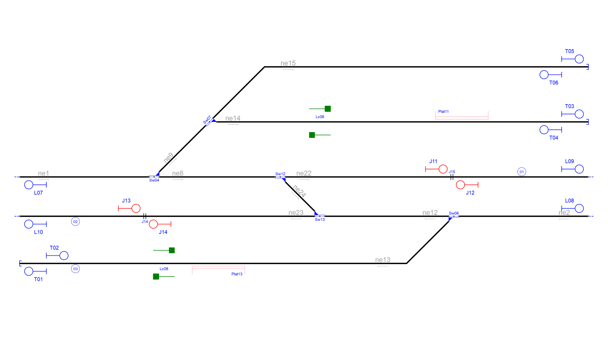
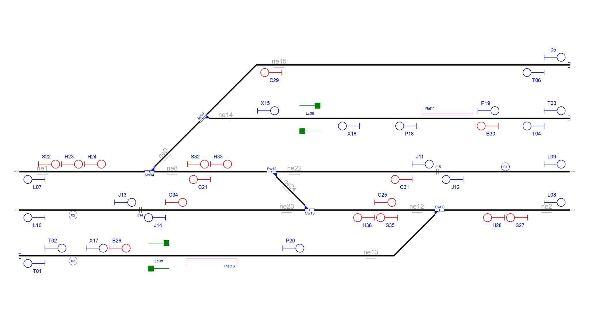
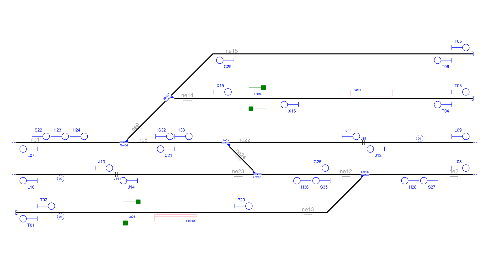

# Example_1
## Description
Name: General example used in the paper

## Step by step

Layout without signalling:

Signals generated due to line borders(L) and buffer stops(T):

Signals generated due to line borders(L),buffer stops(T) and rail joints (J):

Signals generated due to line borders(L),buffer stops(T),rail joints (J), platforms(P) and level crossings(X):

Signals generated due to line borders(L),buffer stops(T),rail joints (J), platforms(P),level crossings(X) and switches(S,H,C,B):

Simplified signalling:

## Original table

| Route  | Entry | Exit | Switches | Platforms | Crossings | netElements |
|  :---:  |  :---:  |  :---:  |  :---:  |  :---:  |  :---:  |  :---:  |
| R_01 |  S01  |  S17  | Sw04_N | - | - | ne01-ne08 |
| R_02 |  S01  |  S19  | Sw04_R + Sw07_N | - | - | ne01-ne09-ne15 |
| R_03 |  S01  |  S05  | Sw04_R + Sw07_R | - | - | ne01-ne09-ne14 |
| R_04 |  S17  |  S15  | Sw12_N | - | - | ne08-ne22 |
| R_05 |  S16  |  S02  | Sw12_N | - | - | ne22-ne08 |
| R_06 |  S17  |  S12  | Sw12_R + Sw13_R | - | - | ne08-ne24-ne12 |
| R_07 |  S10  |  S02  | Sw12_R + Sw13_R | - | - | ne12-ne24-ne08 |
| R_08 |  S10  |  S14  | Sw13_N | - | - | ne12-ne23 |
| R_09 |  S13  |  S12  | Sw13_N | - | - | ne23-ne12 |
| R_10 |  S07  |  S10  | Sw06_N | - | - | ne02-ne12 |
| R_11 |  S07  |  S09  | Sw06_R | Plat13 | Lc08 | ne02-ne13 |
| R_12 |  S05  |  S06  | - | Plat11 | Lc06 | ne14 |
| R_13 |  S06  |  S20  | - | - | - | ne14 |
| R_14 |  S09  |  S18  | - | - | - | ne13 |

## Generated table

| Route  | Entry | Exit | Switches | Platforms | Crossings | netElements |
|  :---:  |  :---:  |  :---:  |  :---:  |  :---:  |  :---:  |  :---:  |
| R_01 |  S22  |  S32  | Sw04_N  | - | - | ne01-ne08 |
| R_02 |  S22  |  T05  | Sw04_R + Sw07_N | - | - | ne01-ne09-ne15 |
| R_03 |  S32  |  X15  | Sw04_R + Sw07_R | - | - | ne01-ne09-ne14 |
| R_04 |  S32  |  J11  | Sw12_N | - | - | ne08-ne22 |
| R_05 |  J12  |  C21  | Sw12_N | - | - | ne22-ne08 |
| R_06 |  S32  |  C25  | Sw12_R + Sw13_R | - | - | ne08-ne24-ne12 |
| R_07 |  S35  |  C21  | Sw12_R + Sw13_R | - | - | ne12-ne24-ne08 |
| R_08 |  S35  |  J14  | Sw13_N | - | - | ne12-ne23 |
| R_09 |  J13  |  C25  | Sw13_N | - | - | ne23-ne12 |
| R_10 |  S27  |  S35  | Sw06_N | - | - | ne02-ne12 |
| R_11 |  S27  |  T01  | Sw06_R | Plat13 | Lc08 | ne02-ne13 |
| R_12 |  X15  |  T03  | - | Plat11 | Lc06 | ne14 |
| R_13 |  T04  |  X16  | - | Plat11 | - | ne14 |
| R_14 |  T02  |  P20  | - | Plat13 | Lc08 | ne13 |

Extra routes considering bidirectional tracks:
| Route  | Entry | Exit | Switches | Platforms | Crossings | netElements |
|  :---:  |  :---:  |  :---:  |  :---:  |  :---:  |  :---:  |  :---:  |
| R_15 |  T06  |  C29  | - | - | - | ne15 |
| R_16 |  J11  |  L09  | - | - | - | ne22 |
| R_17 |  J14  |  L10  | - | - | - | ne23 |
| R_18 |  X16  |  L07  | Sw04_R + Sw07_R | - | Lc06 | ne14-ne09-ne01 |
| R_19 |  C29  |  L07  | Sw04_N + Sw07_R | - | - | ne15-ne09-ne01 |
| R_20 |  C21  |  L07  | Sw04_N  | - | - | ne08-ne01 |
| R_21 |  P20  |  L08  | Sw06_R  | - | - | ne13-ne02 |
| R_22 |  C25  |  L08  | Sw06_N  | - | - | nex12-ne02 |

Routes 1 to 11 are the same in both interlocking tables.

Routes 12 and 13 in the original interlocking table were combined in Route Routet 12 because signals S06 and S20 were replaced by T03 due to proximity.

Route 14 was deleted because signal S09 was very close S18 and, therefore, unuseful as signal. Routes 11 and 14 in the original signalling were combined in Route 11 in the new signalling.

Routes 15 to 22 are created because RNA added signals T01,T02,T03,T04,T05 and T06 to protectt buffer stops and signals L07,L08,L09 and L10 to protect line borders. These new signals created new routes to stop prior the (relative or absolute) end of the network, increasing safety, and to add opposite routes than the originals, increasing mobility.
