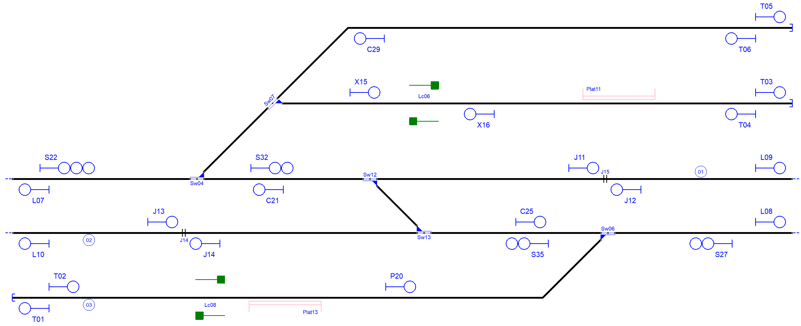
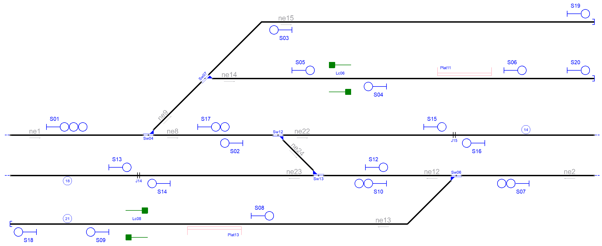
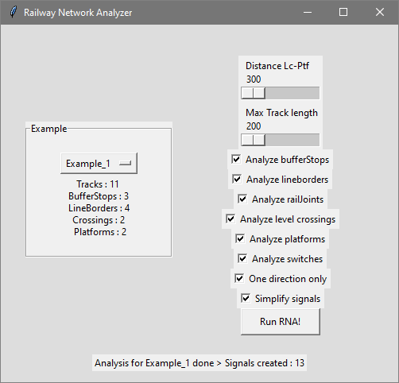
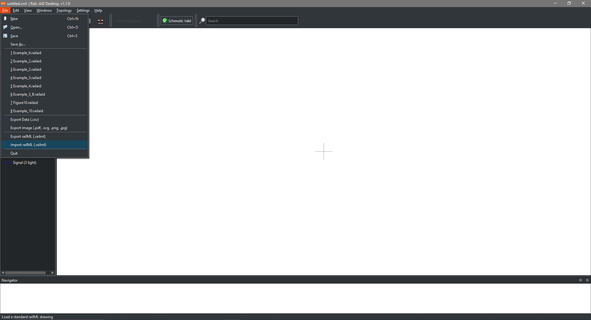

# Example_1
## Description
Name: General example used in the paper

This example is mentioned in the manuscript titled: "Automatic Railway Signalling Generation for Railways Systems Described on Railway Markup Language (railML)". Henceforth, when we refer to the manuscript, we will do it as [[1]](#references).

## Analysis principles

The signalling generation process used in this work was designed following signalling principles detailed in [[1]](#references) in the section "I. INTRODUCTION".

## Step by step

The following is the general methodology or "step by step" followed for analysing a railway network with the approach of this work [[1]](#references).

A. Import the railway layout description.

B. Define a graph network to associate the railway elements.

C. Infrastructure analysis

D. Detect CDL zones.

E. Generate signalling.

F. Simplify signalling.

G. Logfile generated by RNA.

H. Comparing interlocking tables.

E. Extra

Each step is explained below.

### A. Import the railway layout description

After having installed the RNA program according to the steps shown in the the section ["Usage"](https://github.com/GICSAFePhD/Layouts#usage), run the Python archive "main_GUI.py". This action produces the program output shown in Figure 1.

*Figure 1. Select example.*

The necessary information to define the graph network is distributed across several sections of the railML file, specifically inside netElements (nodes) and netRelations (edges) items found in the class Infrastructure/Topology as described in [[1]](#references).

Figure 2 shows the railway network without signalling. The user will need the Design4Rail Horizon Software Suite Track Planner application and import the archive "Example_2.railml" to visualise the railway network used in this example. 

For further information about the Design4Rail Horizon Software Suite and the Track Planner application, please refer to [Official web page of Design4Rail](https://design4rail.com/service/d4rhorizon/#section-downloadHorizon).

For a detailed explanation about importing railML files, go to section [G.1](#g1-obtaining-the-interlocking-table-in-design4rail) of this document. 

*Figure 2. Railway network without signalling.*

### B. Define a graph network to associate the railway elements

This step allows us to evaluate the consistency of the network connections provided in the RailML file, through the determination of the direction, position, and interconnection of each of the nodes of the given railway network.

In [[1]](#references), in the section "II. RAILWAY NETWORK ANALYZER DESIGN" in literal B, we see Algorithm 1, which explains the network analysis process.

The result of this RNA step is show in Console Output 1:

~~~
#################### Starting Railway Network Analyzer ####################
Reading .railML file
Creating railML object
Analysing railML object
 Analysing graph
ne1 [810, 150] [1320, 150] >>
ne2 [2970, 0] [2460, 0] <<
ne8 [1320, 150] [1800, 150] >>
ne9 [1320, 150] [1530, 360] >>
ne12 [2460, 0] [1950, 0] <<
ne13 [2460, 0] [810, -180] <<
ne14 [1530, 360] [2970, 360] >>
ne15 [1530, 360] [2970, 570] >>
ne22 [1800, 150] [2970, 150] >>
ne23 [1950, 0] [810, 0] <<
ne24 [1800, 150] [1950, 0] >>
 The network is connected
~~~

*Console Output 1. Step B railway elements.*

In this example, the Console Output 1 shows that the program can identify the nodes and their directions. Consol Output 1 has, for example, this line: ne1 [810, 150] [1320, 150] >>, it indicates the name of the netElement (ne1), the position (origin [810, 150] and end point [1320, 150]) of the net element, and the direction (>>, at right in this case, but in other example it could have been at left: <<). If compare this Consol Output 1 with Figure 2, and analysing each "netElement", all elements are coincident. The same analysis for: ne14, ne15, ne17, ne18, ne19 and ne20.

### C and D. Infrastructure analysis and CDL zones detection

The process of analysing the infrastructure and detecting CDL zones produces one result: identifying the existence and position of each infrastructure element in the network: platforms, curves, level crossings,  buffer stops, derailers, lines,  operational points, signals, switches, tracks and detection elements (axle counters, rail joints and track circuits).

In section "II. RAILWAY NETWORK ANALYSER DESIGN" literal C of [1], it is shown Algorithm 2, which explains the process of analysing the network; and in the same section but in literal D, it is explained the process used to detect CDL zones.

The result of this step is shown in Console Output 2 and Figure 3.

~~~
Analysing infrastructure --> Infrastructure.RNA
 Detecting Danger --> Safe_points.RNA
  ne1 has a Middle point @ [1065.0, 150]
  ne2 has a Middle point @ [2715.0, 0]
  ne8 has a Middle point @ [1560.0, 150]
  ne12 has a Middle point @ [2205.0, 0]
  ne13 has a Platform[plf75] @ [1564, 180]
  ne13 has a LevelCrossing[lcr74] @ [1362, 180]
  ne13 has a Curve(2 lines) @ [[2280, -180]]
  ne14 has a Platform[plf68] @ [2490, -360]
  ne14 has a LevelCrossing[lcr69] @ [1945, -360]
  ne15 has a Curve(2 lines) @ [[1740, 570]]
  ne22 has a RailJoint[J15] @ [2452, 150]
  ne23 has a RailJoint[J14] @ [1284, 0]
~~~

*Console Output 2. Infraestructure analysis and CDL zone detection.*

*Figure 3. Infrastructure analysis and CDL zones detection: GUI Output.*

Figure 4 shows these elements.

*Figure 4. Infrastructure analysis and CDL zones detection: Layout.*

### E. Generate signalling

To obtain an analysis for each network element in the program configurations (view Figure 5), select only the options you want.

*Figure 5. Configuration options of RNA.*

Below, in subsections E.1, E.2, E.3, and E.4, you will find the sequence of configurations used to analyze, step by step, the railway in this example.

#### E.1. Signals generated due to line borders(L) and buffer stops(T)

The configuration of the RNA GUI application needed for this step of the analysis is shown in Figure 6.

*Figure 6. Configuring RNA to obtain signals for line borders(L) and buffer stops(T).*

Signals are enumerated since 00 with a prefix letter to indicate which element generates them. BufferStops and LineBorders signals start with T and L, respectively. In Figure 7, we can visualise the signals generated by applying algorithm 3, explained in [[1]](#references) section "III. SIGNALLING GENERATION".

In red letters, automatically added signals are shown.

The RNA allocates signals close to the buffer stops:

-- Stop: *T01*, *T03*, *T05*
-- Departure: *T02*, *T04*, *T06*

The RNA allocates signals close to the line borders. RNA allocates departure signals which are: *L07, L08, L09 and L10* assigned close to every line border that belongs to a netElement whose track is longer than a configurable fixed length.

*Figure 7. Signals due to line borders(L) and buffer stops(T).*

#### E.2. Signals generated due to line borders(L),buffer stops(T) and rail joints (J)

The signals for rail joints are named J and have a consecutive number of signals.

Figure 8 shows the configuration of the RNA GUI application needed for this step of analysis.

*Figure 8. Configuring RNA to obtain signals for line borders(L), buffer stops(T) and rail joints (J).*

The algorithm assigns signals *J11*, *J12*, *J13* and *J14* at the beginning and end of each track to indicate the rail joints as shown in Figure 9.

*Figure 9. Signals due to line borders(L), buffer stops(T) and rail joints (J).*

#### E.3. Signals generated due to line borders(L),buffer stops(T),rail joints (J), platforms(P) and level crossings(X)

The signals for platforms are named P, and signals for level crossings are named X. A consecutive number of signals is assigned for each type of signalling.

The configuration of the RNA GUI application needed for this step of the analysis is shown in Figure 10.

*Figure 10. Configuring RNA to obtain signals for line borders(L),buffer stops(T),rail joints (J), platforms(P) and level crossings(X).*

Notice that RNA can be configured to avoid adding duplicate signals when the level crossing and the platform are close together, as discussed in [[1]](#references), and therefore, the signalling between them is unnecessary. However, this configuration is a special parameter in RNA. For furthermore information about this, see section [G.3.1.2.](#g32-minimum-distance-parameter) 

It is necessary to introduce signals before the train reaches the level crossing as explained in Algorithm 5, explained in [[1]](#references) section "III. SIGNALLING GENERATION".

Also, it is necessary to have a departure signal after the platform. This logic is implemented using Algorithm 6, explained in [[1]](#references) section "III. SIGNALLING GENERATION".

In red letters, the signals Generated due level crossings and platforms are shown in Figure 11.

*Figure 11. Signals due to line borders(L),buffer stops(T),rail joints (J), platforms(P) and level crossings(X).*

#### E.4. Signals generated due to line borders(L),buffer stops(T),rail joints (J), platforms(P),level crossings(X) and switches(S,H,C,B)

Figure 6 shows the configuration of the RNA GUI application needed for this step of analysis.

*Figure 12. Configuring RNA to obtain signals for line borders(L),buffer stops(T),rail joints (J), platforms(P),level crossings(X) and switches(S,H,C,B).*

The signals for switches are named based on the point they want to protect: S for Starting branch, C for the Continue branch and B for the Detour branch. There are also signals whose name starts with H that are not explicitly protecting the starting branch, the continue branch or the detour branch of a switch. These H signals are explained in [[1]](#references) section "III. SIGNALLING GENERATION" in literal E, where a manoeuvre signal numbered with H is always added plus the corresponding numbering sequence by Algorithm 7. This manoeuvre signal always accompanies the signal of the start branch (S) of the switch, and its function is to protect the railway elements that are after this signal (i.e. elements that are in the detour branch and in the continue branch).

Signals generated for (in red letters, added signals are shown):

- Sw04: *S22*, *C21*, *H23*, *H24*
- Sw06: *S27*, *C25*, *B26*, *H28*
- Sw07: *C29*, *B30*
- Sw12: *S32*, *C31*, *H33*
- Sw13: *S35*, *C34*, *H36*

*Figure 13. Signals due to line borders(L),buffer stops(T),rail joints (J), platforms(P),level crossings(X) and switches(S,H,C,B).*

### F. Simplify signalling

The signal simplification process used by RNA relies on two main principles: i) vertical inheritance and ii) horizontal inheritance. Both principles are explained in [1] in section "IV. SIGNALLING SIMPLIFICATION".

To simplify signals mark the configuration option "Simplify signals", as shown in Figure 14.

*Figure 14. Configuring RNA to simplify signalling.*

After the simplification only the appropriate signals are kept, as shown in Figure 15.

*Figure 15. Signalling simplification.*

The simplification process was carried out according to the process described in section IV. SIGNALLING SIMPLIFICATION of [[1]](#references), as follows:

- **Simplification by vertical inheritance**

    Vertical inheritance was applied when the B signals of the Sw12 and Sw13 were moved to the signals H33 y H36, respectably. These signals B were not created because of the RNA when analysing the switches,  applying Algorithm 8 explained in section IV. SIGNALLING SIMPLIFICATION of [[1]](#references), literal A. The same simplification was done for moving signals C and S from ne9 to become H23 and H24.

- **Simplification by horizontal inheritance**

    The simplified signals due to horizontal inheritance are follows: X17, P18, P19, B26, B30, C31 and C34 . Signal X17 and B26 were deleted due this was nearby of signal T02, and have the same direction and orientation. The same situation occurs between signals P18/B30 and T04; between signals P19 and T03; between C31 and J12; and between signals C34 and J13. In all cases, is applied Algorithm 9 (described in section IV. SIGNALLING SIMPLIFICATION of [[1]](#references)). This algorithm was designed to group nearby objects as one single object, and generating signals according to the leftmost and rightmost railway element in the new single object. 

    The signal priority used to decide which signal remains and which is deleted is explained in section IV. SIGNALLING SIMPLIFICATION of [[1]](#references), literal B.

~~~
Reducing redundant signals
 removing sig17 for sig02
 removing sig26 for sig02
 removing sig19 for sig03
 removing sig30 for sig04
 removing sig31 for sig12
 removing sig34 for sig13
 removing sig18 for sig30
~~~

### G. Output generated by RNA

Once the signalling is generated, it is necessary to establish the railway routes to create the railway interlocking table. A railway route is the simplest path between two consecutive signals in the same direction, using the same tracks (see [[1]](#references)). RNA generates 4 logfiles as a summary of all the analysis, these files are: 

- Infrastructure.RNA: summary of elements node per node. 
- Safe_points.RNA: absolute coordinates of every point where it is safe to add signals depending on prev/next direction, node per node.
- Signalling: summary of all the signalling generated and their relevant information.
- Routes.RNA: Interlocking table with the information of each route.

Aditionally, RNA generates the object that will be used by the ACG. The logfiles are a summary of the information contained in the object.

#### G.1 Infrastructure.RNA: 

~~~
Nodes: 11 | Switches: 5 | Signals: 0 | Detectors: 2 | Ends: 7 | Barriers: 2
Node ne1:
	Track = track1
	Neighbours = 2 -> ['ne8', 'ne9']
	Switches -> Sw04
		ContinueCourse -> right -> ne8
		BranchCourse -> left -> ne9
Node ne2:
	Track = track7
	Neighbours = 2 -> ['ne12', 'ne13']
	Switches -> Sw06
		ContinueCourse -> right -> ne12
		BranchCourse -> left -> ne13
Node ne8:
	Track = track2
	Neighbours = 4 -> ['ne1', 'ne9', 'ne22', 'ne24']
	Switches -> Sw12
		ContinueCourse -> left -> ne22
		BranchCourse -> right -> ne24
Node ne9:
	Track = track3
	Neighbours = 4 -> ['ne1', 'ne8', 'ne14', 'ne15']
	Switches -> Sw07
		ContinueCourse -> left -> ne15
		BranchCourse -> right -> ne14
Node ne12:
	Track = track8
	Neighbours = 4 -> ['ne2', 'ne13', 'ne23', 'ne24']
	Switches -> Sw13
		ContinueCourse -> left -> ne23
		BranchCourse -> right -> ne24
Node ne13:
	Track = track9
	Type = BufferStop -> ['bus56']
	Neighbours = 2 -> ['ne2', 'ne12']
	Level crossing -> lcr74
		Protection -> true | Barriers -> none | Lights -> none Acoustic -> none
		Position -> [1317, 180] | Coordinate: 0.7059
Node ne14:
	Track = track4
	Type = BufferStop -> ['bus10']
	Neighbours = 2 -> ['ne9', 'ne15']
	Level crossing -> lcr69
		Protection -> true | Barriers -> none | Lights -> none Acoustic -> none
		Position -> [1990, -360] | Coordinate: 0.3197
Node ne15:
	Track = track10
	Type = BufferStop -> ['bus59']
	Neighbours = 2 -> ['ne9', 'ne14']
Node ne22:
	Track = track6
	TrainDetectionElements -> tde78
		Type -> insulatedRailJoint
	Neighbours = 2 -> ['ne8', 'ne24']
Node ne23:
	Track = track5
	TrainDetectionElements -> tde77
		Type -> insulatedRailJoint
	Neighbours = 2 -> ['ne12', 'ne24']
Node ne24:
	Track = track11
	Neighbours = 4 -> ['ne8', 'ne12', 'ne22', 'ne23']
~~~

#### G.2 Safe_points.RNA: 

~~~
ne1:
  Next: [[1065.0, 150]]
  Prev: [[1065.0, 150]]
ne2:
  Next: [[2715.0, 0]]
  Prev: [[2715.0, 0]]
ne8:
  Next: [[1560.0, 150]]
  Prev: [[1560.0, 150]]
ne12:
  Next: [[2205.0, 0]]
  Prev: [[2205.0, 0]]
ne13:
  Next: [[1162, 180], [2180.0, -180]]
  Prev: [[1764, 180]]
ne14:
  Next: [[2290, -360], [1745, -360]]
  Prev: [[2690, -360], [2145, -360]]
ne15:
  Prev: [[1840.0, 570]]
ne22:
  Next: [[2352.0, 150]]
  Prev: [[2552.0, 150]]
ne23:
  Next: [[1184.0, 0]]
  Prev: [[1384.0, 0]]
~~~

#### G.3 Signalling.RNA: 

~~~
sig01 [T01] <<:
	From: ne13 | To: bus56_left
	Type: Stop | Direction: normal | AtTrack: left 
	Position: [910, 180] | Coordinate: 0.2055
sig02 [T02] >>:
	From: ne13 | To: ne13_right
	Type: Stop | Direction: reverse | AtTrack: right 
	Position: [910, 180] | Coordinate: 0.2055
sig03 [T03] >>:
	From: ne14 | To: bus10_right
	Type: Stop | Direction: normal | AtTrack: left 
	Position: [2870, -360] | Coordinate: 0.9305
sig04 [T04] <<:
	From: ne14 | To: ne14_left
	Type: Stop | Direction: reverse | AtTrack: right 
	Position: [2870, -360] | Coordinate: 0.9305
sig05 [T05] >>:
	From: ne15 | To: bus59_right
	Type: Stop | Direction: normal | AtTrack: left 
	Position: [2870, -570] | Coordinate: 0.9345
sig06 [T06] <<:
	From: ne15 | To: ne15_left
	Type: Stop | Direction: reverse | AtTrack: right 
	Position: [2870, -570] | Coordinate: 0.9345
sig07 [L07] <<:
	From: ne1 | To: oe40_left
	Type: Circulation | Direction: reverse | AtTrack: right 
	Position: [910, -150] | Coordinate: 0.1960
sig08 [L08] >>:
	From: ne2 | To: oe42_right
	Type: Circulation | Direction: reverse | AtTrack: right 
	Position: [2870, 0] | Coordinate: 0.8039
sig09 [L09] >>:
	From: ne22 | To: oe41_right
	Type: Circulation | Direction: normal | AtTrack: left 
	Position: [2870, -150] | Coordinate: 0.9145
sig10 [L10] <<:
	From: ne23 | To: oe39_left
	Type: Circulation | Direction: normal | AtTrack: left 
	Position: [910, 0] | Coordinate: 0.0877
sig11 [J11] >>:
	From: ne22 | To: ne22_right
	Type: Circulation | Direction: normal | AtTrack: left 
	Position: [2352.0, -150] | Coordinate: 0.4717
sig12 [J12] <<:
	From: ne22 | To: ne22_left
	Type: Circulation | Direction: reverse | AtTrack: right 
	Position: [2552.0, -150] | Coordinate: 0.6427
sig13 [J13] >>:
	From: ne23 | To: ne23_right
	Type: Circulation | Direction: reverse | AtTrack: right 
	Position: [1184.0, 0] | Coordinate: 0.3280
sig14 [J14] <<:
	From: ne23 | To: ne23_left
	Type: Circulation | Direction: normal | AtTrack: left 
	Position: [1384.0, 0] | Coordinate: 0.5035
sig15 [X15] >>:
	From: ne14 | To: ne14_right
	Type: Circulation | Direction: normal | AtTrack: left 
	Position: [1745, 360] | Coordinate: 0.5218
sig16 [X16] <<:
	From: ne14 | To: ne14_left
	Type: Circulation | Direction: reverse | AtTrack: right 
	Position: [2145, 360] | Coordinate: 0.6575
sig20 [P20] >>:
	From: ne13 | To: ne13_right
	Type: Circulation | Direction: reverse | AtTrack: right 
	Position: [1844, -180] | Coordinate: 0.7824
sig21 [C21] <<:
	From: ne8 | To: ne8_left
	Type: Circulation | Direction: reverse | AtTrack: right 
	Position: [1560.0, -150] | Coordinate: 0.5
sig22 [S22] >>:
	From: ne1 | To: ne1_right
	Type: Circulation | Direction: normal | AtTrack: left 
	Position: [1065.0, -150] | Coordinate: 0.5
sig25 [C25] >>:
	From: ne12 | To: ne12_right
	Type: Circulation | Direction: reverse | AtTrack: right 
	Position: [2205.0, 0] | Coordinate: 0.5
sig27 [S27] <<:
	From: ne2 | To: ne2_left
	Type: Circulation | Direction: normal | AtTrack: left 
	Position: [2715.0, 0] | Coordinate: 0.5
sig29 [C29] <<:
	From: ne15 | To: ne15_left
	Type: Manouver | Direction: reverse | AtTrack: right 
	Position: [1840.0, -570] | Coordinate: 0.2599
sig32 [S32] >>:
	From: ne8 | To: ne8_right
	Type: Circulation | Direction: normal | AtTrack: left 
	Position: [1560.0, -150] | Coordinate: 0.5
sig35 [S35] <<:
	From: ne12 | To: ne12_left
	Type: Circulation | Direction: normal | AtTrack: left 
	Position: [2205.0, 0] | Coordinate: 0.5
~~~

#### G.4 Routes.RNA: 

Full interlocking table
~~~
route_1 [sig02 >> sig20]:
	Path: ['ne13']
	Platforms: ['plf75']
route_2 [sig04 << sig16]:
	Path: ['ne14']
	Platforms: ['plf68']
route_3 [sig06 << sig29]:
	Path: ['ne15']
route_4 [sig11 >> sig09]:
	Path: ['ne22']
route_5 [sig12 << sig21]:
	Path: ['ne22', 'ne8']
	Switches: ['Sw12']
route_6 [sig13 >> sig25]:
	Path: ['ne23', 'ne12']
	Switches: ['Sw13']
route_7 [sig14 << sig10]:
	Path: ['ne23']
route_8 [sig15 >> sig03]:
	Path: ['ne14']
	Platforms: ['plf68']
route_9 [sig16 << sig07]:
	Path: ['ne14', 'ne9', 'ne1']
	Switches: ['Sw04', 'Sw07']
	Platforms: ['plf68']
route_10 [sig20 >> sig08]:
	Path: ['ne13', 'ne2']
	Switches: ['Sw06']
	Platforms: ['plf75']
route_11 [sig21 << sig07]:
	Path: ['ne8', 'ne1']
	Switches: ['Sw04', 'Sw12']
route_12 [sig22 >> sig32]:
	Path: ['ne1', 'ne8']
	Switches: ['Sw04', 'Sw12']
route_13 [sig22 >> sig15]:
	Path: ['ne1', 'ne9', 'ne14']
	Switches: ['Sw04', 'Sw07']
	Platforms: ['plf68']
route_14 [sig22 >> sig05]:
	Path: ['ne1', 'ne9', 'ne15']
	Switches: ['Sw04', 'Sw07']
route_15 [sig25 >> sig08]:
	Path: ['ne12', 'ne2']
	Switches: ['Sw06', 'Sw13']
route_16 [sig27 << sig35]:
	Path: ['ne2', 'ne12']
	Switches: ['Sw06', 'Sw13']
route_17 [sig27 << sig01]:
	Path: ['ne2', 'ne13']
	Switches: ['Sw06']
	Platforms: ['plf75']
route_18 [sig29 << sig07]:
	Path: ['ne15', 'ne9', 'ne1']
	Switches: ['Sw04', 'Sw07']
route_19 [sig32 >> sig11]:
	Path: ['ne8', 'ne22']
	Switches: ['Sw12']
route_20 [sig32 >> sig25]:
	Path: ['ne8', 'ne24', 'ne12']
	Switches: ['Sw12', 'Sw13']
route_21 [sig35 << sig14]:
	Path: ['ne12', 'ne23']
	Switches: ['Sw13']
route_22 [sig35 << sig21]:
	Path: ['ne12', 'ne24', 'ne8']
	Switches: ['Sw12', 'Sw13']
~~~

### H. Comparing interlocking tables.

The interlocking table generated by the RNA in G.4 for the new signalling (Example_1_B.railml) must be compared with the interlocking table generated by Design4Rail for the original signalling (Example_1.railml).

#### H.1. Original interlocking table

Figure 16 shows the structure of the original example. The signalling and the routes were designed by experts following the RailMl standard.

*Figure 16. Original example provided by RailMl*

The original interlocking table can be found in the original railML file in railML/interlocking/assetsForIL/routes. There are a lot of information in those lines, but focusing on the designtor tag only, we can find the data associated to begin/end signals. The signalling and the original interlocking table were designed by experts following the RailMl standard.

Routes defined in "Example_1.railML" (original layout)
~~~
<routes>
	<route id="rt_sig97_sig98">
	    <designator register="_Example" entry="Route S05-S06"/>
	</route>
	<route id="rt_sig98_sig116">
	    <designator register="_Example" entry="Route S06-S20"/>
	</route>
	<route id="rt_sig101_sig114">
	    <designator register="_Example" entry="Route S09-S18"/>
	</route>
	<route id="rt_sig105_sig104">
	    <designator register="_Example" entry="Route S13-S12"/>
	</route>
	<route id="rt_sig108_sig94">
	    <designator register="_Example" entry="Route S16-S02"/>
	</route>
	<route id="rt_sig109_sig110_swi55N">
	    <designator register="_Example" entry="Route S07-S10 (Sw06N)"/>
	</route>
	<route id="rt_sig109_sig101_swi55R">
	    <designator register="_Example" entry="Route S07-S09 (Sw06R)"/>
	</route>
	<route id="rt_sig110_sig106_swi73N">
	    <designator register="_Example" entry="Route S10-S14 (Sw13N)"/>
	</route>
	<route id="rt_sig110_sig94_swi73R">
	    <designator register="_Example" entry="Route S10-S02 (Sw13R)"/>
	</route>
	<route id="rt_sig111_sig113_swi9N">
	    <designator register="_Example" entry="Route S01-S17 (Sw04N)"/>
	</route>
	<route id="rt_sig111_sig115_swi9R_swi58N">
	    <designator register="_Example" entry="Route S01-S19 (Sw04R-Sw07N)"/>
	</route>
	<route id="rt_sig111_sig97_swi9R_swi58R">
	    <designator register="_Example" entry="Route S01-S05 (Sw04R-Sw07R)"/>
	</route>
	<route id="rt_sig113_sig107_swi72N">
	    <designator register="_Example" entry="Route S17-S15 (Sw12N)"/>
	</route>
	<route id="rt_sig113_sig104_swi72R">
	    <designator register="_Example" entry="Route S17-S12 (Sw12R)"/>
	</route>
</routes>
~~~

This routes were rearrenged and summarized in Table 1.

*Table 1. Original interlocking table for this example provided by RailMl*

| Route  | Entry | Exit | Switches | Platforms | Crossings | netElements |
|  :---:  |  :---:  |  :---:  |  :---:  |  :---:  |  :---:  |  :---:  |
| R_01 |  S01  |  S05  | Sw04_R + Sw07_R | - | - | ne01-ne09-ne14 |
| R_02 |  S01  |  S17  | Sw04_N | - | - | ne01-ne08 |
| R_03 |  S01  |  S19  | Sw04_R + Sw07_N | - | - | ne01-ne09-ne15 |
| R_04 |  S05  |  S06  | - | Plat11 | Lc06 | ne14 |
| R_05 |  S06  |  S20  | - | - | - | ne14 |
| R_06 |  S07  |  S09  | Sw06_R | Plat13 | Lc08 | ne02-ne13 |
| R_07 |  S07  |  S10  | Sw06_N | - | - | ne02-ne12 |
| R_08 |  S09  |  S18  | - | - | - | ne13 |
| R_09 |  S10  |  S02  | Sw12_R + Sw13_R | - | - | ne12-ne24-ne08 |
| R_10 |  S10  |  S14  | Sw13_N | - | - | ne12-ne23 |
| R_11 |  S13  |  S12  | Sw13_N | - | - | ne23-ne12 |
| R_12 |  S16  |  S02  | Sw12_N | - | - | ne22-ne08 |
| R_13 |  S17  |  S15  | Sw12_N | - | - | ne08-ne22 |
| R_14 |  S17  |  S12  | Sw12_R + Sw13_R | - | - | ne08-ne24-ne12 |

#### H.2. Generated interlocking table

The result of the automatic process carried by the RNA (Obtained in G.4) is the intelocking table shown in Table 2.

*Table 2. Interlocking table obtain through RNA for bidirectional tracks. Considering only routes without lineBorders or stopBuffers*

| Route  | Entry | Exit | Switches | Platforms | Crossings | netElements |
|  :---:  |  :---:  |  :---:  |  :---:  |  :---:  |  :---:  |  :---:  |
| R_01 |  T02  |  P20  | - | Plat13 | Lc08 | ne13 |
| R_02 |  T04  |  X16  | - | Plat11 | - | ne14 |
| R_05 |  J12  |  C21  | Sw12_N | - | - | ne22-ne08 |
| R_06 |  J13  |  C25  | Sw13_N | - | - | ne23-ne12 |
| R_08 |  X15  |  T03  | - | Plat11 | Lc06 | ne14 |
| R_12 |  S22  |  S32  | Sw04_N  | - | - | ne01-ne08 |
| R_13 |  S22  |  X15  | Sw04_R + Sw07_R | - | - | ne01-ne09-ne14 |
| R_14 |  S22  |  T05  | Sw04_R + Sw07_N | - | - | ne01-ne09-ne15 |
| R_16 |  S27  |  S35  | Sw06_N | - | - | ne02-ne12 |
| R_17 |  S27  |  T01  | Sw06_R | Plat13 | Lc08 | ne02-ne13 |
| R_19 |  S32  |  J11  | Sw12_N | - | - | ne08-ne22 |
| R_20 |  S32  |  C25  | Sw12_R + Sw13_R | - | - | ne08-ne24-ne12 |
| R_21 |  S35  |  J14  | Sw13_N | - | - | ne12-ne23 |
| R_22 |  S35  |  C21  | Sw12_R + Sw13_R | - | - | ne12-ne24-ne08 |

#### H.3. Interlocking table comparisson

*Table 3. Comparisson between the original interlocking table (Design4Rail) and the interlocking table generated by RNA*

| Design4Rail  | Signals | netElements | RNA | Signals | netElements |
|  :---:  |  :---:  |  :---:  |  :---:  |  :---:  |  :---:  |
| R_01 | S01-S05 |  ne01-ne09-ne14  | R_13 | S22-X15 | ne01-ne09-ne14 |
| R_02 | S01-S17 |  ne01-ne08  | R_12 | S22-S32 | ne01-ne08 |
| R_03 | S01-S19 |  ne01-ne09-ne15  | R_14 | S22-T05 | ne01-ne09-ne15 |
| R_04 | S05-S06 |  ne14  | R_08 | X15-T03 | ne14 |
| R_05 | S06-S20 |  ne14  | R_02 | T04-X16 | ne14 |
| R_06 | S07-S09 |  ne02-ne13  | R_17 | S27-T01 | ne02-ne13 |
| R_07 | S07-S10 |  ne02-ne12  | R_15 | S27-S35 | ne02-ne12 |
| R_08 | S09-S18 |  ne13  | R_01 | T02-P20 | ne13 |
| R_09 | S10-S02 |  ne12-ne24-ne08  | R_22 | S35-C21 | ne12-ne24-ne08 |
| R_10 | S10-S14 |  ne12-ne23  | R_21 | S35-J14 | ne12-ne23 |
| R_11 | S13-S12 |  ne23-ne12  | R_06 | J13-C25 | ne23-ne12 |
| R_12 | S16-S02 |  ne22-ne08  | R_05 | J12-C21 | ne22-ne08 |
| R_13 | S17-S15 |  ne08-ne22  | R_19 | S32-J11 | ne08-ne22 |
| R_14 | S17-S12 |  ne08-ne24-ne12  | R_20 | S32-C25 | ne08-ne24-ne12 |

The 14 routes in the original interlocking table (Table 1) have en exact equivalent with the 14 routes in the interlocking table generated by RNA (Table 2). It is clear that not safety functionality were ignored by RNA.

Routes 3,4,7,9,10,11,15 and 18 (Table 4) were created because RNA added signals T01,T02,T03,T04,T05 and T06 to protectt buffer stops and signals L07,L08,L09 and L10 to protect line borders. These new signals created new routes to stop prior the (relative or absolute) end of the network, increasing safety, and to add opposite routes than the originals, increasing mobility. These elements were not protected in the original interlocking table.

*Table 4. Interlocking table obtain through RNA considering "Analyze bufferStop" and "Analyze lineBorders" are marked.*

Extra routes considering bufferStop and lineBorders:

| Route  | Entry | Exit | Switches | Platforms | Crossings | netElements |
|  :---:  |  :---:  |  :---:  |  :---:  |  :---:  |  :---:  |  :---:  |
| R_03 |  T06  |  C29  | - | - | - | ne15 |
| R_04 |  J11  |  L09  | - | - | - | ne22 |
| R_07 |  J14  |  L10  | - | - | - | ne23 |
| R_09 |  X16  |  L07  | Sw04_R + Sw07_R | - | Lc06 | ne14-ne09-ne01 |
| R_10 |  P20  |  L08  | Sw06_R  | - | - | ne13-ne02 |
| R_11 |  C21  |  L07  | Sw04_N  | - | - | ne08-ne01 |
| R_15 |  C25  |  L08  | Sw06_N  | - | - | nex12-ne02 |
| R_18 |  C29  |  L07  | Sw04_N + Sw07_R | - | - | ne15-ne09-ne01 |

### E Extras

#### E.1. One-directional and bidirectional tracks

RNA can consider tracks as one-directional as well as bidirectional. This feature is activated by mismarking the "One direction only" option, as shown in Figure 17.

*Figure 17. Produce routes considering bidirectional tracks*

#### E.2. Minimum distance parameter

As explained in literal B of section "IV. SIGNALING SIMPLIFICATION" in [[1]](#references), more than two railway elements can be combined if they are close enough. The threshold distance to determine if this combination must be done is a configuration parameter of RNA, named MIN_DISTANCE (minimum distance). As shown in Algorithms 8, 9, and 10 in [[1]](#references), this parameter is essential to locate, relocate and simplify signals. Because of integrity software reasons, this parameter should be between 300 and 500. For default, this value is 300. Figure 18 shows the parameter configuration in the GUI of RNA. 

*Figure 18. Minimum distance parameter configuration*

#### E.3. Fixed length parameter

The fixed length parameter is necessary to allocate the departure signals, which maintains the trains in the network until the next network approves the movement. These signals allow trains to move outside the network without restrictions only if the track is not long enough (fixed length). RNA could easily be adapted to different criteria and regulations, thanks to this parameter. As shown in Algorithms 3, and 4 in [[1]](#references). Configuration of the fixed length parameter in RNA as shown in Figure 19. Because of integrity software reasons, this parameter should be between 300 and 500. For default, this value is 200. Figure 23 shows the parameter configuration in the GUI of RNA.

*Figure 19. Fixed length parameter configuration*

#### E.4. Obtaining the interlocking tables using Design4Rail.

Design4Rail has not only a sintax analyzer that is used to check that the .railML file generated by RNA is correct. It also can be used as a visualization tool for both the layout and the interlocking table if you import the correspondig railML file. Design4Rail generates its own interlocking table based on the railML file. This can be done following the next steps:

In Design4Rail software open the archive Example_1_B.railml", generated by RNA for this example, as shown in Figure 20.

*Figure 21. Import railml file.*

Once the file is opened, it will be possible to view the network and its elements, as in Figure 21.

*Figure 21. Example 2 network in Design4Rail Track Planner.*

In the menu "View" in Design4Rail Track Planner, select "Routes", as shown in Figure 22.

*Figure 22. View Routes*

Then Design4Rail Track Planner will display the interlocking table for this network. It is shown in Figure 23.

*Interlocking table visualized in Design4Rail*

### ***Note***
   To carry out this research work, we used the software Rail-AID developed by NEAT, and provided to us on July 2021. However, NEAT no longer supports this software. They upgrade to a new software named Desgin4Rail TrackPlanner application, whose functionalities are essentially the same as Rail-AID. Because of this reason, we recommended in the manuscript and the development of the examples available in this repository, the use of Design4Rail TrackPlanner. Users are notified, that Rail-AID and Design4Rail are not free software; therefore, appropriate licenses should be purchased for use. A trial version is sufficient to open and visualize the layouts of examples 2, 5, 6 y 7. However, to open and visualize examples 1, 3 y 4 a license should be purchased.

   Moreover, it is important to mention that when the RNA exports the railML file the Rail-AID software considers all these signals as a single aspect. This issue was notified by us to NEAT in March 2022, they acknowledged the notification, agreed that there is an error on their software and committed to fix this problem. However, this problem was never solved, and NEAT discontinued Rail-AID software, as explained above. This problem is not solved yet on Design4Rail, either. To get around this issue, the RNA creates N semaphores of one aspect and displays them one after the other, instead of creating one semaphore of N aspects. However, this extra signals are not considered by RNA when routes are generated and, therefore, has no impact in the interlocking table.

## References

[1] M. N. Menendez, S. Germino, L. Díaz-Charris, and A. Lutenberg, Automatic Railway Signalling Generation for Railways Systems Described on Railway Markup Language (railML). 
