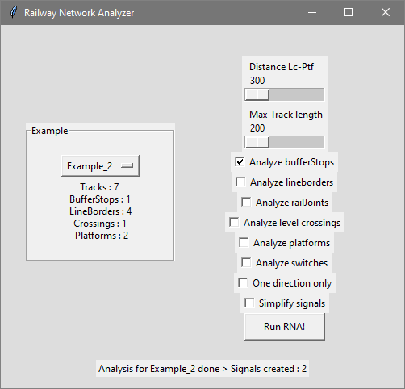
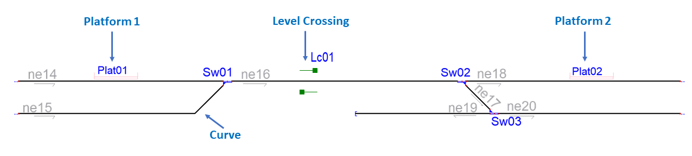
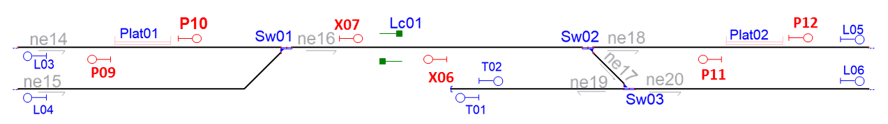
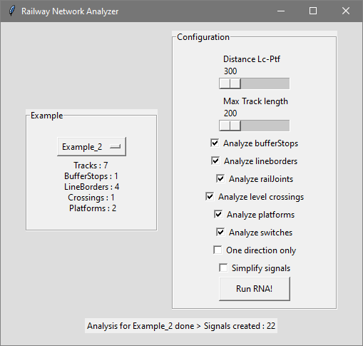
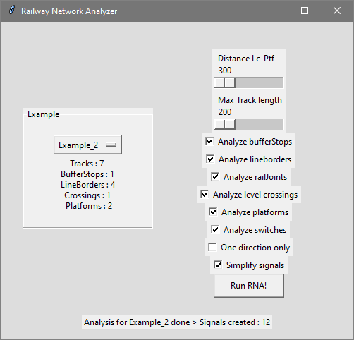
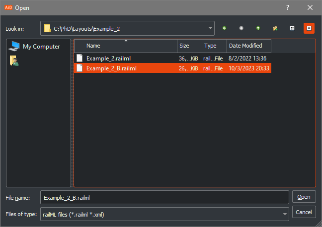

# Example 2

## Description

Name: SimpleExample.railAID

This example was mentioned in the manuscript titled: "Automatic Railway Signalling Generation for Railways Systems Described on Railway Markup Language (railML)". Henceforth, when we refer to the manuscript, we will do it as [1].

## Analysis principles

The signalling generation process used in this work was designed following signalling principles detailed in [1] in the section "I. INTRODUCTION".

## Step by step

The following is the general methodology or "step by step" followed for analysing a railway network with the approach of this work [1].

A. Import the railway layout description.

B. Define a graph network to associate the railway elements.

C. Infrastructure analysis

D. Detect CDL zones.

E. Generate signalling.

F. Simplify signalling.

G. Export a resulting railway layout description.

Each step is explained below.

### A. Import the railway layout description

After having installed the RNA program according to the steps shown in the the section ["Usage"](https://github.com/GICSAFePhD/Layouts#usage), run the Python archive "main_GUI.py". This action produces the program output shown in Figure 1.

*Figure 1. Select example.*

The necessary information to define the graph network is distributed across several sections of the railML file, specifically inside netElements (nodes) and netRelations (edges) items found in the class Infrastructure/Topology as described in [1].

Figure 2 shows the railway network without signalling. The user will need the Design4Rail Horizon Software Suite Track Planner application and import the archive "Example_2.railml" to visualise the railway network for this example. 

For further information about the Design4Rail Horizon Software Suite and the Track Planner application, please refer to [Official web page of Design4Rail](https://design4rail.com/service/d4rhorizon/#section-downloadHorizon).

For a detailed explanation about importing railML files, go to section [G.1](#g1-obtaining-table-in-design4rail) of this document. 

*Figure 2. Railway network without signalling.*

### B. Define a graph network to associate the railway elements

This step allows determining that the provided file's network connections are consistent. It also allows verifying the address, position, and interconnection of each node in the network.

In [1], in the section "II. RAILWAY NETWORK ANALYZER DESIGN" in literal B, we see Algorithm 1, which explains the network analysis process.

The result of this RNA step is show in Console Output 1:

~~~
#################### Starting Railway Network Analyzer ####################
Reading .railML file
Creating railML object
Analysing railML object
 Analysing graph
ne14 [-1521, 450] [-560, 450] >>
ne15 [-1521, 300] [-560, 450] >>
ne16 [-560, 450] [516, 450] >>
ne17 [516, 450] [666, 300] >>
ne18 [516, 450] [1521, 450] >>
ne19 [666, 300] [28, 300] <<
ne20 [666, 300] [1521, 300] >>
 The network is connected
~~~

*Console Output 1. Step B railway elements.*

In this example, the Console Output 1 shows that the program can identify the nodes and their directions. Consol Output 1 has, for example, this line: ne16 [-560, 450] [516, 450] >>, it indicates the name of the netElement (ne16), the position (origin [-560, 450] and end point [516, 450]) of the net element, and the direction (>>, at right in this case, but in other example it could have been at left: <<). If compare this Consol Output 1 with Figure 2, and analysing each "netElement", all elements are coincident. The same analysis for: ne14, ne15, ne17, ne18, ne19 and ne20.

### C and D. Infrastructure analysis and CDL zones detection

The process of analysing the infrastructure and detecting CDL zones produces one result: identifying the existence and position of each infrastructure element in the network: platforms, curves, level crossings,  buffer stops, derailers, lines,  operational points, signals, switches, tracks and detection elements (axle counters, rail joints and track circuits).

In section "II. RAILWAY NETWORK ANALYSER DESIGN" literal C of [1], it is shown Algorithm 2, which explains the process of analysing the network; and in the same section but in literal D, it is explained the process used to detect CDL zones.

The result of this step is shown in Console Output 2 and Figure 3.

~~~
Analysing infrastructure --> Infrastructure.RNA
 Detecting Danger --> Safe_points.RNA
  ne14 has a Platform[plf116] @ [-1075, -450]
  ne15 has a Curve(2 lines) @ [[-710, 300]]
  ne16 has a LevelCrossing[lcr120] @ [-192, -450]
  ne18 has a Platform[plf117] @ [1111, -450]
  ne19 has a Middle point @ [347.0, 300]
  ne20 has a Middle point @ [1093.5, 300]
~~~

*Console Output 2. Infraestructure analysis and CDL zone detection.*

*Figure 3. Infrastructure analysis and CDL zones detection: GUI Output.*

Figure 4 shows these elements.

*Figure 4. Infrastructure analysis and CDL zones detection: Layout.*

### E. Generate signalling

To obtain an analysis for each network element in the program configurations (view Figure 5), select only the options you want.

*Figure 5. Configuration options of RNA.*

Below you will find the sequence of configurations used to analyze, step by step, the railway in this example.

#### E.1. Signals generated due to line borders(L) and buffer stops(T)

Figure 6 shows the configuration of the RNA GUI application needed for this step of analysis.

*Figure 6. Configuring RNA to obtain signals for line borders(L) and buffer stops(T).*

Signals are enumerated since 00 with a prefix letter to indicate which element generates them. BufferStops and LineBorders signals start with T and L, respectively. In Figure 7, we can visualise the signals generated by applying algorithm 3, explained in [1] section "III. SIGNALLING GENERATION".

In red letters, automatically added signals are shown.

The RNA allocates signals close to the buffer stops:

-- Stop: *T01*

-- Departure: *T02*

The RNA allocates signals close to the line borders. RNA allocates departure signals which are: *L03, L04, L05 and L06* assigned close to every line border that belongs to a netElement whose track is longer than a configurable fixed length.

*Figure 7. Signals due to line borders(L) and buffer stops(T).*

#### E.2. Signals generated due to line borders(L),buffer stops(T) and rail joints (J)

The signals for rail joints are named J and have a consecutive number of signals.

Figure 8 shows the configuration of the RNA GUI application needed for this step of analysis.

*Figure 8. Configuring RNA to obtain signals for line borders(L), buffer stops(T) and rail joints (J).*

The algorithm does not assign signalling at the beginning and end of each track because this network does not have rail joints as shown in Figure 9.

*Figure 9. Signals due to line borders(L), buffer stops(T) and rail joints (J).*

#### E.3. Signals generated due to line borders(L),buffer stops(T),rail joints (J), platforms(P) and level crossings(X)

The signals for platforms are named P, and signals for level crossings are named X. A consecutive number of signals is assigned for each type of signalling.

Figure 10 shows the configuration of the RNA GUI application needed for this step of analysis.

*Figure 10. Configuring RNA to obtain signals for line borders(L),buffer stops(T),rail joints (J), platforms(P) and level crossings(X).*

Notice that RNA can be configured to avoid adding this signalling when the level crossing and the platform are close together; therefore, the signalling between them is unnecessary. However, this configuration is not accessible by the end user, since it is a special parameter in the RNA source code. 

It is necessary to introduce signals before the train reaches the level crossing as explained in Algorithm 5, explained in [1] section "III. SIGNALLING GENERATION".

A railway platform is where the passengers wait for trains to arrive and depart. Therefore, it is necessary to have a departure signal after the platform. This logic is implemented using Algorithm 6, explained in [1] section "III. SIGNALLING GENERATION".

Figure 11 shows (in red letters) the signals Generated due level crossings and platforms.

*Figure 11. Signals due to line borders(L),buffer stops(T),rail joints (J), platforms(P) and level crossings(X).*

#### E.4. Signals generated due to line borders(L),buffer stops(T),rail joints (J), platforms(P),level crossings(X) and switches(S,H,C,B)

Figure 6 shows the configuration of the RNA GUI application needed for this step of analysis.

*Figure 12. Configuring RNA to obtain signals for line borders(L),buffer stops(T),rail joints (J), platforms(P),level crossings(X) and switches(S,H,C,B).*

The signals for switches are named based on the point they want to protect: S for Starting branch, C for the Continue branch and B for the Detour branch. However, other signals named with H are not explicitly protecting any of the three points switches have.

The Algorithm 7, explained in [1] section "III. SIGNALLING GENERATION" in literal E, a manoeuvre signal numbered with H is always added plus the corresponding numbering sequence. This manoeuvre signal that always accompanies the signal of the start branch (S) of the switch, and whose function is to protect the railway elements that are after this signal. That is, the elements that are in the detour branch and in the continue branch.

Signals generated for (in red letters, added signals are shown):

- Sw01:*C13, B14, S18 and H19*.
- Sw02:*C17, S15 and H16*.
- Sw03:*C20, S21 and H22*.

*Figure 13. Signals due to line borders(L),buffer stops(T),rail joints (J), platforms(P),level crossings(X) and switches(S,H,C,B).*

### F. Simplify signalling

The signal simplification process used by RNA relies on two main principles: i) vertical inheritance and ii) horizontal inheritance. Both principles are explained in [1] in section "IV. SIGNALLING SIMPLIFICATION".

To simplify signals is needed that, mark the configuration option "Simplify signals", as shown in Figure 14.

*Figure 14. Configuring RNA to simplify signalling.*

After generating all the signalling, a simplification should be made to keep only the appropriate signals, as shown in Figure 15.

*Figure 15. Signalling simplification.*

Followin, explains the simplification process.

- **Simplification by vertical inheritance**

    Vertical inheritance was applied when the B signals of the Sw03 and Sw02 were moved to the signals H16 y H22, respectably. These signals B, apparently were not created, because of the RNA when analysing the switches, applying Algorithm 8 explained in section IV. SIGNALLING SIMPLIFICATION of [1], literal A.  

- **Simplification by horizontal inheritance**

    The simplified signals due to horizontal inheritance are follows: L03, L05, X07, X08, C13, C17 and C20. Signal L03 was deleted due this was nearby of signal P09, and have the same direction and orientation. The same situation occurs between signals L05 and P12; between signals C17 and P11; and between signals C20 and T02. In all cases, is applied Algorithm 9 (described in section IV. SIGNALLING SIMPLIFICATION of [1]). This algorithm was designed to avoid collisions by considering nearby objects as one single object, and generating signals according to the leftmost and rightmost railway element in the new single object. 

    Finally, signals X08 and X09 were deleted due to horizontal inheritance between signals S18 and S15, respectably. In this case, the priority of S18 and S15 were superior, as explained in section IV. SIGNALLING SIMPLIFICATION of [1], literal B. 

### G. Export a resulting railway layout description

Once the signalling is generated and simplified, it is necessary to establish the railway routes to create the railway interlocking table. A railway route is the simplest path between two consecutive signals in the same direction, using the same tracks.

#### G.1. Obtaining table in Design4Rail

To obtain the table of routes is necessary to open the archive generated for this example: "Example_2_B.railml" (if the user keeps the names provided by this repository) using Design4Rail software, as shown in Figure 16.

*Figure 16. Import railml file.*

Once the file is opened, it will be possible to view the network and its elements, as in Figure 17.

*Figure 17. Example 2 network in Design4Rail Track Planner.*

In the menu "View" in Design4Rail Track Planner, select "Routes", as shown in Figure 18.

*Figure 18. View Routes*

Then Design4Rail Track Planner will display the table of routes for this network. It is shown in Figure 19.

*Figure 19. Routes in Design4Rail*

#### G.2. Original table

Figure 20 shows the structure of the original example. The signalling and the routes were designed by experts following the RailMl standard.

*Figure 20. Original example provided by RailMl*

| Route  | Entry | Exit | Switches | Platforms | Crossings | netElements |
|  :---:  |  :---:  |  :---:  |  :---:  |  :---:  |  :---:  |  :---:  |
| R_01 |  S07  |  S11  | Sw01_N  | - | - | ne14-ne16 |
| R_02 |  S08  |  S11  | Sw01_R  | - | - | ne15-ne16 |
| R_03 |  S09  |  S12  | Sw02_N  | - | - | ne18-ne16 |
| R_04 |  S10  |  S13  | Sw03_N  | - | - | ne20-ne19 |
| R_05 |  S10  |  S12  | Sw03_R + Sw02_R  | - | - | ne20-ne17-ne16  |

#### G.3. Generated table

The example analysed by RNA and the approach of this work has the following structure, signalling and routes, which are the result of an automatic process and also follow the RailMl standard.

*Figure 21. Generate table through RNA railway generate signalling*

| Route  | Entry | Exit | Switches | Platforms | Crossings | netElements |
|  :---:  |  :---:  |  :---:  |  :---:  |  :---:  |  :---:  |  :---:  |
| R_01 |  P10  |  S18  | Sw01_N  | - | - | ne14-ne16 |
| R_02 |  B14  |  S18  | Sw01_R  | - | - | ne15-ne16 |
| R_03 |  P11  |  S15  | Sw02_N  | - | - | ne18-ne16 |
| R_04 |  S21  |  T01  | Sw03_N  | - | - | ne20-ne19 |
| R_05 |  S21  |  S15  | Sw03_R + Sw02_R | - | - | ne20-ne17-ne16 |

Extra routes considering bidirectional tracks:

| Route  | Entry | Exit | Switches | Platforms | Crossings | netElements |
|  :---:  |  :---:  |  :---:  |  :---:  |  :---:  |  :---:  |  :---:  |
| R_06 |  S15  |  P09  | Sw01_N  | - | Lc01 | ne16-ne14 |
| R_07 |  S15  |  L04  | Sw01_R  | - | Lc01 | ne16-ne15 |
| R_08 |  S18  |  P12  | Sw02_N  | - | Lc01 | ne16-ne18 |
| R_09 |  T02  |  L06  | SW03_N  | -  | - | ne19-ne20 |
| R_10 |  S18  |  L06  | Sw02_R + Sw03_R  | - | Lc01 | ne16-ne17-ne20 |

Routes 1 to 5 are the same in both interlocking tables, but RNA considers tracks as bidirectional, while the original layout has only one direction per track. Routes 6 to 10 are the opposite of routes 1 to 5. So it does not affect safety, RNA always considers every possible route in the layout. Moreover, departure signals are considered for line borders and buffer stops for extra protection.

For obtaining an analysis which only includes a one direction of a railway operation, should be mismark the option in the program. Like Figure 21 and Figure 22. To obtain the tables, you have to follow the steps explained in [G.1](#g1-obtaining-table-in-design4rail).

*Figure 21. Produce routes considering one directional tracks*

*Figure 22. Produce routes considering bidirectional tracks*

## References

[1] M. N. Menendez, S. Germino, L. Díaz-Charris, and A. Lutenberg, Automatic Railway Signalling Generation for Railways Systems Described on Railway Markup Language (railML).
