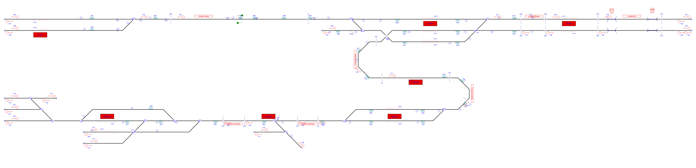
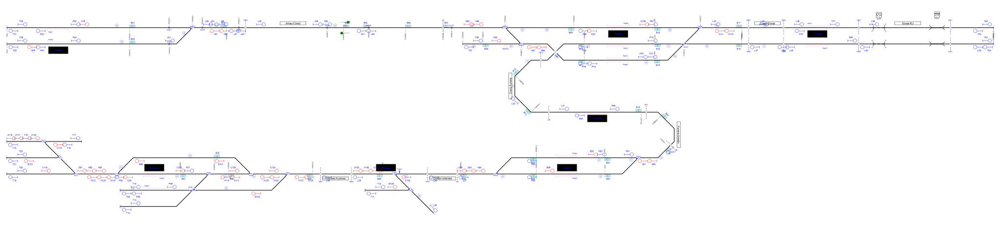

# Example_3
## Description
Name: AdvancedExample.RailAID

## Step by step

Layout without signalling:

Signals generated due to line borders(L) and buffer stops(T):

Signals generated due to line borders(L),buffer stops(T) and rail joints (J):

Signals generated due to line borders(L),buffer stops(T),rail joints (J), platforms(P) and level crossings(X):

Signals generated due to line borders(L),buffer stops(T),rail joints (J), platforms(P),level crossings(X) and switches(S,H,C,B):

Simplified signalling:

## Original table

| Route  | Entry | Exit | Switches | Platforms | Crossings | netElements |
|  :---:  |  :---:  |  :---:  |  :---:  |  :---:  |  :---:  |  :---:  |
| R_01 | 68N1 | 69Va | 68W02_R | - | Lc01 | ne7-ne9-ne95 |
| R_02 | 68N2 | 69Va | 68W02_N | - | Lc01 | ne1-ne9-ne95 |
| R_03 | 69Va | 69A | - | - | - | ne95-ne59 |
| R_04 | 69A | 69N2 | 69W03_N | Plat09 | - | ne59-ne17 |
| R_05 | 69A | 69N3 | Sw03_NN + 69W03_R + 69W04_R | Plat08 + Plat13 | - | ne59-ne11-ne52-ne77 |
| R_06 | 69B2 | 69P2 | Sw06_N | Plat09 | - | ne78-ne17 |
| R_07 | 69B2 | 69P3 | Sw06_R + Sw07_RR | Plat13 | - | ne78-ne79-ne77 |
| R_08 | 69B2 | 69P1 | Sw06_R + Sw07_RN | Plat12 | - | ne78-ne79-ne21 |
| R_09 | 69C | 69N1 | Sw04_RR | Plat12 | - | ne70-ne104-ne21 |
| R_10 | 69Vc | 69Vc1 | - | Plat7 | - | ne67-ne70 |
| R_11 | 70Va | 70A | - | - | - | ne103-ne64 |
| R_12 | 70N2 | 69Vc | 70W01_R | - | - | ne23-ne64-ne103-ne67 |
| R_13 | 70N1 | 69Vc | 70W0_N | - | - | ne24-ne64-ne103-ne67 |
| R_14 | 70B | 70N2 | 70W02_N | Plat05 | - | ne26-ne23 |
| R_15 | 70B | 70N1 | 70W02_R | Plat06 | - | ne26-ne24 |
| R_16 | 70A | 70P1 | 70W01_N | Plat06 | - | ne64-ne24 |
| R_17 | 70A | 70P2 | 70W01_R | Plat05 | - | ne64-ne23 |
| R_18 | 69W04Y | 69N3 | Sw03_NN + 69W04_N | Plat13 | - | ne14-ne52-ne77 |
| R_19 | 72-1 | S01 | Sw04_N | - | - | ne83-ne32 |
| R_20 | 72-3b | S01 | Sw04_R + Sw05_NR | - | - | ne41-ne82-ne32 |
| R_21 | 69B1 | 69P3 | Sw07_NR | Plat08 + Plat13 | - | ne97-ne94-ne77 |
| R_22 | 69P1 | 70Va | Sw03_RR | Plat07 | - | ne21-ne104-ne70-ne67-ne103 |
| R_23 | 69B1 | 69P1 | Sw07_NN | Plat12 | - | ne94-ne21 |
| R_24 | 69P2 | 68F | 69W03_N | - | Lc01 | ne17-ne59-ne95-ne9 |
| R_25 | 72-3b | 72B | Sw05_NN + Sw41_R | - | - | ne41-ne85-ne100 |
| R_26 | 72Va | 72A | - | - | - | ne44-ne104-ne100 |
| R_27 | 72-2 | 72B | Sw09_R + Sw41_N | - | - | ne29-ne110-ne100 |
| R_28 | S01 | 72B | Sw09_N + Sw41_N | - | - | ne32-ne110-ne100 |
| R_29 | 72B | 70B | 71W01_N | - | - | ne100-ne101-ne44-ne102-ne65-ne26 |
| R_30 | 69P3 | 68F | Sw03_NN + 69W03_R + 6904_R | - | Lc01 | ne77-ne52-ne11-ne59-ne95-ne9 |
| R_31 | 70P1 | 72Va | 70W02_R + 71W01_N | - | - | ne24-ne26-ne65-ne102-ne44 |
| R_32 | 70P2 | 72Va | 70W02_N + 71W01_N | - | - | ne23-ne26-ne65-ne102-ne44 |
| R_33 | 69Vc1 | 69C | - | - | - | ne70 |

## Generated table

| Route  | Entry | Exit | Switches | Platforms | Crossings | netElements |
|  :---:  |  :---:  |  :---:  |  :---:  |  :---:  |  :---:  |  :---:  |
| R_01 |  J43  |  L35  | 68W02_R | - | - | ne7-ne9-ne95 |
| R_02 |  P53  |  L35  | 68W02_N | - | - | ne1-ne9-ne95 |
| R_03 |  J48  |  S83  | - | - | Lc01 | ne95-ne59 |
| R_04 |  S83  |  P67  | 69W03_N | Plat09 | - | ne59-ne17 |
| R_05 |  S83  |  P75  | Sw03_NN + 69W03_R + 69W04_R | Plat08 + Plat13 | - | ne59-ne11-ne52-ne77 |
| R_06 |  S110  |  P66  | Sw06_N | Plat09 | - | ne78-ne17 |
| R_07 |  S110  |  P74  | Sw06_R + Sw07_RR | Plat08 + Plat13 | - | ne78-ne79-ne77 |
| R_08 |  S110 |  P72  | Sw06_R + Sw07_NR | Plat12 | - | ne78-ne79-ne21 |
| R_09 |  L32  |  P73  | Sw03_RR | Plat12 | - | ne70-ne104-ne21 |
| R_10 |  P64  |  L32  | - | - | - | ne67-ne70 |
| R_11 |  L41  |  S90  | - | - | - | ne103-ne64 |
| R_12 |  B89  |  P64  | 70W01_R | Plat05 | - | ne23-ne64-ne103-ne67 |
| R_13 |  P61  |  P64  | 70W01_N | Plat07 | - | ne24-ne64-ne103-ne67 |
| R_14 |  S93  |  B89  | 70W02_N | - | - | ne26-ne23 |
| R_15 |  S93  |  B92  | 70W02_R | Plat06 | - | ne26-ne24 |
| R_16 |  S90 |  P62  | 70W01_N | Plat06 | - | ne64-ne24 |
| R_17 |  S90  |  P60  | 70W01_R | Plat05 | - | ne64-ne23 |
| R_18 |  T08  |  P75  | Sw03_NN + 69W04_N | Plat08 + Plat13 | - | ne14-ne52-ne77 |
| R_19 |  P57  |  C100  | Sw04_N | - | - | ne83-ne32 |
| R_20 |  P59  |  C100  | S04_R + Sw05_NR | - | - | ne41-ne82-ne32 |
| R_21 |  L37  |  P74  | Sw07_NR | Plat08 + Plat13 | - | ne97-ne94-ne77 |
| R_22 |  P72  |  L31  | Sw03_RR | - | - | ne21-ne104-ne70-ne67 |
| R_23 |  L37  |  P72  | Sw07_NN | Plat12 | - | ne97-ne94-ne21 |
| R_24 |  P66  |  J49  | 69W03_N | - | - | ne17-ne59-ne95 |
| R_25 |  P59  |  S105  | Sw05_NN + Sw41_R | - | - | ne41-ne85-ne100-ne101-ne44 |
| R_26 |  L28  |  L40  | - | - | - | ne44-ne104 |
| R_27 |  S97  |  C124  | Sw08_R + Sw09_R | - | - | ne30-ne29-ne110 |
| R_28 |  C100  |  C124  | Sw09_N | - | - | ne32-ne110 |
| R_29 |  S105  |  S93  | 71W01_N | - | - | ne44-ne102-ne65-ne26 |
| R_30 |  S86  |  J49  | 69W03_R + 69W04_R | - | - | ne52-ne11-ne59-ne95 |
| R_31 |  J49  |  S80  | - | - | Lc01 | ne95-ne9 |
| R_32 |  P60  |  L27  | 70W02_N | - | - | ne23-ne26 |
| R_33 |  P62  |  L27  | 70W02_R | - | - | ne24-ne26 |
| R_34 |  L27  |  L30  | - | - | - | ne26-ne65 |
| R_35 |  C104  |  L28  | 71W01_N | - | - | ne102-ne44 |

Extra routes considering bidirectional tracks:
| Route  | Entry | Exit | Switches | Platforms | Crossings | netElements |
|  :---:  |  :---:  |  :---:  |  :---:  |  :---:  |  :---:  |  :---:  |
| R_36 |  T02  |  P53  | - | Plat01 | - | ne1 |
| R_37 |  T04  |  L42  | - | - | Ucr01 + Ocr01 | ne4-ne106 |
| R_38 |  T06  |  P55  | - | Plat02 | - | ne7 |
| R_39 |  T10  |  P59  | - | Plat04 | - | ne41 |
| R_40 |  T12  |  L29  | 71W02 | - | - | ne47-ne48 |
| R_41 |  T14  |  S105  | Sw05_RN + Sw41_R | - | - | ne84-ne85-ne100-ne101-ne44 |
| R_42 |  T14  |  C100  | Sw04_R + Sw05_RR | - | - | ne84-ne83-ne32 |
| R_43 |  T18  |  T15  | Sw11_N | - | - | ne88-ne86 |
| R_44 |  T20  |  S97  | Sw12_N | - | - | ne89-ne30 |
| R_45 |  T22  |  S97  | Sw12_R + Sw13_R | - | - | ne90-ne91-ne30 |
| R_46 |  T24  |  P70  | - | Plat11 | Ucr01 + Ocr01 | ne105-ne98-ne96 |
| R_47 |  L30  |  C104  | - | - | - | ne65-ne102 |
| R_48 |  L31  |  P65  | - | Plat07 | - | ne67 |
| R_49 |  L33  |  L34  | - | - | - | ne78-ne93 |
| R_50 |  L34  |  L38  | - | Plat11 | - | ne96-ne98 |
| R_51 |  L35  |  J48  | - | - | - | ne95 |
| R_52 |  L38  |  T23  | - | - | Ucr01 + Ocr01 | ne98-ne105 |
| R_53 |  L40  |  S126  | - | - | - | ne101-ne100 |
| R_54 |  L42  |  L37  | - | Plat10 | - | ne108-ne99-ne97 |
| R_55 |  P55  |  J43  | - | - | - | ne7 |
| R_56 |  P56  |  S119  | Sw08_N | - | - | ne83-ne30 |
| R_57 |  P65  |  L41  | - | - | - | ne67-ne103-ne64 |
| R_58 |  P67  |  L33  | Sw06_N | - | - | ne17-ne78 |
| R_59 |  P69  |  T03  | - | - | Ucr01 + Ocr01 | ne90-ne106-ne4 |
| R_60 |  P70  |  S110  | - | - | - | ne96-ne93-ne78 |
| R_61 |  P73  |  P69  | Sw07_NN | Plat10 | - | ne21-ne94-ne97-ne99 |
| R_62 |  P73  |  L33  | Sw07_NR | - | - | ne21-ne79-ne78 |
| R_63 |  P74  |  S86  | Sw03_NN | - | - | ne77-ne52 |
| R_64 |  P75  |  P69  | Sw07_RN | - | - | ne77-ne94-ne97-ne99 |
| R_65 |  P75  |  L33  | Sw06_R + Sw07_RR | - | - | ne77-ne79-ne78 |
| R_66 |  B92  |  P61  | - | - | - | ne24 |
| R_67 |  B96  |  S119  | Sw08_R | - | - | ne29-ne30 |
| R_68 |  B101  |  B96  | - | - | - | ne29 |
| R_69 |  C124  |  S105  | Sw41_N | - | - | ne110-ne100-ne101-ne44 |
| R_70 |  B125  |  T09  | Sw05_NN | Plat04 | - | ne85-ne41 |
| R_71 |  B125  |  T13  | Sw05_RN | - | - | ne85-ne84 |
| R_72 |  S80  |  T01  | 68W02_n | Plat01 | - | ne9-ne1 |
| R_73 |  S80  |  T05  | 68W02_R | Plat02 | - | ne9-ne7 |
| R_74 |  S86  |  T07  | 69W04_N | - | - | ne52-ne14 |
| R_75 |  S105 |  L29  | 71W01_R + 71W02_N | - | - | ne44-ne43-ne48 |
| R_76 |  S126  |  S102  | Sw41_N | - | - | ne100-ne110 |
| R_77 |  S126  |  B125 | Sw41_R | - | - | ne100-ne85 |
| R_78 |  S102  |  S113  | Sw09_N | - | - | ne110-ne32 |
| R_79 |  S102  |  B101  | Sw09_R | - | - | ne110-ne29 |
| R_80 |  S113  |  P56  | Sw04_N | Plat03 | - | ne32-ne83 |
| R_81 |  S113  |  T09  | Sw04_R + Sw05_NR | Plat04 | - | ne32-ne82-ne41 |
| R_82 |  S113  |  T13  | Sw04_R + Sw05_RR | - | - | ne32-ne82-ne84 |
| R_83 |  S119  |  T19  | Sw012_N | - | - | ne30-ne89 |
| R_84 |  S119  |  T15  | Sw11_R + Sw12_R + Sw13_N | - | - | ne30-ne91-ne87-ne86 |
| R_85 |  S119  |  T21 | Sw12_R + Sw13_R | - | - | ne30-ne91-ne90 |
| R_86 |  S97  |  P57  | Sw08_N | Plat03 | - | ne30-ne83 |
| R_87 |  T16  |  T17  | Sw11_N | - | - | ne86-ne88 |
| R_88 |  T16  |  S97  | Sw11_R + Sw12_R + Sw13_N | - | - | ne86-ne87-ne91-ne30 |

Routes 1 to 29 are equivalent in both interlocking tables.

Route 30 in the original signalling is splitted in route 30 and 31 by the RNA

Route 31 and 32 in the original signalling is splitted in routes 32/34/35 and 33/34/35 respectively.

Route 33 in the orignal signallins is integrated in Routes 9, 10 and 22 by the RNA.

Routes 34 to 88 are created considering all the signals generated to protect buffer stops, line borders and curves, and to considering bidirectional tracks. Disabling these functionalities both interlocking tables are equivalent without any other difference between them.
