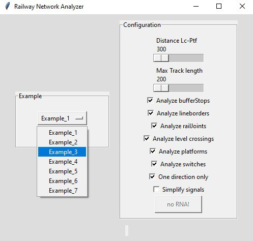
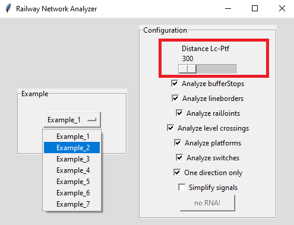

# Example_3
## Description
Name: AdvancedExample.RailAID

This example is mentioned in the manuscript titled: "Automatic Railway Signalling Generation for Railways Systems Described on Railway Markup Language (railML)". Henceforth, when we refer to the manuscript, we will do it as [[1]](#references).

## Analysis principles

The signalling generation process used in this work was designed following signalling principles detailed in [[1]](#references) in the section "I. INTRODUCTION".

## Step by step

The following is the general methodology or "step by step" followed for analysing a railway network with the approach of this work [[1]](#references).

A. Import the railway layout description.

B. Define a graph network to associate the railway elements.

C. Infrastructure analysis

D. Detect CDL zones.

E. Generate signalling.

F. Simplify signalling.

G. Logfile generated by RNA.

H. Comparing interlocking tables.

E. Extra

Each step is explained below.

### A. Import the railway layout description

After having installed the RNA program according to the steps shown in the the section ["Usage"](https://github.com/GICSAFePhD/Layouts#usage), run the Python archive "main_GUI.py". This action produces the program output shown in Figure 1.

*Figure 1. Select example.*

The necessary information to define the graph network is distributed across several sections of the railML file, specifically inside netElements (nodes) and netRelations (edges) items found in the class Infrastructure/Topology as described in [[1]](#references).

Figure 2 shows the railway network without signalling. The user will need the Design4Rail Horizon Software Suite Track Planner application and import the archive "Example_3.railml" to visualise the railway network used in this example. 

For further information about the Design4Rail Horizon Software Suite and the Track Planner application, please refer to [Official web page of Design4Rail](https://design4rail.com/service/d4rhorizon/#section-downloadHorizon).

For a detailed explanation about importing railML files, go to section [G.1](#g1-obtaining-the-interlocking-table-in-design4rail) of this document. 

*Figure 2. Railway network without signalling.*

### B. Define a graph network to associate the railway elements

This step allows us to evaluate the consistency of the network connections provided in the RailML file, through the determination of the direction, position, and interconnection of each of the nodes of the given railway network.

In [[1]](#references), in the section "II. RAILWAY NETWORK ANALYZER DESIGN" in literal B, we see Algorithm 1, which explains the network analysis process.

The result of this RNA step is show in Console Output 1:

~~~
#################### Starting Railway Network Analyzer ####################
Reading .railML file
Creating railML object
Analysing railML object
 Analysing graph
ne1 [-2010, 300] [-300, 300] >>   
ne4 [7083, 150] [6686, 150] <<    
ne7 [-2010, 150] [-300, 300] >>   
ne9 [-300, 300] [188, 300] >>     
ne11 [2580, 300] [2730, 150] >>   
ne14 [2730, 150] [2190, 150] <<   
ne17 [4380, 300] [2580, 300] <<   
ne23 [3810, -900] [2490, -1050] <<
ne24 [3810, -900] [2490, -1050] <<
ne26 [2490, -1050] [2138, -1050] <<
ne29 [-996, -1050] [239, -1050] >>
ne30 [-996, -1050] [-1373, -1050] <<
ne32 [239, -1050] [-150, -1050] <<
ne41 [-966, -1200] [-300, -1200] >>
ne43 [1560, -1050] [1710, -1200] >>
ne44 [1560, -1050] [1165, -1050] <<
ne47 [1710, -1200] [1290, -1200] <<
ne48 [1710, -1200] [1920, -1410] >>
ne59 [2009, 300] [2580, 300] >>
ne64 [4108, -782] [3810, -900] <<
ne65 [2138, -1050] [1866, -1050] <<
ne67 [2984, -480] [3882, -480] >>
ne70 [2984, -480] [2910, 0] <<
ne78 [4380, 300] [4825, 300] >>
ne79 [4230, 150] [4380, 300] >>
ne82 [-150, -1050] [-300, -1200] <<
ne83 [-150, -1050] [-996, -1050] <<
ne84 [-300, -1200] [-966, -1350] <<
ne86 [-2013, -750] [-1673, -750] >>
ne87 [-1673, -750] [-1523, -900] >>
ne88 [-1673, -750] [-1323, -750] >>
ne89 [-1373, -1050] [-2013, -1050] <<
ne90 [-2013, -900] [-1523, -900] >>
ne91 [-1523, -900] [-1373, -1050] >>
ne93 [4825, 300] [5149, 300] >>
ne94 [4826, 150] [4230, 150] <<
ne95 [188, 300] [2009, 300] >>
ne96 [5149, 300] [5842, 300] >>
ne97 [5149, 150] [4826, 150] <<
ne98 [5842, 300] [6686, 300] >>
ne99 [5841, 150] [5149, 150] <<
ne100 [880, -1050] [578, -1050] <<
ne101 [1165, -1050] [880, -1050] <<
ne102 [1866, -1050] [1560, -1050] <<
ne103 [3882, -480] [4108, -782] >>
ne105 [6686, 300] [7083, 300] >>
ne106 [6686, 150] [5841, 150] <<
ne85 [-300, -1200] [578, -1050] >>
ne77 [4230, 150] [3045, 75] <<
ne104 [2910, 0] [3045, 75] >>
ne52 [2730, 150] [3045, 75] >>
ne21 [4230, 150] [3045, 75] <<
ne110 [578, -1050] [239, -1050] <<
 The network is connected
~~~

*Console Output 1. Step B railway elements.*

In this example, the Console Output 1 shows that the program can identify the nodes and their directions. Consol Output 1 has, for example, this line: ne1 [-2010, 300] [-300, 300] >>, it indicates the name of the netElement (ne1), the position (origin [-2010, 30] and end point [-300, 300]) of the net element, and the direction (>>, at right in this case, but in other example it could have been at left: <<). If compare this Consol Output 1 with Figure 2, and analysing each "netElement", all elements are coincident. The same analysis for the others netElements.

### C and D. Infrastructure analysis and CDL zones detection

The process of analysing the infrastructure and detecting CDL zones produces one result: identifying the existence and position of each infrastructure element in the network: platforms, curves, level crossings,  buffer stops, derailers, lines,  operational points, signals, switches, tracks and detection elements (axle counters, rail joints and track circuits).

In section "II. RAILWAY NETWORK ANALYSER DESIGN" literal C of [1], it is shown Algorithm 2, which explains the process of analysing the network; and in the same section but in literal D, it is explained the process used to detect CDL zones.

The result of this step is shown in Console Output 2 and Figure 3.

~~~
Analysing infrastructure --> Infrastructure.RNA
 Detecting Danger --> Safe_points.RNA
  ne1 has a Platform[plf177] @ [-1539, -300]
  ne4 has a Middle point @ [6884.5, 150]
  ne7 has a Platform[plf178] @ [-1538, -150]
  ne7 has a Curve(2 lines) @ [[-450, 150]]
  ne9 has a Middle point @ [-56.0, 300]
  ne14 has a Middle point @ [2460.0, 150]
  ne17 has a Platform[plf185] @ [3623, -300]
  ne23 has a Platform[plf181] @ [3151, 1050]
  ne23 has a Curve(2 lines) @ [[3660, -1050]]
  ne24 has a Platform[plf182] @ [3151, 900]
  ne24 has a Curve(2 lines) @ [[2640, -900]]
  ne26 has a Middle point @ [2314.0, -1050]
  ne29 has a Curve(3 lines) @ [[-846, -900], [89, -900]]
  ne30 has a Middle point @ [-1184.5, -1050]
  ne32 has a Middle point @ [44.5, -1050]
  ne41 has a Platform[plf180] @ [-653, 1200]
  ne44 has a Middle point @ [1362.5, -1050]
  ne47 has a Middle point @ [1500.0, -1200]
  ne59 has a Middle point @ [2294.5, 300]
  ne64 has a Curve(2 lines) @ [[3990, -900]]
  ne65 has a Middle point @ [2002.0, -1050]
  ne67 has a Platform[plf183] @ [3430, 480]
  ne70 has a Curve(5 lines) @ [[2670, -150], [2820, -480], [2820, 0], [2910, 0]]
  ne78 has a Middle point @ [4602.5, 300]
  ne83 has a Platform[plf179] @ [-653, 1050]
  ne84 has a Curve(2 lines) @ [[-450, -1350]]
  ne86 has a Middle point @ [-1843.0, -750]
  ne88 has a Middle point @ [-1498.0, -750]
  ne89 has a Middle point @ [-1799.7, -1050]
  ne89 has a Middle point @ [-1586.3, -1050]
  ne90 has a Middle point @ [-1768.0, -900]
  ne93 has a Middle point @ [4987.0, 300]
  ne94 has a Middle point @ [4528.0, 150]
  ne95 has a LevelCrossing[lcr176] @ [1100, -300]
  ne96 has a Platform[plf187] @ [5459, -300]
  ne97 has a Middle point @ [4987.5, 150]
  ne98 has a Middle point @ [6053.0, 300]
  ne98 has a Middle point @ [6264.0, 300]
  ne98 has a Middle point @ [6475.0, 300]
  ne99 has a Platform[plf186] @ [5459, -150]
  ne100 has a Middle point @ [729.0, -1050]
  ne101 has a Middle point @ [1022.5, -1050]
  ne102 has a Middle point @ [1713.0, -1050]
  ne103 has a Curve(4 lines) @ [[3990, -480], [4108, -782], [4140, -630]]
  ne105 has a Middle point @ [6884.5, 300]
  ne106 has a Middle point @ [6052.2, 150]
  ne106 has a Middle point @ [6263.5, 150]
  ne106 has a Middle point @ [6474.8, 150]
  ne85 has a Curve(2 lines) @ [[428, -1200]]
  ne77 has a Platform[plf322] @ [3619, 0]
  ne77 has a Curve(3 lines) @ [[3120, 0], [4080, 0]]
  ne104 has a Curve(2 lines) @ [[2970, 0]]
  ne52 has a Curve(2 lines) @ [[2970, 150]]
  ne21 has a Platform[plf321] @ [3621, -150]
  ne21 has a Curve(2 lines) @ [[3120, 150]]
  ne110 has a Middle point @ [408.5, -1050]
~~~

*Console Output 2. Infraestructure analysis and CDL zone detection.*

*Figure 3. Infrastructure analysis and CDL zones detection: GUI Output.*

As an example, Figure 4 zoom in some of these elements.

*Figure 4. Infrastructure analysis and CDL zones detection: Layout.*

### E. Generate signalling

To obtain an analysis for each network element in the program configurations (view Figure 5), select only the options you want.

*Figure 5. Configuration options of RNA.*

Below, in subsections E.1, E.2, E.3, and E.4, you will find the sequence of configurations used to analyze, step by step, the railway in this example.

#### E.1. Signals generated due to line borders(L) and buffer stops(T)

The configuration of the RNA GUI application needed for this step of the analysis is shown in Figure 6.

*Figure 6. Configuring RNA to obtain signals for line borders(L) and buffer stops(T).*

Signals are enumerated since 00 with a prefix letter to indicate which element generates them. BufferStops and LineBorders signals start with T and L, respectively. In Figure 7, we can visualise the signals generated by applying algorithm 3, explained in [[1]](#references) section "III. SIGNALLING GENERATION".

In red letters, automatically added signals are shown.

The RNA allocates signals close to the buffer stops:

-- Stop: *T01*, *T03*, *T05*, *T07*, *T09*, *T11*, *T13*, *T15*, *T17*, *T19*, *T21*, *T23*
-- Departure: *T02*, *T04*, *T06*, *T08*, *T10*, *T12*, *T14*, *T16*, *T18*, *T20*, *T22*, *T24*

The RNA allocates signals close to the line borders. RNA allocates departure signals which are: *L25* to *L42* assigned close to every line border that belongs to a netElement whose track is longer than a configurable fixed length.

*Figure 7. Signals due to line borders(L) and buffer stops(T).*

#### E.2. Signals generated due to line borders(L),buffer stops(T) and rail joints (J)

The signals for rail joints are named J and have a consecutive number of signals.

Figure 8 shows the configuration of the RNA GUI application needed for this step of analysis.

*Figure 8. Configuring RNA to obtain signals for line borders(L), buffer stops(T) and rail joints (J).*

The algorithm assigns signals *J43* to *J49* at the beginning and end of each track to indicate the rail joints as shown in Figure 9.

*Figure 9. Signals due to line borders(L), buffer stops(T) and rail joints (J).*

#### E.3. Signals generated due to line borders(L),buffer stops(T),rail joints (J), platforms(P) and level crossings(X)

The signals for platforms are named P, and signals for level crossings are named X. A consecutive number of signals is assigned for each type of signalling.

The configuration of the RNA GUI application needed for this step of the analysis is shown in Figure 10.

*Figure 10. Configuring RNA to obtain signals for line borders(L),buffer stops(T),rail joints (J), platforms(P) and level crossings(X).*

Notice that RNA can be configured to avoid adding duplicate signals when the level crossing and the platform are close together, as discussed in [[1]](#references), and therefore, the signalling between them is unnecessary. However, this configuration is a special parameter in RNA. For furthermore information about this, see section [G.3.1.2.](#g32-minimum-distance-parameter) 

It is necessary to introduce signals before the train reaches the level crossing as explained in Algorithm 5, explained in [[1]](#references) section "III. SIGNALLING GENERATION".

Also, it is necessary to have a departure signal after the platform. This logic is implemented using Algorithm 6, explained in [[1]](#references) section "III. SIGNALLING GENERATION".

In red letters, the signals Generated due level crossings and platforms are shown in Figure 11.

*Figure 11. Signals due to line borders(L),buffer stops(T),rail joints (J), platforms(P) and level crossings(X).*

#### E.4. Signals generated due to line borders(L),buffer stops(T),rail joints (J), platforms(P),level crossings(X) and switches(S,H,C,B)

Figure 6 shows the configuration of the RNA GUI application needed for this step of analysis.

*Figure 12. Configuring RNA to obtain signals for line borders(L),buffer stops(T),rail joints (J), platforms(P),level crossings(X) and switches(S,H,C,B).*

The signals for switches are named based on the point they want to protect: S for Starting branch, C for the Continue branch and B for the Detour branch. There are also signals whose name starts with H that are not explicitly protecting the starting branch, the continue branch or the detour branch of a switch. These H signals are explained in [[1]](#references) section "III. SIGNALLING GENERATION" in literal E, where a manoeuvre signal numbered with H is always added plus the corresponding numbering sequence by Algorithm 7. This manoeuvre signal always accompanies the signal of the start branch (S) of the switch, and its function is to protect the railway elements that are after this signal (i.e. elements that are in the detour branch and in the continue branch).

Signals generated for (in red letters, added signals are shown):

- Sw04: *S113*, *C112*, *H114*
- Sw05: *B125 *
- Sw08: *S97*, *C95*, *B96*, *H98*, *H99*
- Sw09: *S102*, *C100*, *B101*, *H103*
- Sw11: *S116*, *C115*, *H117*
- Sw12: *S119*, *C118*, *H120*, *H121*
- Sw13: *B123*
- Sw41: *S126*, *C124*

(Only switches in Figure 4 were analised in the previous list, all the others are shown in Figure 13)

*Figure 13. Signals due to line borders(L),buffer stops(T),rail joints (J), platforms(P),level crossings(X) and switches(S,H,C,B).*

### F. Simplify signalling

The signal simplification process used by RNA relies on two main principles: i) vertical inheritance and ii) horizontal inheritance. Both principles are explained in [1] in section "IV. SIGNALLING SIMPLIFICATION".

To simplify signals mark the configuration option "Simplify signals", as shown in Figure 14.

*Figure 14. Configuring RNA to simplify signalling.*

After the simplification only the appropriate signals are kept, as shown in Figure 15.

*Figure 15. Signalling simplification.*

The simplification process was carried out according to the process described in section IV. SIGNALLING SIMPLIFICATION of [[1]](#references), as follows:

- **Simplification by vertical inheritance**

    Vertical inheritance was applied when the B signals of the Sw12 and Sw13 were moved to the signals H33 y H36, respectably. These signals B were not created because of the RNA when analysing the switches,  applying Algorithm 8 explained in section IV. SIGNALLING SIMPLIFICATION of [[1]](#references), literal A. The same simplification was done for moving signals C and S from ne9 to become H23 and H24.

- **Simplification by horizontal inheritance**

    The simplified signals due to horizontal inheritance are follows: S116 anc C122 were deleted due these were nearby T16, and have the same direction and orientation, but T16 has a higher priority. The same situation occurs between signals B123 and T21; between C95 and P56 and between C112 and P57. In all cases, is applied Algorithm 9 (described in section IV. SIGNALLING SIMPLIFICATION of [[1]](#references)). This algorithm was designed to group nearby objects as one single object, and generating signals according to the leftmost and rightmost railway element in the new single object. 
    
    The signal priority used to decide which signal remains and which is deleted is explained in section IV. SIGNALLING SIMPLIFICATION of [[1]](#references), literal B.  

~~~
Reducing redundant signals
 removing sig52 for sig01
 removing sig53 for sig02
 removing sig25 for sig04
 removing sig54 for sig05
 removing sig55 for sig06
 removing sig79 for sig06
 removing sig85 for sig08
 removing sig58 for sig09
 removing sig59 for sig10
 removing sig108 for sig11
 removing sig116 for sig16
 removing sig122 for sig16
 removing sig115 for sig18
 removing sig118 for sig20
 removing sig123 for sig22
 removing sig26 for sig44
 removing sig44 for sig26
 removing sig46 for sig26
 removing sig71 for sig36
 removing sig36 for sig71
 removing sig39 for sig68
 removing sig68 for sig39
 removing sig47 for sig45
 removing sig45 for sig80
 removing sig50 for sig48
 removing sig51 for sig49
 removing sig78 for sig53
 removing sig95 for sig56
 removing sig112 for sig57
 removing sig82 for sig66
 removing sig109 for sig67
 removing sig76 for sig74
 removing sig77 for sig75
 removing sig88 for sig93
 removing sig107 for sig105
~~~

### G. Output generated by RNA

Once the signalling is generated, it is necessary to establish the railway routes to create the railway interlocking table. A railway route is the simplest path between two consecutive signals in the same direction, using the same tracks (see [[1]](#references)). RNA generates 4 logfiles as a summary of all the analysis, these files are: 

- Infrastructure.RNA: summary of elements node per node. 
- Safe_points.RNA: absolute coordinates of every point where it is safe to add signals depending on prev/next direction, node per node.
- Signalling: summary of all the signalling generated and their relevant information.
- Routes.RNA: Interlocking table with the information of each route.

Aditionally, RNA generates the object that will be used by the ACG. The logfiles are a summary of the information contained in the object.

#### G.1 Infrastructure.RNA: 

~~~
Nodes: 53 | Switches: 15 | Signals: 0 | Detectors: 7 | Ends: 30 | Barriers: 1
Node ne1:
	Lines -> line442
	Lines -> line443
	Lines -> line451
	Lines -> line445
	Lines -> line446
	Lines -> line447
	Lines -> line448
	Track = track1
	TrainDetectionElements -> ac235
		Type -> axleCounter
		Side -> right
	Type = BufferStop -> ['bus2']
	Neighbours = 2 -> ['ne9', 'ne7']
Node ne4:
	Lines -> line442
	Lines -> line443
	Lines -> line451
	Lines -> line445
	Lines -> line446
	Lines -> line447
	Lines -> line448
	Track = track3
	Type = BufferStop -> ['bus5']
	Neighbours = 1 -> ['ne106']
Node ne7:
	Lines -> line442
	Lines -> line443
	Lines -> line451
	Lines -> line445
	Lines -> line446
	Lines -> line447
	Lines -> line448
	Track = track5
	TrainDetectionElements -> ac236
		Type -> axleCounter
		Side -> left
	Type = BufferStop -> ['bus8']
	Neighbours = 2 -> ['ne1', 'ne9']
Node ne9:
	Lines -> line442
	Lines -> line443
	Lines -> line451
	Lines -> line445
	Lines -> line446
	Lines -> line447
	Lines -> line448
	Track = track6
	TrainDetectionElements -> ac237
		Type -> axleCounter
		Side -> right
	TrainDetectionElements -> ac238
		Type -> axleCounter
		Side -> right
	Neighbours = 3 -> ['ne1', 'ne7', 'ne95']
	Switches -> 68W02
		ContinueCourse -> right -> ne1
		BranchCourse -> left -> ne7
Node ne11:
	Lines -> line442
	Lines -> line443
	Lines -> line451
	Lines -> line445
	Lines -> line446
	Lines -> line447
	Lines -> line448
	Track = track8
	Neighbours = 4 -> ['ne59', 'ne17', 'ne52', 'ne14']
Node ne14:
	Lines -> line442
	Lines -> line443
	Lines -> line451
	Lines -> line445
	Lines -> line446
	Lines -> line447
	Lines -> line448
	Track = track4
	Derailer -> der172
		 Side -> left
	Type = BufferStop -> ['bus6']
	Neighbours = 2 -> ['ne11', 'ne52']
Node ne17:
	Lines -> line442
	Lines -> line443
	Lines -> line451
	Lines -> line445
	Lines -> line446
	Lines -> line447
	Lines -> line448
	Track = track7
	Neighbours = 4 -> ['ne11', 'ne78', 'ne79', 'ne59']
Node ne23:
	Lines -> line442
	Lines -> line443
	Lines -> line451
	Lines -> line445
	Lines -> line446
	Lines -> line447
	Lines -> line448
	Track = track12
	Neighbours = 3 -> ['ne64', 'ne24', 'ne26']
Node ne24:
	Lines -> line442
	Lines -> line443
	Lines -> line451
	Lines -> line445
	Lines -> line446
	Lines -> line447
	Lines -> line448
	Track = track11
	Neighbours = 3 -> ['ne23', 'ne64', 'ne26']
Node ne26:
	Lines -> line442
	Lines -> line443
	Lines -> line451
	Lines -> line445
	Lines -> line446
	Lines -> line447
	Lines -> line448
	Track = track13
	Neighbours = 3 -> ['ne23', 'ne24', 'ne65']
	Switches -> 70W02
		ContinueCourse -> right -> ne23
		BranchCourse -> left -> ne24
Node ne29:
	Lines -> line442
	Lines -> line443
	Lines -> line451
	Lines -> line445
	Lines -> line446
	Lines -> line447
	Lines -> line448
	Track = track16
	Neighbours = 4 -> ['ne30', 'ne83', 'ne32', 'ne110']
Node ne30:
	Lines -> line442
	Lines -> line443
	Lines -> line451
	Lines -> line445
	Lines -> line446
	Lines -> line447
	Lines -> line448
	Track = track14
	Neighbours = 4 -> ['ne29', 'ne83', 'ne89', 'ne91']
	Switches -> Sw08
		ContinueCourse -> right -> ne83
		BranchCourse -> left -> ne29
	Switches -> Sw12
		ContinueCourse -> left -> ne89
		BranchCourse -> right -> ne91
Node ne32:
	Lines -> line442
	Lines -> line443
	Lines -> line451
	Lines -> line445
	Lines -> line446
	Lines -> line447
	Lines -> line448
	Track = track18
	Neighbours = 4 -> ['ne29', 'ne83', 'ne82', 'ne110']
	Switches -> Sw04
		ContinueCourse -> right -> ne83
		BranchCourse -> left -> ne82
Node ne41:
	Lines -> line442
	Lines -> line443
	Lines -> line451
	Lines -> line445
	Lines -> line446
	Lines -> line447
	Lines -> line448
	Track = track19
	Type = BufferStop -> ['bus37']
	Neighbours = 3 -> ['ne82', 'ne84', 'ne85']
Node ne43:
	Lines -> line442
	Lines -> line443
	Lines -> line451
	Lines -> line445
	Lines -> line446
	Lines -> line447
	Lines -> line448
	Track = track21
	Neighbours = 4 -> ['ne44', 'ne48', 'ne47', 'ne102']
Node ne44:
	Lines -> line442
	Lines -> line443
	Lines -> line451
	Lines -> line445
	Lines -> line446
	Lines -> line447
	Lines -> line448
	Track = track20
	Neighbours = 3 -> ['ne43', 'ne101', 'ne102']
	Switches -> 71W01
		ContinueCourse -> left -> ne102
		BranchCourse -> right -> ne43
Node ne47:
	Lines -> line442
	Lines -> line443
	Lines -> line451
	Lines -> line445
	Lines -> line446
	Lines -> line447
	Lines -> line448
	Track = track23
	Type = BufferStop -> ['bus50']
	Neighbours = 2 -> ['ne43', 'ne48']
Node ne48:
	Lines -> line442
	Lines -> line443
	Lines -> line451
	Lines -> line445
	Lines -> line446
	Lines -> line447
	Lines -> line448
	Track = track22
	Neighbours = 2 -> ['ne43', 'ne47']
	Switches -> 71W02
		ContinueCourse -> right -> ne43
		BranchCourse -> left -> ne47
Node ne59:
	Lines -> line442
	Lines -> line443
	Lines -> line451
	Lines -> line445
	Lines -> line446
	Lines -> line447
	Lines -> line448
	TrainDetectionElements -> ac241
		Type -> axleCounter
		Side -> left
	Neighbours = 3 -> ['ne11', 'ne17', 'ne95']
	Switches -> 69W03
		ContinueCourse -> left -> ne17
		BranchCourse -> right -> ne11
Node ne64:
	Lines -> line442
	Lines -> line443
	Lines -> line451
	Lines -> line445
	Lines -> line446
	Lines -> line447
	Lines -> line448
	Track = track10
	Neighbours = 3 -> ['ne23', 'ne24', 'ne103']
	Switches -> 70W01
		ContinueCourse -> right -> ne24
		BranchCourse -> left -> ne23
Node ne65:
	Lines -> line442
	Lines -> line443
	Lines -> line451
	Lines -> line445
	Lines -> line446
	Lines -> line447
	Lines -> line448
	Neighbours = 2 -> ['ne26', 'ne102']
Node ne67:
	Lines -> line442
	Lines -> line443
	Lines -> line451
	Lines -> line445
	Lines -> line446
	Lines -> line447
	Lines -> line448
	Neighbours = 2 -> ['ne70', 'ne103']
Node ne70:
	Lines -> line442
	Lines -> line443
	Lines -> line451
	Lines -> line445
	Lines -> line446
	Lines -> line447
	Lines -> line448
	Neighbours = 2 -> ['ne67', 'ne104']
Node ne78:
	Lines -> line442
	Lines -> line443
	Lines -> line451
	Lines -> line445
	Lines -> line446
	Lines -> line447
	Lines -> line448
	Neighbours = 3 -> ['ne17', 'ne79', 'ne93']
	Switches -> Sw06
		ContinueCourse -> right -> ne17
		BranchCourse -> left -> ne79
Node ne79:
	Lines -> line442
	Lines -> line443
	Lines -> line451
	Lines -> line445
	Lines -> line446
	Lines -> line447
	Lines -> line448
	Track = track24
	Neighbours = 5 -> ['ne17', 'ne78', 'ne94', 'ne77', 'ne21']
Node ne82:
	Lines -> line442
	Lines -> line443
	Lines -> line451
	Lines -> line445
	Lines -> line446
	Lines -> line447
	Lines -> line448
	Track = track25
	Neighbours = 5 -> ['ne32', 'ne41', 'ne83', 'ne84', 'ne85']
Node ne83:
	Lines -> line442
	Lines -> line443
	Lines -> line451
	Lines -> line445
	Lines -> line446
	Lines -> line447
	Lines -> line448
	Track = track15
	Neighbours = 4 -> ['ne29', 'ne30', 'ne32', 'ne82']
Node ne84:
	Lines -> line442
	Lines -> line443
	Lines -> line451
	Lines -> line445
	Lines -> line446
	Lines -> line447
	Lines -> line448
	Track = track26
	Type = BufferStop -> ['bus327']
	Neighbours = 3 -> ['ne41', 'ne82', 'ne85']
Node ne86:
	Lines -> line442
	Lines -> line443
	Lines -> line451
	Lines -> line445
	Lines -> line446
	Lines -> line447
	Lines -> line448
	Track = track28
	Type = BufferStop -> ['bus331']
	Neighbours = 2 -> ['ne88', 'ne87']
	Switches -> Sw11
		ContinueCourse -> left -> ne88
		BranchCourse -> right -> ne87
Node ne87:
	Lines -> line442
	Lines -> line443
	Lines -> line451
	Lines -> line445
	Lines -> line446
	Lines -> line447
	Lines -> line448
	Track = track30
	Neighbours = 4 -> ['ne86', 'ne88', 'ne91', 'ne90']
Node ne88:
	Lines -> line442
	Lines -> line443
	Lines -> line451
	Lines -> line445
	Lines -> line446
	Lines -> line447
	Lines -> line448
	Track = track29
	Type = BufferStop -> ['bus332']
	Neighbours = 2 -> ['ne86', 'ne87']
Node ne89:
	Lines -> line442
	Lines -> line443
	Lines -> line451
	Lines -> line445
	Lines -> line446
	Lines -> line447
	Lines -> line448
	Track = track27
	Type = BufferStop -> ['bus330']
	Neighbours = 2 -> ['ne30', 'ne91']
Node ne90:
	Lines -> line442
	Lines -> line443
	Lines -> line451
	Lines -> line445
	Lines -> line446
	Lines -> line447
	Lines -> line448
	Track = track32
	Type = BufferStop -> ['bus335']
	Neighbours = 2 -> ['ne87', 'ne91']
Node ne91:
	Lines -> line442
	Lines -> line443
	Lines -> line451
	Lines -> line445
	Lines -> line446
	Lines -> line447
	Lines -> line448
	Track = track31
	Neighbours = 4 -> ['ne30', 'ne87', 'ne89', 'ne90']
	Switches -> Sw13
		ContinueCourse -> right -> ne87
		BranchCourse -> left -> ne90
Node ne93:
	Lines -> line442
	Lines -> line443
	Lines -> line451
	Lines -> line445
	Lines -> line446
	Lines -> line447
	Lines -> line448
	Neighbours = 2 -> ['ne78', 'ne96']
Node ne94:
	Lines -> line442
	Lines -> line443
	Lines -> line451
	Lines -> line445
	Lines -> line446
	Lines -> line447
	Lines -> line448
	Neighbours = 4 -> ['ne79', 'ne97', 'ne77', 'ne21']
Node ne95:
	Lines -> line442
	Lines -> line443
	Lines -> line451
	Lines -> line445
	Lines -> line446
	Lines -> line447
	Lines -> line448
	TrainDetectionElements -> ac239
		Type -> axleCounter
		Side -> left
	TrainDetectionElements -> ac240
		Type -> axleCounter
		Side -> left
	Neighbours = 2 -> ['ne9', 'ne59']
	Level crossing -> lcr176
		Protection -> true | Barriers -> doubleHalfBarrier | Lights -> none Acoustic -> bell
		Position -> [1145, -300] | Coordinate: 0.5254
Node ne96:
	Lines -> line442
	Lines -> line443
	Lines -> line451
	Lines -> line445
	Lines -> line446
	Lines -> line447
	Lines -> line448
	Neighbours = 2 -> ['ne93', 'ne98']
Node ne97:
	Lines -> line442
	Lines -> line443
	Lines -> line451
	Lines -> line445
	Lines -> line446
	Lines -> line447
	Lines -> line448
	Neighbours = 2 -> ['ne94', 'ne99']
Node ne98:
	Lines -> line442
	Lines -> line443
	Lines -> line451
	Lines -> line445
	Lines -> line446
	Lines -> line447
	Lines -> line448
	Neighbours = 2 -> ['ne96', 'ne105']
Node ne99:
	Lines -> line442
	Lines -> line443
	Lines -> line451
	Lines -> line445
	Lines -> line446
	Lines -> line447
	Lines -> line448
	Neighbours = 2 -> ['ne97', 'ne106']
Node ne100:
	Lines -> line442
	Lines -> line443
	Lines -> line451
	Lines -> line445
	Lines -> line446
	Lines -> line447
	Lines -> line448
	Neighbours = 3 -> ['ne101', 'ne110', 'ne85']
	Switches -> Sw41
		ContinueCourse -> right -> ne110
		BranchCourse -> left -> ne85
Node ne101:
	Lines -> line442
	Lines -> line443
	Lines -> line451
	Lines -> line445
	Lines -> line446
	Lines -> line447
	Lines -> line448
	Neighbours = 2 -> ['ne44', 'ne100']
Node ne102:
	Lines -> line442
	Lines -> line443
	Lines -> line451
	Lines -> line445
	Lines -> line446
	Lines -> line447
	Lines -> line448
	Neighbours = 3 -> ['ne43', 'ne44', 'ne65']
Node ne103:
	Lines -> line442
	Lines -> line443
	Lines -> line451
	Lines -> line445
	Lines -> line446
	Lines -> line447
	Lines -> line448
	Neighbours = 2 -> ['ne64', 'ne67']
Node ne105:
	Lines -> line442
	Lines -> line443
	Lines -> line451
	Lines -> line445
	Lines -> line446
	Lines -> line447
	Lines -> line448
	Track = track2
	Type = BufferStop -> ['bus3']
	Neighbours = 1 -> ['ne98']
Node ne106:
	Lines -> line442
	Lines -> line443
	Lines -> line451
	Lines -> line445
	Lines -> line446
	Lines -> line447
	Lines -> line448
	Neighbours = 2 -> ['ne4', 'ne99']
Node ne85:
	Lines -> line442
	Lines -> line443
	Lines -> line451
	Lines -> line445
	Lines -> line446
	Lines -> line447
	Lines -> line448
	Track = track33
	Neighbours = 5 -> ['ne41', 'ne82', 'ne84', 'ne100', 'ne110']
Node ne77:
	Lines -> line442
	Lines -> line443
	Lines -> line451
	Lines -> line445
	Lines -> line446
	Lines -> line447
	Lines -> line448
	Track = track34
	Neighbours = 5 -> ['ne79', 'ne94', 'ne104', 'ne52', 'ne21']
Node ne104:
	Lines -> line442
	Lines -> line443
	Lines -> line451
	Lines -> line445
	Lines -> line446
	Lines -> line447
	Lines -> line448
	Neighbours = 4 -> ['ne70', 'ne77', 'ne21', 'ne52']
Node ne52:
	Lines -> line442
	Lines -> line443
	Lines -> line451
	Lines -> line445
	Lines -> line446
	Lines -> line447
	Lines -> line448
	Track = track9
	Neighbours = 5 -> ['ne11', 'ne14', 'ne77', 'ne104', 'ne21']
	Switches -> 69W04
		ContinueCourse -> left -> ne14
		BranchCourse -> right -> ne11
Node ne21:
	Lines -> line442
	Lines -> line443
	Lines -> line451
	Lines -> line445
	Lines -> line446
	Lines -> line447
	Lines -> line448
	Track = track35
	Neighbours = 5 -> ['ne79', 'ne94', 'ne77', 'ne104', 'ne52']
Node ne110:
	Lines -> line442
	Lines -> line443
	Lines -> line451
	Lines -> line445
	Lines -> line446
	Lines -> line447
	Lines -> line448
	Track = track17
	Neighbours = 4 -> ['ne29', 'ne32', 'ne100', 'ne85']
	Switches -> Sw09
		ContinueCourse -> left -> ne32
		BranchCourse -> right -> ne29
~~~

#### G.2 Safe_points.RNA: 

~~~
ne1:
  Next: [[-1739, -300]]
  Prev: [[-1339, -300]]
ne4:
  Next: [[6884.5, 150]]
  Prev: [[6884.5, 150]]
ne7:
  Next: [[-1738, -150], [-550.0, 150]]
  Prev: [[-1338, -150]]
ne9:
  Next: [[-56.0, 300]]
  Prev: [[-56.0, 300]]
ne14:
  Next: [[2460.0, 150]]
  Prev: [[2460.0, 150]]
ne17:
  Next: [[3423, -300]]
  Prev: [[3823, -300]]
ne23:
  Next: [[2951, 1050], [3560.0, -1050]]
  Prev: [[3351, 1050]]
ne24:
  Next: [[2951, 900]]
  Prev: [[3351, 900], [2740.0, -900]]
ne26:
  Next: [[2314.0, -1050]]
  Prev: [[2314.0, -1050]]
ne29:
  Next: [[-11.0, -900]]
  Prev: [[-746.0, -900]]
ne30:
  Next: [[-1184.5, -1050]]
  Prev: [[-1184.5, -1050]]
ne32:
  Next: [[44.5, -1050]]
  Prev: [[44.5, -1050]]
ne41:
  Next: [[-853, 1200]]
  Prev: [[-453, 1200]]
ne44:
  Next: [[1362.5, -1050]]
  Prev: [[1362.5, -1050]]
ne47:
  Next: [[1500.0, -1200]]
  Prev: [[1500.0, -1200]]
ne59:
  Next: [[2294.5, 300]]
  Prev: [[2294.5, 300]]
ne64:
  Next: [[3890.0, -900]]
ne65:
  Next: [[2002.0, -1050]]
  Prev: [[2002.0, -1050]]
ne67:
  Next: [[3230, 480]]
  Prev: [[3630, 480]]
ne70:
  Next: [[2570.0, -150], [2720.0, -480], [2810.0, 0]]
  Prev: [[2770.0, -150], [2920.0, -480], [2920.0, 0]]
ne78:
  Next: [[4602.5, 300]]
  Prev: [[4602.5, 300]]
ne83:
  Next: [[-853, 1050]]
  Prev: [[-453, 1050]]
ne84:
  Next: [[-550.0, -1350]]
ne86:
  Next: [[-1843.0, -750]]
  Prev: [[-1843.0, -750]]
ne88:
  Next: [[-1498.0, -750]]
  Prev: [[-1498.0, -750]]
ne89:
  Next: [[-1799.7, -1050], [-1586.3, -1050]]
  Prev: [[-1799.7, -1050], [-1586.3, -1050]]
ne90:
  Next: [[-1768.0, -900]]
  Prev: [[-1768.0, -900]]
ne93:
  Next: [[4987.0, 300]]
  Prev: [[4987.0, 300]]
ne94:
  Next: [[4528.0, 150]]
  Prev: [[4528.0, 150]]
ne95:
  Next: [[900, -300]]
  Prev: [[1300, -300]]
ne96:
  Next: [[5259, -300]]
  Prev: [[5659, -300]]
ne97:
  Next: [[4987.5, 150]]
  Prev: [[4987.5, 150]]
ne98:
  Next: [[6053.0, 300], [6264.0, 300], [6475.0, 300]]
  Prev: [[6053.0, 300], [6264.0, 300], [6475.0, 300]]
ne99:
  Next: [[5259, -150]]
  Prev: [[5659, -150]]
ne100:
  Next: [[729.0, -1050]]
  Prev: [[729.0, -1050]]
ne101:
  Next: [[1022.5, -1050]]
  Prev: [[1022.5, -1050]]
ne102:
  Next: [[1713.0, -1050]]
  Prev: [[1713.0, -1050]]
ne103:
  Next: [[3890.0, -480], [4008.0, -782], [4040.0, -630]]
  Prev: [[4208.0, -782], [4240.0, -630]]
ne105:
  Next: [[6884.5, 300]]
  Prev: [[6884.5, 300]]
ne106:
  Next: [[6052.2, 150], [6263.5, 150], [6474.8, 150]]
  Prev: [[6052.2, 150], [6263.5, 150], [6474.8, 150]]
ne85:
  Next: [[328.0, -1200]]
ne77:
  Next: [[3419, 0], [3980.0, 0]]
  Prev: [[3819, 0], [3220.0, 0]]
ne104:
  Next: [[2870.0, 0]]
ne52:
  Next: [[2870.0, 150]]
ne21:
  Next: [[3421, -150]]
  Prev: [[3821, -150], [3220.0, 150]]
ne110:
  Next: [[408.5, -1050]]
  Prev: [[408.5, -1050]]
~~~

#### G.3 Signalling.RNA: 

~~~
sig01 [T01] <<:
	From: ne1 | To: bus2_left
	Type: Stop | Direction: reverse | AtTrack: right 
	Position: [-1910, -300] | Coordinate: 0.0584
sig02 [T02] >>:
	From: ne1 | To: ne1_right
	Type: Stop | Direction: normal | AtTrack: left 
	Position: [-1910, -300] | Coordinate: 0.0584
sig03 [T03] >>:
	From: ne4 | To: bus5_right
	Type: Stop | Direction: reverse | AtTrack: right 
	Position: [6983, -150] | Coordinate: 0.7481
sig05 [T05] <<:
	From: ne7 | To: bus8_left
	Type: Stop | Direction: reverse | AtTrack: right 
	Position: [-1910, -150] | Coordinate: 0.1761
sig06 [T06] >>:
	From: ne7 | To: ne7_right
	Type: Stop | Direction: normal | AtTrack: left 
	Position: [-1910, -150] | Coordinate: 0.1761
sig07 [T07] <<:
	From: ne14 | To: bus6_left
	Type: Stop | Direction: normal | AtTrack: left 
	Position: [2290, -150] | Coordinate: 0.1851
sig08 [T08] >>:
	From: ne14 | To: ne14_right
	Type: Stop | Direction: reverse | AtTrack: right 
	Position: [2290, -150] | Coordinate: 0.1851
sig09 [T09] <<:
	From: ne41 | To: bus37_left
	Type: Stop | Direction: reverse | AtTrack: right 
	Position: [-866, 1200] | Coordinate: 0.1501
sig10 [T10] >>:
	From: ne41 | To: ne41_right
	Type: Stop | Direction: normal | AtTrack: left 
	Position: [-866, 1200] | Coordinate: 0.1501
sig11 [T11] <<:
	From: ne47 | To: bus50_left
	Type: Stop | Direction: normal | AtTrack: left 
	Position: [1390, 1200] | Coordinate: 0.2380
sig12 [T12] >>:
	From: ne47 | To: ne47_right
	Type: Stop | Direction: reverse | AtTrack: right 
	Position: [1390, 1200] | Coordinate: 0.2380
sig13 [T13] <<:
	From: ne84 | To: bus327_left
	Type: Stop | Direction: normal | AtTrack: left 
	Position: [-866, 1350] | Coordinate: 0.4286
sig14 [T14] >>:
	From: ne84 | To: ne84_right
	Type: Stop | Direction: reverse | AtTrack: right 
	Position: [-866, 1350] | Coordinate: 0.4286
sig15 [T15] <<:
	From: ne86 | To: bus331_left
	Type: Stop | Direction: reverse | AtTrack: right 
	Position: [-1913, 750] | Coordinate: 0.2941
sig16 [T16] >>:
	From: ne86 | To: ne86_right
	Type: Stop | Direction: normal | AtTrack: left 
	Position: [-1913, 750] | Coordinate: 0.2941
sig17 [T17] >>:
	From: ne88 | To: bus332_right
	Type: Stop | Direction: normal | AtTrack: left 
	Position: [-1423, 750] | Coordinate: 0.7142
sig18 [T18] <<:
	From: ne88 | To: ne88_left
	Type: Stop | Direction: reverse | AtTrack: right 
	Position: [-1423, 750] | Coordinate: 0.7142
sig19 [T19] <<:
	From: ne89 | To: bus330_left
	Type: Stop | Direction: normal | AtTrack: left 
	Position: [-1913, 1050] | Coordinate: 0.1562
sig20 [T20] >>:
	From: ne89 | To: ne89_right
	Type: Stop | Direction: reverse | AtTrack: right 
	Position: [-1913, 1050] | Coordinate: 0.1562
sig21 [T21] <<:
	From: ne90 | To: bus335_left
	Type: Stop | Direction: reverse | AtTrack: right 
	Position: [-1913, 900] | Coordinate: 0.2040
sig22 [T22] >>:
	From: ne90 | To: ne90_right
	Type: Stop | Direction: normal | AtTrack: left 
	Position: [-1913, 900] | Coordinate: 0.2040
sig23 [T23] >>:
	From: ne105 | To: bus3_right
	Type: Stop | Direction: normal | AtTrack: left 
	Position: [6983, -300] | Coordinate: 0.7481
sig24 [T24] <<:
	From: ne105 | To: ne105_left
	Type: Stop | Direction: reverse | AtTrack: right 
	Position: [6983, -300] | Coordinate: 0.7481
sig25 [L25] <<:
	From: ne4 | To: sb450_right
	Type: Circulation | Direction: normal | AtTrack: left 
	Position: [6983, -150] | Coordinate: 0.7481
sig27 [L27] <<:
	From: ne26 | To: sb307_left
	Type: Circulation | Direction: normal | AtTrack: left 
	Position: [2238, 1050] | Coordinate: 0.2840
sig28 [L28] <<:
	From: ne44 | To: sb437_left
	Type: Circulation | Direction: normal | AtTrack: left 
	Position: [1265, 1050] | Coordinate: 0.2531
sig29 [L29] >>:
	From: ne48 | To: line441_right
	Type: Circulation | Direction: normal | AtTrack: left 
	Position: [1820, 1410] | Coordinate: 0.7982
sig30 [L30] <<:
	From: ne65 | To: sb438_left
	Type: Circulation | Direction: normal | AtTrack: left 
	Position: [1966, 1050] | Coordinate: 0.3676
sig32 [L32] <<:
	From: ne70 | To: sb440_left
	Type: Circulation | Direction: normal | AtTrack: left 
	Position: [2770, 330] | Coordinate: 0.9020
sig33 [L33] >>:
	From: ne78 | To: sb398_left
	Type: Circulation | Direction: normal | AtTrack: left 
	Position: [4480, -300] | Coordinate: 0.2247
sig34 [L34] >>:
	From: ne93 | To: sb432_left
	Type: Circulation | Direction: normal | AtTrack: left 
	Position: [4925, -300] | Coordinate: 0.3086
sig35 [L35] >>:
	From: ne95 | To: sb301_left
	Type: Circulation | Direction: normal | AtTrack: left 
	Position: [288, -300] | Coordinate: 0.0549
sig37 [L37] <<:
	From: ne97 | To: sb399_left
	Type: Circulation | Direction: normal | AtTrack: left 
	Position: [4926, -150] | Coordinate: 0.3095
sig38 [L38] >>:
	From: ne98 | To: sb449_left
	Type: Circulation | Direction: normal | AtTrack: left 
	Position: [5942, -300] | Coordinate: 0.1184
sig40 [L40] <<:
	From: ne101 | To: sb436_left
	Type: Circulation | Direction: normal | AtTrack: left 
	Position: [980, 1050] | Coordinate: 0.3508
sig41 [L41] >>:
	From: ne103 | To: sb306_right
	Type: Circulation | Direction: normal | AtTrack: left 
	Position: [4008, 782] | Coordinate: 0.9693
sig42 [L42] <<:
	From: ne106 | To: sb435_left
	Type: Circulation | Direction: normal | AtTrack: left 
	Position: [5941, -150] | Coordinate: 0.1183
sig43 [J43] >>:
	From: ne7 | To: ne7_right
	Type: Circulation | Direction: normal | AtTrack: left 
	Position: [-550.0, -150] | Coordinate: 0.9435
sig46 [J46] >>:
	From: ne9 | To: ne9_right
	Type: Circulation | Direction: normal | AtTrack: left 
	Position: [-56.0, -300] | Coordinate: 0.5
sig50 [X50] >>:
	From: ne95 | To: ne95_right
	Type: Circulation | Direction: normal | AtTrack: left 
	Position: [900, 300] | Coordinate: 0.5113
sig51 [X51] <<:
	From: ne95 | To: ne95_left
	Type: Circulation | Direction: reverse | AtTrack: right 
	Position: [1300, 300] | Coordinate: 0.6938
sig56 [P56] <<:
	From: ne83 | To: ne83_left
	Type: Circulation | Direction: normal | AtTrack: left 
	Position: [-933, -1050] | Coordinate: 2.4833
sig57 [P57] >>:
	From: ne83 | To: ne83_right
	Type: Circulation | Direction: reverse | AtTrack: right 
	Position: [-373, -1050] | Coordinate: 2.5891
sig60 [P60] <<:
	From: ne23 | To: ne23_left
	Type: Circulation | Direction: normal | AtTrack: left 
	Position: [2871, -1050] | Coordinate: 1.6976
sig63 [P63] >>:
	From: ne24 | To: ne24_right
	Type: Circulation | Direction: reverse | AtTrack: right 
	Position: [3431, -900] | Coordinate: 1.5760
sig64 [P64] <<:
	From: ne67 | To: ne67_left
	Type: Circulation | Direction: reverse | AtTrack: right 
	Position: [3310, -480] | Coordinate: 1.1290
sig65 [P65] >>:
	From: ne67 | To: ne67_right
	Type: Circulation | Direction: normal | AtTrack: left 
	Position: [3550, -480] | Coordinate: 1.2410
sig66 [P66] <<:
	From: ne17 | To: ne17_left
	Type: Circulation | Direction: normal | AtTrack: left 
	Position: [3343, 300] | Coordinate: 0.5392
sig67 [P67] >>:
	From: ne17 | To: ne17_right
	Type: Circulation | Direction: reverse | AtTrack: right 
	Position: [3903, 300] | Coordinate: 0.8070
sig68 [P68] <<:
	From: ne99 | To: ne99_left
	Type: Circulation | Direction: normal | AtTrack: left 
	Position: [5179, 150] | Coordinate: 0.4356
sig69 [P69] >>:
	From: ne99 | To: ne99_right
	Type: Circulation | Direction: reverse | AtTrack: right 
	Position: [5739, 150] | Coordinate: 0.9564
sig70 [P70] <<:
	From: ne96 | To: ne96_left
	Type: Circulation | Direction: reverse | AtTrack: right 
	Position: [5339, 300] | Coordinate: 0.9081
sig71 [P71] >>:
	From: ne96 | To: ne96_right
	Type: Circulation | Direction: normal | AtTrack: left 
	Position: [5579, 300] | Coordinate: 1.0651
sig72 [P72] <<:
	From: ne21 | To: ne21_left
	Type: Circulation | Direction: normal | AtTrack: left 
	Position: [3341, 150] | Coordinate: 0.3936
sig73 [P73] >>:
	From: ne21 | To: ne21_right
	Type: Circulation | Direction: reverse | AtTrack: right 
	Position: [3901, 150] | Coordinate: 0.7752
sig76 [P76] <<:
	From: ne77 | To: ne77_left
	Type: Circulation | Direction: normal | AtTrack: left 
	Position: [3339, 0] | Coordinate: 0.4202
sig77 [P77] >>:
	From: ne77 | To: ne77_right
	Type: Circulation | Direction: reverse | AtTrack: right 
	Position: [3899, 0] | Coordinate: 0.8583
sig78 [C78] >>:
	From: ne1 | To: ne1_right
	Type: Circulation | Direction: normal | AtTrack: left 
	Position: [-1339, 300] | Coordinate: 0.5263
sig80 [S80] <<:
	From: ne9 | To: ne9_left
	Type: Circulation | Direction: reverse | AtTrack: right 
	Position: [-56.0, -300] | Coordinate: 0.5
sig83 [S83] >>:
	From: ne59 | To: ne59_right
	Type: Circulation | Direction: normal | AtTrack: left 
	Position: [2294.5, -300] | Coordinate: 0.5
sig86 [S86] <<:
	From: ne52 | To: ne52_left
	Type: Circulation | Direction: reverse | AtTrack: right 
	Position: [2870.0, -150] | Coordinate: 0.7110
sig89 [B89] >>:
	From: ne23 | To: ne23_right
	Type: Manouver | Direction: reverse | AtTrack: right 
	Position: [2951, -1050] | Coordinate: 1.7090
sig90 [S90] <<:
	From: ne64 | To: ne64_left
	Type: Circulation | Direction: normal | AtTrack: left 
	Position: [3890.0, 900] | Coordinate: 0.7117
sig92 [B92] >>:
	From: ne24 | To: ne24_left
	Type: Manouver | Direction: normal | AtTrack: right 
	Position: [3351, -900] | Coordinate: 1.5537
sig93 [S93] >>:
	From: ne26 | To: ne26_right
	Type: Circulation | Direction: reverse | AtTrack: right 
	Position: [2314.0, 1050] | Coordinate: 0.5
sig96 [B96] <<:
	From: ne29 | To: ne29_left
	Type: Manouver | Direction: normal | AtTrack: right 
	Position: [-746.0, 900] | Coordinate: 0.3856
sig97 [S97] >>:
	From: ne30 | To: ne30_right
	Type: Circulation | Direction: reverse | AtTrack: right 
	Position: [-1184.5, 1050] | Coordinate: 0.5
sig100 [C100] >>:
	From: ne32 | To: ne32_right
	Type: Circulation | Direction: reverse | AtTrack: right 
	Position: [44.5, 1050] | Coordinate: 0.5
sig101 [B101] <<:
	From: ne29 | To: ne29_right
	Type: Manouver | Direction: reverse | AtTrack: right 
	Position: [-11.0, 900] | Coordinate: 0.9264
sig102 [S102] <<:
	From: ne110 | To: ne110_left
	Type: Circulation | Direction: normal | AtTrack: left 
	Position: [408.5, 1050] | Coordinate: 0.5
sig104 [C104] <<:
	From: ne102 | To: ne102_left
	Type: Circulation | Direction: normal | AtTrack: left 
	Position: [1713.0, 1050] | Coordinate: 0.5
sig105 [S105] >>:
	From: ne44 | To: ne44_right
	Type: Circulation | Direction: reverse | AtTrack: right 
	Position: [1362.5, 1050] | Coordinate: 0.5
sig110 [S110] <<:
	From: ne78 | To: ne78_left
	Type: Circulation | Direction: reverse | AtTrack: right 
	Position: [4602.5, -300] | Coordinate: 0.5
sig113 [S113] <<:
	From: ne32 | To: ne32_left
	Type: Circulation | Direction: normal | AtTrack: left 
	Position: [44.5, 1050] | Coordinate: 0.5
sig119 [S119] <<:
	From: ne30 | To: ne30_left
	Type: Circulation | Direction: normal | AtTrack: left 
	Position: [-1184.5, 1050] | Coordinate: 0.5
sig124 [C124] >>:
	From: ne110 | To: ne110_right
	Type: Circulation | Direction: reverse | AtTrack: right 
	Position: [408.5, 1050] | Coordinate: 0.5
sig125 [B125] <<:
	From: ne85 | To: ne85_right
	Type: Manouver | Direction: reverse | AtTrack: right 
	Position: [328.0, 1200] | Coordinate: 0.8936
sig126 [S126] <<:
	From: ne100 | To: ne100_left
	Type: Circulation | Direction: normal | AtTrack: left 
	Position: [729.0, 1050] | Coordinate: 0.5
~~~

#### G.4 Routes.RNA: 

Full interlocking table
~~~
route_1 [sig02 >> sig78]:
	Path: ['ne1']
	Platforms: ['plf177']
route_2 [sig06 >> sig43]:
	Path: ['ne7']
	Platforms: ['plf178']
route_3 [sig08 >> sig77]:
	Path: ['ne14', 'ne52', 'ne77']
	Switches: ['69W04']
	Platforms: ['plf184', 'plf322']
route_4 [sig10 >> sig100]:
	Path: ['ne41', 'ne82', 'ne32']
	Switches: ['Sw04']
	Platforms: ['plf180']
route_5 [sig10 >> sig105]:
	Path: ['ne41', 'ne85', 'ne100', 'ne101', 'ne44']
	Switches: ['71W01', 'Sw41']
	Platforms: ['plf180']
route_6 [sig12 >> sig29]:
	Path: ['ne47', 'ne48']
	Switches: ['71W02']
route_7 [sig14 >> sig100]:
	Path: ['ne84', 'ne82', 'ne32']
	Switches: ['Sw04']
route_8 [sig14 >> sig105]:
	Path: ['ne84', 'ne85', 'ne100', 'ne101', 'ne44']
	Switches: ['71W01', 'Sw41']
route_9 [sig16 >> sig17]:
	Path: ['ne86', 'ne88']
	Switches: ['Sw11']
route_10 [sig16 >> sig97]:
	Path: ['ne86', 'ne87', 'ne91', 'ne30']
	Switches: ['Sw08', 'Sw11', 'Sw12', 'Sw13']
route_11 [sig18 << sig15]:
	Path: ['ne88', 'ne86']
	Switches: ['Sw11']
route_12 [sig20 >> sig97]:
	Path: ['ne89', 'ne30']
	Switches: ['Sw08', 'Sw12']
route_13 [sig22 >> sig97]:
	Path: ['ne90', 'ne91', 'ne30']
	Switches: ['Sw08', 'Sw12', 'Sw13']
route_14 [sig24 << sig70]:
	Path: ['ne105', 'ne98', 'ne96']
	Platforms: ['plf187']
route_15 [sig25 << sig42]:
	Path: ['ne4', 'ne106']
route_16 [sig27 << sig30]:
	Path: ['ne26', 'ne65']
	Switches: ['70W02']
route_17 [sig28 << sig40]:
	Path: ['ne44', 'ne101']
	Switches: ['71W01']
route_18 [sig30 << sig104]:
	Path: ['ne65', 'ne102']
route_19 [sig32 >> sig73]:
	Path: ['ne70','ne104','ne21']
	Switches: ['sw03']
route_20 [sig33 >> sig34]:
	Path: ['ne78', 'ne93']
	Switches: ['Sw06']
route_21 [sig34 >> sig71]:
	Path: ['ne93', 'ne96']
	Platforms: ['plf187']
route_22 [sig35 >> sig50]:
	Path: ['ne95']
route_23 [sig37 << sig76]:
	Path: ['ne97', 'ne94', 'ne77']
	Platforms: ['plf184', 'plf322']
route_24 [sig37 << sig72]:
	Path: ['ne97', 'ne94', 'ne21']
	Platforms: ['plf321']
route_25 [sig38 >> sig23]:
	Path: ['ne98', 'ne105']
route_26 [sig40 << sig126]:
	Path: ['ne101', 'ne100']
	Switches: ['Sw41']
route_27 [sig41 << sig90]:
	Path: ['ne103','ne64']
route_28 [sig42 << sig68]:
	Path: ['ne106', 'ne99']
	Platforms: ['plf186']
route_29 [sig43 >> sig46]:
	Path: ['ne7', 'ne9']
	Switches: ['68W02']
	Platforms: ['plf178']
route_30 [sig46 >> sig35]:
	Path: ['ne9', 'ne95']
	Switches: ['68W02']
route_31 [sig50 >> sig83]:
	Path: ['ne95', 'ne59']
	Switches: ['69W03']
route_32 [sig51 << sig80]:
	Path: ['ne95', 'ne9']
	Switches: ['68W02']
route_33 [sig56 << sig119]:
	Path: ['ne83', 'ne30']
	Switches: ['Sw08', 'Sw12']
	Platforms: ['plf179']
route_34 [sig57 >> sig100]:
	Path: ['ne83', 'ne32']
	Switches: ['Sw04']
	Platforms: ['plf179']
route_35 [sig60 << sig27]:
	Path: ['ne23', 'ne26']
	Switches: ['70W02']
	Platforms: ['plf181']
route_36 [sig63 >> sig41]:
	Path: ['ne24', 'ne64', 'ne103']
	Switches: ['70W01']
	Platforms: ['plf182']
route_37 [sig64 << sig32]:
	Path: ['ne67', 'ne70']
	Platforms: ['plf183']
route_38 [sig65 >> sig41]:
	Path: ['ne67', 'ne103']
	Platforms: ['plf183']
route_39 [sig66 << sig51]:
	Path: ['ne17', 'ne59', 'ne95']
	Switches: ['69W03']
	Platforms: ['plf185']
route_40 [sig67 >> sig33]:
	Path: ['ne17', 'ne78']
	Switches: ['Sw06']
	Platforms: ['plf185']
route_41 [sig68 << sig37]:
	Path: ['ne99', 'ne97']
	Platforms: ['plf186']
route_42 [sig69 >> sig03]:
	Path: ['ne99', 'ne106', 'ne4']
	Platforms: ['plf186']
route_43 [sig70 << sig110]:
	Path: ['ne96', 'ne93', 'ne78']
	Switches: ['Sw06']
	Platforms: ['plf187']
route_44 [sig71 >> sig38]:
	Path: ['ne96', 'ne98']
	Platforms: ['plf187']
route_45 [sig72 << sig32]:
	Path: ['ne21', 'ne104', 'ne70']
	Platforms: ['plf321']
route_46 [sig73 >> sig33]:
	Path: ['ne21', 'ne79', 'ne78']
	Switches: ['Sw06']
	Platforms: ['plf321']
route_47 [sig73 >> sig69]:
	Path: ['ne21', 'ne94', 'ne97', 'ne99']
	Platforms: ['plf186', 'plf321']
route_48 [sig76 << sig86]:
	Path: ['ne77', 'ne52']
	Switches: ['69W04']
	Platforms: ['plf184', 'plf322']
route_49 [sig77 >> sig33]:
	Path: ['ne77', 'ne79', 'ne78']
	Switches: ['Sw06']
	Platforms: ['plf184', 'plf322']
route_50 [sig77 >> sig69]:
	Path: ['ne77', 'ne94', 'ne97', 'ne99']
	Platforms: ['plf186', 'plf184', 'plf322']
route_51 [sig78 >> sig46]:
	Path: ['ne1', 'ne9']
	Switches: ['68W02']
	Platforms: ['plf177']
route_52 [sig80 << sig01]:
	Path: ['ne9', 'ne1']
	Switches: ['68W02']
	Platforms: ['plf177']
route_53 [sig80 << sig05]:
	Path: ['ne9', 'ne7']
	Switches: ['68W02']
	Platforms: ['plf178']
route_54 [sig83 >> sig77]:
	Path: ['ne59', 'ne11', 'ne52', 'ne77']
	Switches: ['69W03', '69W04']
	Platforms: ['plf184', 'plf322']
route_55 [sig83 >> sig67]:
	Path: ['ne59', 'ne17']
	Switches: ['69W03']
	Platforms: ['plf185']
route_56 [sig86 << sig51]:
	Path: ['ne52', 'ne11', 'ne59', 'ne95']
	Switches: ['69W03', '69W04']
route_57 [sig86 << sig07]:
	Path: ['ne52', 'ne14']
	Switches: ['69W04']
route_58 [sig89 >> sig41]:
	Path: ['ne23', 'ne64', 'ne103']
	Switches: ['70W01']
	Platforms: ['plf181']
route_59 [sig90 << sig60]:
	Path: ['ne64', 'ne23']
	Switches: ['70W01']
	Platforms: ['plf181']
route_60 [sig90 << sig27]:
	Path: ['ne64', 'ne23', 'ne26']
	Switches: ['70W01', '70W02']
	Platforms: ['plf181']
route_61 [sig92 >> sig63]:
	Path: ['ne24']
	Platforms: ['plf182']
route_62 [sig93 >> sig89]:
	Path: ['ne26', 'ne23']
	Switches: ['70W02']
	Platforms: ['plf181']
route_63 [sig93 >> sig92]:
	Path: ['ne26', 'ne24']
	Switches: ['70W02']
	Platforms: ['plf182']
route_64 [sig96 << sig119]:
	Path: ['ne29', 'ne30']
	Switches: ['Sw08', 'Sw12']
route_65 [sig97 >> sig124]:
	Path: ['ne30', 'ne29', 'ne110']
	Switches: ['Sw08', 'Sw09', 'Sw12']
route_66 [sig97 >> sig57]:
	Path: ['ne30', 'ne83']
	Switches: ['Sw08', 'Sw12']
	Platforms: ['plf179']
route_67 [sig100 >> sig124]:
	Path: ['ne32', 'ne110']
	Switches: ['Sw09', 'Sw04']
route_68 [sig101 << sig96]:
	Path: ['ne29']
route_69 [sig102 << sig113]:
	Path: ['ne110', 'ne32']
	Switches: ['Sw09', 'Sw04']
route_70 [sig102 << sig101]:
	Path: ['ne110', 'ne29']
	Switches: ['Sw09']
route_71 [sig104 << sig28]:
	Path: ['ne102', 'ne44']
	Switches: ['71W01']
route_72 [sig105 >> sig29]:
	Path: ['ne44', 'ne43', 'ne48']
	Switches: ['71W01', '71W02']
route_73 [sig105 >> sig93]:
	Path: ['ne44', 'ne102', 'ne65', 'ne26']
	Switches: ['70W02', '71W01']
route_74 [sig110 << sig66]:
	Path: ['ne78', 'ne17']
	Switches: ['Sw06']
	Platforms: ['plf185']
route_75 [sig110 << sig76]:
	Path: ['ne78', 'ne79', 'ne77']
	Switches: ['Sw06']
	Platforms: ['plf184', 'plf322']
route_76 [sig110 << sig72]:
	Path: ['ne78', 'ne79', 'ne21']
	Switches: ['Sw06']
	Platforms: ['plf321']
route_77 [sig113 << sig56]:
	Path: ['ne32', 'ne83']
	Switches: ['Sw04']
	Platforms: ['plf179']
route_78 [sig113 << sig09]:
	Path: ['ne32', 'ne82', 'ne41']
	Switches: ['Sw04']
	Platforms: ['plf180']
route_79 [sig113 << sig13]:
	Path: ['ne32', 'ne82', 'ne84']
	Switches: ['Sw04']
route_80 [sig119 << sig19]:
	Path: ['ne30', 'ne89']
	Switches: ['Sw08', 'Sw12']
route_81 [sig119 << sig15]:
	Path: ['ne30', 'ne91', 'ne87', 'ne86']
	Switches: ['Sw08', 'Sw11', 'Sw12', 'Sw13']
route_82 [sig119 << sig21]:
	Path: ['ne30', 'ne91', 'ne90']
	Switches: ['Sw08', 'Sw12', 'Sw13']
route_83 [sig124 >> sig105]:
	Path: ['ne110', 'ne100', 'ne101', 'ne44']
	Switches: ['Sw09', '71W01', 'Sw41']
route_84 [sig125 << sig09]:
	Path: ['ne85', 'ne41']
	Platforms: ['plf180']
route_85 [sig125 << sig13]:
	Path: ['ne85', 'ne84']
route_86 [sig126 << sig102]:
	Path: ['ne100', 'ne110']
	Switches: ['Sw09', 'Sw41']
route_87 [sig126 << sig125]:
	Path: ['ne100', 'ne85']
	Switches: ['Sw41']
es: ['Sw41']	
~~~

### H. Comparing interlocking tables.

The interlocking table generated by the RNA in G.4 for the new signalling (Example_2_B.railml) must be compared with the interlocking table generated by Design4Rail for the original signalling (Example_3.railml).

#### H.1. Original interlocking table

Figure 16 shows the structure of the original example. The signalling and the routes were designed by experts following the RailMl standard.

*Figure 16. Original example provided by RailMl*

The original interlocking table can be found in the original railML file in railML/interlocking/assetsForIL/routes. There are a lot of information in those lines, but focusing on the designtor tag only, we can find the data associated to begin/end signals. The signalling and the original interlocking table were designed by experts following the RailMl standard.

Routes defined in "Example_3.railML" (original layout)

~~~
<routes>
   <route id="rt_sig148_sig151">
       <designator register="_AdvancedExample" entry="Route 68N1-69Va"/>
   </route>
   <route id="rt_sig149_sig151">
       <designator register="_AdvancedExample" entry="Route 68N2-69Va"/>
   </route>
   <route id="rt_sig151_sig152">
       <designator register="_AdvancedExample" entry="Route 69Va-69A"/>
   </route>
   <route id="rt_sig152_sig174_swi13N">
       <designator register="_AdvancedExample" entry="Route 69A-69N2 (69W03N)"/>
   </route>
   <route id="rt_sig152_sig160_swi13R">
       <designator register="_AdvancedExample" entry="Route 69A-69N3 (69W03R)"/>
   </route>
   <route id="rt_sig153_sig150">
       <designator register="_AdvancedExample" entry="Route 69P2-68F"/>
   </route>
   <route id="rt_sig157_sig153_swi316N">
       <designator register="_AdvancedExample" entry="Route 69B2-69P2 (Sw06N)"/>
   </route>
   <route id="rt_sig157_sig173_swi316R_dsw317S">
       <designator register="_AdvancedExample" entry="Route 69B2-69P3 (Sw06R-Sw07S)"/>
   </route>
   <route id="rt_sig157_sig154_swi316R_dsw317T">
       <designator register="_AdvancedExample" entry="Route 69B2-69P1 (Sw06R-Sw07T)"/>
   </route>
   <route id="rt_sig158_sig155">
       <designator register="_AdvancedExample" entry="Route 69C-69N1"/>
   </route>
   <route id="rt_sig159_sig158">
       <designator register="_AdvancedExample" entry="Route 69Vc1-69C"/>
   </route>
   <route id="rt_sig161_sig159">
       <designator register="_AdvancedExample" entry="Route 69Vc-69Vc1"/>
   </route>
   <route id="rt_sig162_sig175">
       <designator register="_AdvancedExample" entry="Route 70Va-70A"/>
   </route>
   <route id="rt_sig163_sig161">
       <designator register="_AdvancedExample" entry="Route 70N2-69Vc"/>
   </route>
   <route id="rt_sig164_sig161">
       <designator register="_AdvancedExample" entry="Route 70N1-69Vc"/>
   </route>
   <route id="rt_sig165_sig282">
       <designator register="_AdvancedExample" entry="Route 70P1-72Va"/>
   </route>
   <route id="rt_sig166_sig282">
       <designator register="_AdvancedExample" entry="Route 70P2-72Va"/>
   </route>
   <route id="rt_sig167_sig163_swi27N">
       <designator register="_AdvancedExample" entry="Route 70B-70N2 (70W02N)"/>
   </route>
   <route id="rt_sig167_sig164_swi27R">
       <designator register="_AdvancedExample" entry="Route 70B-70N1 (70W02R)"/>  
   </route>
   <route id="rt_sig175_sig165_swi25N">
       <designator register="_AdvancedExample" entry="Route 70A-70P1 (70W01N)"/>
   </route>
   <route id="rt_sig175_sig166_swi25R">
       <designator register="_AdvancedExample" entry="Route 70A-70P2 (70W01R)"/>
   </route>
   <route id="rt_sig188_sig160">
       <designator register="_AdvancedExample" entry="Route 69W04Y-69N3"/>
   </route>
   <route id="rt_sig282_sig283">
       <designator register="_AdvancedExample" entry="Route 72Va-72A"/>
   </route>
   <route id="rt_sig286_sig325">
       <designator register="_AdvancedExample" entry="Route 72-1-S01"/>
   </route>
   <route id="rt_sig287_sig325_dsw328T">
       <designator register="_AdvancedExample" entry="Route 72-3b-S01 (Sw05T)"/>
   </route>
   <route id="rt_sig287_sig284_dsw328S">
       <designator register="_AdvancedExample" entry="Route 72-3b-72B (Sw05S)"/>
   </route>
   <route id="rt_sig288_sig284">
       <designator register="_AdvancedExample" entry="Route 72-2-72B"/>
   </route>
   <route id="rt_sig325_sig284">
       <designator register="_AdvancedExample" entry="Route S01-72B"/>
   </route>
   <route id="rt_sig156_sig173_dsw317T">
       <designator register="_AdvancedExample" entry="Route 69B1-69P3 (Sw07T)"/>
   </route>
   <route id="rt_sig156_sig154_dsw317S">
       <designator register="_AdvancedExample" entry="Route 69B1-69P1 (Sw07S)"/>
   </route>
   <route id="rt_sig284_sig167_swi45N">
       <designator register="_AdvancedExample" entry="Route 72B-70B (71W01N)"/>
   </route>
   <route id="rt_sig173_sig150_swi15R">
       <designator register="_AdvancedExample" entry="Route 69P3-68F (69W04R)"/>
   </route>
   <route id="rt_sig154_sig162">
       <designator register="_AdvancedExample" entry="Route 69P1-70Va"/>
   </route>
</routes>
~~~

This routes were rearrenged and summarized in Table 1.

*Table 1. Original interlocking table for this example provided by RailMl*

| Route  | Entry | Exit | Switches | Platforms | Crossings | netElements |
|  :---:  |  :---:  |  :---:  |  :---:  |  :---:  |  :---:  |  :---:  |
| Route  | Entry | Exit | Switches | Platforms | Crossings | netElements |
|  :---:  |  :---:  |  :---:  |  :---:  |  :---:  |  :---:  |  :---:  |
| R_01 | 68N1 | 69Va | 68W02_R | - | Lc01 | ne7-ne9-ne95 |
| R_02 | 68N2 | 69Va | 68W02_N | - | Lc01 | ne1-ne9-ne95 |
| R_03 | 69Va | 69A | - | - | - | ne95-ne59 |
| R_04 | 69A | 69N2 | 69W03_N | Plat09 | - | ne59-ne17 |
| R_05 | 69A | 69N3 | Sw03_NN + 69W03_R + 69W04_R | Plat08 + Plat13 | - | ne59-ne11-ne52-ne77 |
| R_06 | 69P2 | 68F | 69W03_N | - | Lc01 | ne17-ne59-ne95-ne9 |
| R_07 | 69B2 | 69P2 | Sw06_N | Plat09 | - | ne78-ne17 |
| R_08 | 69B2 | 69P3 | Sw06_R + Sw07_RR | Plat13 | - | ne78-ne79-ne77 |
| R_09 | 69B2 | 69P1 | Sw06_R + Sw07_RN | Plat12 | - | ne78-ne79-ne21 |
| R_10 | 69C | 69N1 | Sw04_RR | Plat12 | - | ne70-ne104-ne21 |
| R_11 | 69Vc1 | 69C | - | - | - | ne70 |
| R_12 | 69Vc | 69Vc1 | - | Plat7 | - | ne67-ne70 |
| R_13 | 70Va | 70A | - | - | - | ne103-ne64 |
| R_14 | 70N2 | 69Vc | 70W01_R | - | - | ne23-ne64-ne103-ne67 |
| R_15 | 70N1 | 69Vc | 70W0_N | - | - | ne24-ne64-ne103-ne67 |
| R_16 | 70P1 | 72Va | 70W02_R + 71W01_N | - | - | ne24-ne26-ne65-ne102-ne44 |
| R_17 | 70P2 | 72Va | 70W02_N + 71W01_N | - | - | ne23-ne26-ne65-ne102-ne44 |
| R_18 | 70B | 70N2 | 70W02_N | Plat05 | - | ne26-ne23 |
| R_19 | 70B | 70N1 | 70W02_R | Plat06 | - | ne26-ne24 |
| R_20 | 70A | 70P1 | 70W01_N | Plat06 | - | ne64-ne24 |
| R_21 | 70A | 70P2 | 70W01_R | Plat05 | - | ne64-ne23 |
| R_22 | 69W04Y | 69N3 | Sw03_NN + 69W04_N | Plat13 | - | ne14-ne52-ne77 |
| R_23 | 72Va | 72A | - | - | - | ne44-ne101-ne100 |
| R_24 | 72-1 | S01 | Sw04_N | - | - | ne83-ne32 |
| R_25 | 72-3b | 72B | Sw05_NN + Sw41_R | - | - | ne41-ne85-ne100 |
| R_26 | 72-3b | S01 | Sw04_R + Sw05_NR | - | - | ne41-ne82-ne32 |
| R_27 | 72-2 | 72B | Sw09_R + Sw41_N | - | - | ne29-ne110-ne100 |
| R_28 | S01 | 72B | Sw09_N + Sw41_N | - | - | ne32-ne110-ne100 |
| R_29 | 69B1 | 69P1 | Sw07_NN | Plat12 | - | ne94-ne21 |
| R_30 | 69B1 | 69P3 | Sw07_NR | Plat08 + Plat13 | - | ne94-ne77 |
| R_31 | 72B | 70B | 71W01_N | - | - | ne100-ne101-ne44-ne102-ne65-ne26 |
| R_32 | 69P3 | 68F | Sw03_NN + 69W03_R + 6904_R | - | Lc01 | ne77-ne52-ne11-ne59-ne95-ne9 |
| R_33 | 69P1 | 70Va | Sw03_RR | Plat07 | - | ne21-ne104-ne70-ne67-ne103 |

#### H.2. Generated interlocking table

The result of the automatic process carried by the RNA (Obtained in G.4) is the intelocking table shown in Table 2.

*Table 2. Interlocking table obtain through RNA when the option "One direction only" is dismismarked.*

| Route  | Entry | Exit | Switches | Platforms | Crossings | netElements |
|  :---:  |  :---:  |  :---:  |  :---:  |  :---:  |  :---:  |  :---:  |
| R_01 |  T02  |  C78  | 68W02_N | - | - | ne1 |
| R_02 |  T06  |  J43  | - | Plat02 | - | ne7 |
| R_03 |  T08  |  P77  | Sw03_NN + 69W04_N | Plat08 + Plat13 | - | ne14-ne52-ne77 |
| R_04 |  T10  |  S105  | Sw05_NN + Sw41_R | - | - | ne41-ne85-ne100-ne101-ne44 |
| R_05 |  T10  |  C100  | S04_R + Sw05_NR | - | - | ne41-ne82-ne32 |
| R_06 |  T12  |  L29  | 71W02_R | - | - | ne47-ne48 |
| R_07 |  T14  |  S105  | Sw05_RN + Sw41_R | - | - | ne84-ne85-ne100-ne101-ne44 |
| R_08 |  T14  |  C100  | Sw05_RR + Sw04_R | - | - | ne84-ne62-ne32 |
| R_09 |  T16  |  T17  | Sw11_N | - | - | ne86-ne88 |
| R_10 |  T16  |  S97  | Sw11_R + Sw13_N + Sw12_R | - | - | ne86-ne87-ne91-ne30 |
| R_11 |  T18  |  T15  | Sw11_N | - | - | ne86-ne88 |
| R_12 |  T20  |  S97  | Sw12_N | - | - | ne89-ne30 |
| R_13 |  T22  |  S97  | Sw13_R + Sw12_R | - | - | ne90-ne91-ne30 |
| R_14 |  T24  |  P70  | - | Plat11 | Ucr01 + Orc01 | ne105-ne98-ne96 |
| R_15 |  L25  |  L42  | - | - | Ucr01 + Orc01 | ne4-ne106 |
| R_16 |  L27  |  L30  | - | - | - | ne26-ne65 |
| R_17 |  L28  |  L40  | - | - | - | ne44-ne104 |
| R_18 |  L30  |  C104  | - | - | - | ne65-ne102 |
| R_19 |  L32  |  P73  | Sw03_RR | - | - | ne70-ne21 |
| R_20 |  L33  |  L34  | - | - | - | ne78-ne93 |
| R_21 |  L34  |  L36  | - | - | - | ne93-ne96 |
| R_22 |  L35  |  X50  | - | - | - | ne95 |
| R_23 |  L37  |  P72  | Sw07_NN | Plat12 | - | ne97-ne94-ne21 |
| R_24 |  L37  |  P76  | Sw07_NR | Plat08 + Plat13 | - | ne97-ne94-ne77 |
| R_25 |  L38  |  T23  | - | - | Ucr01 + Ocr01 | ne98-ne105 |
| R_26 |  L40  |  S126  | - | - | - | ne101-ne100 |
| R_27 |  L41  |  S90  | - | - | - | ne64 |
| R_28 |  L42  |  P68  | - | Plat10 | - | ne108-ne99 |
| R_29 |  J43  |  J46  | 68W02_R | - | - | ne7-ne9 |
| R_30 |  J46  |  L35  | - | - | - | ne9-ne95 |
| R_31 |  X50  |  S83  | - | - | Lc01 | ne95-ne59 |
| R_32 |  X51  |  S80  | - | Lc01 | - | ne95-ne9 |
| R_33 |  P56  |  S119  | Sw08_N | - | - | ne83-ne30 |
| R_34 |  P57  |  C100  | Sw04_N | - | - | ne83-ne32 |
| R_35 |  P60  |  L27  | 70W02_N | - | - | ne23-ne26 |
| R_36 |  P63  |  P64  | 70W01_N | - | - | ne24-ne64-ne103-ne67 |
| R_37 |  P64  |  L32  | - | - | - | ne67-ne70 |
| R_38 |  P65  |  L41  | - | - | - | ne67-ne103-ne64 |
| R_39 |  P66  |  X51  | 69W03_N | - | - | ne17-ne59-ne95 |
| R_40 |  P67  |  L33  | Sw06_N | - | - | ne17-ne78 |
| R_41 |  P68  |  L37  | - | - | - | ne99-ne97 |
| R_42 |  P69  |  T03  | - | - | Ucr01 + Ocr01 | ne90-ne106-ne4 |
| R_43 |  P70  |  S110  | - | - | - | ne96-ne93-ne78 |
| R_44 |  P71  |  L38  | - | - | - | ne96-ne98 |
| R_45 |  P72  |  P65  | Sw03_RR | - | - | ne21-ne104-ne70-ne67 |
| R_46 |  P73  |  P69  | Sw07_NN | Plat10 | - | ne21-ne94-ne97-ne99 |
| R_47 |  P73  |  L33  | Sw07_NR | - | - | ne21-ne79-ne78 |
| R_48 |  P76  |  S86  | Sw03_NN | - | - | ne77-ne52 |
| R_49 |  P77  |  P69  | Sw07_RN | - | - | ne77-ne94-ne97-ne99 |
| R_50 |  P75  |  L33  | Sw06_R + Sw07_RR | - | - | ne77-ne79-ne78 |
| R_51 |  C78  |  J46  | 68W02_N | - | - | ne1-ne9 |
| R_52 |  S80  |  T01  | 68W02_N | Plat01 | - | ne9-ne1 |
| R_53 |  S80  |  T05  | 68W02_R | - | - | ne9-ne7 |
| R_54 |  S83  |  P67  | 69W03_N | Plat09 | - | ne59-ne17 |
| R_55 |  S83  |  P77  | Sw03_NN + 69W03_R + 69W04_R | Plat08 + Plat13 | - | ne59-ne11-ne52-ne77 |
| R_56 |  S86  |  T07  | 69W04_N | - | - | ne52-ne14 |
| R_57 |  S86  |  X51  | 69W03_R + 69W04_R | - | - | ne52-ne11-ne59-ne95 |
| R_58 |  B89  |  P61  | - | Plat05 | - | ne23 |
| R_59 |  S90  |  P62  | 70W01_N | - | - | ne64-ne24 |
| R_60 |  S90  |  P60  | 70W01_R | Plat05 | - | ne64-ne23 |
| R_61 |  B92  |  P62  | - | Plat06 | - | ne24 |
| R_62 |  S93  |  B89  | 70W02_N | - | - | ne26-ne23 |
| R_63 |  S93  |  P63  | 70W02_R | Plat06 | - | ne26-ne24 |
| R_64 |  B96  |  C124  | Sw09_R | - | - | ne29-ne110 |
| R_65 |  S97  |  P57  | Sw08_N | Plat03 | - | ne30-ne83 |
| R_66 |  S97  |  B96  | Sw08_R | - | - | ne30-ne29 |
| R_67 |  C100  |  C124  | Sw09_N | - | - | ne32-ne110 |
| R_68 |  B101  |  S119  | Sw08_R | - | - | ne29-ne30 |
| R_69 |  S102  |  S113  | Sw09_N | - | - | ne110-ne32 |
| R_70 |  S102  |  B101  | Sw09_R | - | - | ne110-ne29 |
| R_71 |  C104  |  L28  | 71W01_N | - | - | ne102-ne44 |
| R_72 |  S105  |  S93  | 71W01_N | - | - | ne44-ne102-ne65-ne26 |
| R_73 |  S105 |  L29  | 71W01_R + 71W02_N | - | - | ne44-ne43-ne48 |
| R_74 |  S110  |  P66  | Sw06_N | Plat09 | - | ne78-ne17 |
| R_75 |  S110 |  P72  | Sw06_R + Sw07_NR | Plat12 | - | ne78-ne79-ne21 |
| R_76 |  S110  |  P74  | Sw06_R + Sw07_RR | Plat08 + Plat13 | - | ne78-ne79-ne77 |
| R_77 |  S113  |  P56  | Sw04_N | Plat03 | - | ne32-ne83 |
| R_78 |  S113  |  T09  | Sw04_R + Sw05_NR | Plat04 | - | ne32-ne82-ne41 |
| R_79 |  S113  |  T13  | Sw04_R + Sw05_RR | - | - | ne32-ne82-ne84 |
| R_80 |  S119  |  T19  | Sw012_N | - | - | ne30-ne89 |
| R_81 |  S119  |  T15  | Sw11_R + Sw12_R + Sw13_N | - | - | ne30-ne91-ne87-ne86 |
| R_82 |  S119  |  T21  | Sw12_R + Sw13_R | - | - | ne30-ne91-ne90 |
| R_83 |  C124  |  S105  | Sw41_N | - | - | ne110-ne100-ne101-ne44 |
| R_84 |  B125  |  T09  | Sw05_NN | Plat04 | - | ne85-ne41 |
| R_85 |  B125  |  T13  | Sw05_RN | - | - | ne85-ne84 |
| R_86 |  S126  |  S102  | Sw41_N | - | - | ne100-ne110 |
| R_87 |  S126  |  B125 | Sw41_R | - | - | ne100-ne85 |

#### H.3. Interlocking table comparisson

*Table 3. Comparisson between the original interlocking table (Design4Rail) and the interlocking table generated by RNA*

| Design4Rail  | Signals | netElements | RNA | Signals | netElements |
|  :---:  |  :---:  |  :---:  |  :---:  |  :---:  |  :---:  |
| R_01 | 68N1-69Va | ne7-ne9-ne95 | R_02 + R_29 + R_30 | T06-J43-J46-L35 | ne7-ne9-ne95 |
| R_02 | 68N2-69Va | ne1-ne9-ne95 | R_01 + R_51 + R_30 | T02-C78-J46-L35 | ne1-ne9-ne95 |
| R_03 | 69Va-69A | ne95-ne59 | R_22 + R_31 | L35-X50-S83 | ne95-ne59 |
| R_04 | 69A-69N2 | ne59-ne17 | R_54 | S83-P67 | ne59-ne17 |
| R_05 | 69A-69N3 | ne59-ne11-ne52-ne77 | R_55 | S83-P77 | ne59-ne11-ne52-ne77 |
| R_06 | 69P2-68F | ne17-ne59-ne95-ne9 | R_39 + R_32 | P66-X51-S80 | ne17-ne59-ne95-ne9 |
| R_07 | 69B2-69P2 | ne78-ne17 | R_74 | S110-P6 | ne78-ne17 |
| R_08 | 69B2-69P3 | ne78-ne79-ne77 | R_76 | S110-P76 | ne78-ne79-ne77 |
| R_09 | 69B2-69P1 | ne78-ne79-ne21 | R_75 | S110-P72 | ne78-ne79-ne21 |
| R_10 | 69C-69N1 | ne70-ne104-ne21 | R_19 | L32-P73 | ne70-ne104-ne21 |
| R_11 | 69Vc1-69C | ne70 | R_19 | L32-P73 | ne70-ne104-ne21 |
| R_12 | 69Vc-69Vc1 | ne67-ne70 | R_37 | P64-L32 | ne67-ne70 |
| R_13 | 70Va-70A | ne103-ne64 | R_38 | P65-L41 | ne103-ne64 |
| R_14 | 70N2-69Vc | ne23-ne64-ne103-ne67 | R_58 | B89-P64 | ne23-ne64-ne103-ne67 |
| R_15 | 70N1-69Vc | ne24-ne64-ne103-ne67 | R_36 | P63-P64 | ne24-ne64-ne103-ne67 |
| R_16 | 70P1-72Va | ne24-ne26-ne65-ne102-ne44 | R_61 + R_16 + R_18 + R_71 | B92-L27-L30-C104-L28 | ne24-ne26-ne65-ne102-ne44 |
| R_17 | 70P2-72Va | ne23-ne26-ne65-ne102-ne44 | R_35 + R_16 + R_18 + R_71 | P60-L27-L30-C104-L28 | ne23-ne26-ne65-ne102-ne44 |
| R_18 | 70B-70N2 | ne26-ne23 | R_62 | S93-B89 | ne26-ne23 |
| R_19 | 70B-70N1 | ne26-ne24 | R_63 | S93-P63 | ne26-ne24 |
| R_20 | 70A-70P1 | ne64-ne24 | R_59 | S90-B92 | ne64-ne24 |
| R_21 | 70A-70P2 | ne64-ne23 | R_60 | S90-P60 | ne64-ne23 |
| R_22 | 69W04Y-69N3 | ne14-ne52-ne77 | R_03 | T08-P77 | ne14-ne52-ne77 |
| R_23 | 72Va-72A | ne44-ne101-ne100 | R_17 + R_26 | L28-L40-S126 | ne44-ne101-ne100 |
| R_24 | 72-1-S01 | ne83-ne32 | R_34 | P57-C100 | ne83-ne32 |
| R_25 | 72-3b-72B | ne41-ne85-ne100 | R_04 | T10-S105 | ne41-ne85-ne100-ne101-ne44 |
| R_26 | 72-3b-S01 | ne41-ne82-ne32 | R_05 | T10-C100 | ne41-ne82-ne32 |
| R_27 | 72-2-72B | ne29-ne110-ne100 | R_64 + R_83 | B96-C124-S105 | ne29-ne110-ne100-ne101-ne44 |
| R_28 | S01-72B | ne32-ne110-ne100 | R_67 + R_83 | C100-C124-S105 | ne32-ne110-ne100-ne101-ne44 |
| R_29 | 69B1-69P1 | ne94-ne21 | R_23 | L37-P72 | ne97-ne94-ne21 |
| R_30 | 69B1-69P3 | ne94-ne77 | R_24 | L37-P76 | ne97-ne94-ne77 |
| R_31 | 72B-70B | ne100-ne101-ne44-ne102-ne65-ne26 | R_83 + R_72 | C124-S105-S93 | ne100-ne101-ne44-ne102-ne65-ne26 |
| R_32 | 69P3-68F | ne77-ne52-ne11-ne59-ne95-ne9 | R_48 + R_57 + R_32 | P76-S86-X51-S80 | ne77-ne52-ne11-ne59-ne95-ne9 |
| R_33 | 69P1-70Va | ne21-ne104-ne70-ne67-ne103 | R_45 + R_38 | P72-P65-L41 | ne21-ne104-ne70-ne67-ne103 |

The 33 routes in the original interlocking table (Table 1) have en exact equivalent in the interlocking table generated by RNA (Table 2). It is clear that not safety functionality were ignored by RNA.

Some routes in the original table were splitted into new routes, some others were extended or their signals moved earlier. All these because of safety. For example:

Old Route 1 was splitted into Route 02 (to stop before the switch 68W02), Route 29 (to stop before the intersectional change) and Route 30 (to complete the original route).

Old Route 2 was splitted into Route 01 (to stop before the platform plat01), Route 51 (to stop before the intersectional change) and Route 30 (to complete the original route).

Old Route 3 was splitted into Route 22 (to stop before the level crossing Lc01) and Route 31 (to complete the original route).

Old Route 6 was splitted into Route 39 (to stop before the level crossing Lc01) and Route 32 (to complete the original route).

Old Route 11 was combined with the old Route 10 into the new Route 19 due to the fact that stopping in the middle of a curve was considered dangerous

Old Route 13 was modified in the new Route 38 with the start signal before the curve, to increase safety.

Old Route 16 was splitted into Route 61 (to stop before the intersectional change), Route 16 (to stop before the intersectional change), Route 18 (to stop before switch 71W01) and Route 71 (to complete the original route).

Old Route 17 was splitted into Route 35 (to stop before the intersectional change), Route 16 (to stop before the intersectional change), Route 18 (to stop before switch 71W01) and Route 71 (to complete the original route).

Old Route 23 was splitted into Route 17 (to stop before the intersectional change) and Route 26 (to complete the original route).

Old Route 25 was extended until half of old Route 31 in the new Route 04, to stop before the switch 71W01.

Old Route 27 was splitted in the new Route 64 (to stop before switch Sw41) and Route 83 (to complete the original route).

Old Route 28 was splitted in the new Route 67 (to stop before switch Sw41) and Route 83 (to complete the original route).

Old Route 29 starts earlier in the new Route 23, to stop before the intersection changes.

Old Route 31 was splitted into new Route 83 (to stop before switch 71W01) and Route 72 (to complete the original route).

Old Route 32 was splitted into new Route 48 (to stop before switch 69W04), Route 57 (to stop before the level crossing Lc01) and Route 32 (to complete the original route).

Old Route 33 was splitted into Route 45 (to stop before the dangerous curve) and Route 38 (to scomplete the original route).

RNA incorporates signals to protect end of lines (lineBorders and bufferStop) and, therefoure, new routes were created with those signals as start or end signals. This increases both safety and mobility.

### E Extras

#### E.1. One-directional and bidirectional tracks

RNA can consider tracks as one-directional as well as bidirectional. This feature is activated by mismarking the "One direction only" option, as shown in Figure 17.

*Figure 17. Produce routes considering bidirectional tracks*

#### E.2. Minimum distance parameter

As explained in literal B of section "IV. SIGNALING SIMPLIFICATION" in [[1]](#references), more than two railway elements can be combined if they are close enough. The threshold distance to determine if this combination must be done is a configuration parameter of RNA, named MIN_DISTANCE (minimum distance). As shown in Algorithms 8, 9, and 10 in [[1]](#references), this parameter is essential to locate, relocate and simplify signals. Because of integrity software reasons, this parameter should be between 300 and 500. For default, this value is 300. Figure 18 shows the parameter configuration in the GUI of RNA. 

*Figure 18. Minimum distance parameter configuration*

#### E.3. Fixed length parameter

The fixed length parameter is necessary to allocate the departure signals, which maintains the trains in the network until the next network approves the movement. These signals allow trains to move outside the network without restrictions only if the track is not long enough (fixed length). RNA could easily be adapted to different criteria and regulations, thanks to this parameter. As shown in Algorithms 3, and 4 in [[1]](#references). Configuration of the fixed length parameter in RNA as shown in Figure 19. Because of integrity software reasons, this parameter should be between 300 and 500. For default, this value is 200. Figure 23 shows the parameter configuration in the GUI of RNA.

*Figure 19. Fixed length parameter configuration*

#### E.4. Obtaining the interlocking tables using Design4Rail.

Design4Rail has not only a sintax analyzer that is used to check that the .railML file generated by RNA is correct. It also can be used as a visualization tool for both the layout and the interlocking table if you import the correspondig railML file. Design4Rail generates its own interlocking table based on the railML file. This can be done following the next steps:

In Design4Rail software open the archive Example_1_B.railml", generated by RNA for this example, as shown in Figure 20.

*Figure 20. Import railml file.*

Once the file is opened, it will be possible to view the network and its elements, as in Figure 21.

*Figure 21. Example 2 network in Design4Rail Track Planner.*

In the menu "View" in Design4Rail Track Planner, select "Routes", as shown in Figure 22.

*Figure 22. View Routes*

Then Design4Rail Track Planner will display the interlocking table for this network. It is shown in Figure 23.

*Interlocking table visualized in Design4Rail*

### ***Note***
   To carry out this research work, we used the software Rail-AID developed by NEAT, and provided to us on July 2021. However, NEAT no longer supports this software. They upgrade to a new software named Desgin4Rail TrackPlanner application, whose functionalities are essentially the same as Rail-AID. Because of this reason, we recommended in the manuscript and the development of the examples available in this repository, the use of Design4Rail TrackPlanner. Users are notified, that Rail-AID and Design4Rail are not free software; therefore, appropriate licenses should be purchased for use. A trial version is sufficient to open and visualize the layouts of examples 2, 5, 6 y 7. However, to open and visualize examples 1, 3 y 4 a license should be purchased.

   Moreover, it is important to mention that when the RNA exports the railML file the Rail-AID software considers all these signals as a single aspect. This issue was notified by us to NEAT in March 2022, they acknowledged the notification, agreed that there is an error on their software and committed to fix this problem. However, this problem was never solved, and NEAT discontinued Rail-AID software, as explainedabove. This problem is not solved yet onDesign4Rail, either. To get around this issue, the RNA creates N semaphores of one aspect and displays them one after the other, instead of creating one semaphore of N aspects. However, this extra signals are not considered by RNA when routes are generated and, therefore, has no impact in the interlocking table.

## References

[1] M. N. Menendez, S. Germino, L. Daz-Charris, and A. Lutenberg, Automatic Railway Signalling Generation for Railways Systems Described on Railway Markup Language (railML). 
