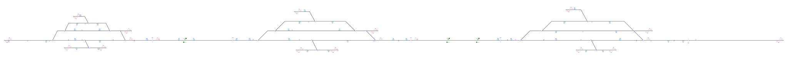

# Example_4
## Description
Name: ERTMS_Test_Plant.RailAID

## Step by step

Layout without signalling:

Signals generated due to line borders(L) and buffer stops(T):

Signals generated due to line borders(L),buffer stops(T) and rail joints (J):

Signals generated due to line borders(L),buffer stops(T),rail joints (J), platforms(P) and level crossings(X):

Signals generated due to line borders(L),buffer stops(T),rail joints (J), platforms(P),level crossings(X) and switches(S,H,C,B):

Simplified signalling:

## Original table

| Route  | Entry | Exit | Switches | Platforms | Crossings | netElements |
|  :---:  |  :---:  |  :---:  |  :---:  |  :---:  |  :---:  |  :---:  |
R_01  |  X19  |  S32  |  -  |  -  |  LC06-LC04  |  ne100-ne101
R_02  |  S32  |  S91  |  D09_N  |  -  |  -  |  ne101-ne912
R_03  |  C62  |  S04  |  SW02_R  |  -  |  -  |  ne104-ne384
R_04  |  B44  |  S04  |  SW02_N  |  -  |  -  |  ne110-ne384
R_05  |  S87  |  T08  |  -  |  -  |  -  |  ne114-ne102
R_06  |  B86  |  S87  |  D23_N  |  -  |  -  |  ne132-ne114
R_07  |  C89  |  C31  |  D20_N  |  -  |  -  |  ne132-ne912
R_08  |  S08  |  T03  |  D14_R + D15_R  |  -  |  -  |  ne290-ne111-ne377
R_09  |  C35  |  T01  |  D01_N  |  -  |  -  |  ne290-ne991
R_10  |  S09  |  C35  |  D14_N  |  -  |  -  |  ne292-ne290
R_11  |  S45  |  T01  |  D03_N + D01_R  |  -  |  -  |  ne295-ne288-ne991
R_12  |  B47  |  S40  |  D04_N  |  -  |  -  |  ne295-ne297
R_13  |  C43  |  S45  |  D04_N  |  -  |  -  |  ne297-ne295
R_14  |  S40  |  T02  |  SW03_N  |  -  |  -  |  ne297-ne995
R_15  |  S40  |  X15  |  Sw03_R + Sw04_R    |  -  |  LC02-LC01  |  ne297-ne997-ne996-ne98
R_16  |  S06  |  C35  |  D15_R + D14_R  |  -  |  -  |  ne377-ne111-ne290
R_17  |  S06  |  T10  |  D15_N  |  -  |  -  |  ne377-ne113
R_18  |  S04  |  S40  |  D04_R  |  -  |  -  |  ne384-ne297
R_19  |  C56  |  S58  |  D07_N  |  -  |  -  |  ne400-ne404
R_20  |  C56  |  S03  |  D07_R  |  -  |  -  |  ne400-ne407
R_21  |  S28  |  T04  |  Sw02_N    |  -  |  -  |  ne400-ne993
R_22  |  B52  |  S28  |  D07_N  |  -  |  -  |  ne404-ne400
R_23  |  S58  |  X16  |  D08_N + D05_R  |  -  |  LC02-LC01  |  ne404-ne61-ne99-ne98
R_24  |  S03  |  T11  |  D16_R  |  -  |  -  |  ne407-ne122
R_25  |  S10  |  S84  |  D18_R + D19_R  |  -  |  -  |  ne63-ne124-ne421
R_26  |  S10  |  S02  |  D18_N  |  -  |  -  |  ne63-ne65
R_27  |  C23  |  X16  |  D05_N  |  -  |  LC06-LC04  |  ne63-ne99-ne98
R_28  |  S11  |  C23  |  D18_N  |  -  |  -  |  ne65-ne63
R_29  |  C93  |  S95  |  D20_R + D21_R  |  -  |  -  |  ne912-ne131-ne465
R_30  |  C93  |  B86  |  D20_N  |  -  |  -  |  ne912-ne132
R_31  |  X15    |  S24    |  -  |   -   |   LC02   |  ne98-ne99
R_32  |  S07  |  S68  |  D01_N  |  -  |  -  |  ne991-ne290
R_33  |  B27  |  C56  |  Sw02_N    |  -  |  -  |  ne993-ne400
R_34  |  B39  |  C43  |  SW03_N  |  -  |  -  |  ne995-ne297
R_35  |  S24  |  S80  |  D05_N  |  -  |  -  |  ne99-ne63
R_36  |  X20  |  S11  |  SW01_N  |  -  |  (LC05-LC03) - (LC06-LC04)  |  ne100-ne992-ne65
R_37  |  X20  |  C56  |  Sw01_R + Sw02_R    |  -  |  (LC05-LC03) - (LC06-LC04)  |  ne100-ne992-ne994-ne400
R_38  |  S32  |  C59  |  D09_R + D10_N  |  -  |  -  |  ne101-ne910-ne130
R_39  |  S32  |  B60  |  D09_R + D10_R  |  -  |  -  |  ne101-ne910-ne135
R_40  |  S01  |  X20  |  D10_N + D9_R  |  -  |  LC06-LC04  |  ne130-ne910-ne101-ne100
R_41  |  B98  |  X20  |  D10_R + D09_R  |  -  |  LC05-LC03  |  ne135-ne910-ne101-ne100
R_42  |  S08  |  X15  |  D14_N + SW04_N  |  -  |  LC02-LC01  |  ne290-ne292-ne996-ne98
R_43  |  S28  |  X29  |  Sw02_R + Sw01_R    |  -  |  (LC05-LC03) - (LC06-LC04)  |  ne400-ne994-ne992-ne100
R_44  |  S02  |  X19  |  SW01_N  |  -  |  (LC05-LC03) - (LC06-LC04)  |  ne65-ne992-ne100
R_45  |  C31  |  X20  |  D09_N  |  -  |  LC06-LC04  |  ne912-ne101-ne100
R_46  |  X16    |  B67    |  Sw04_N    |  -  |  -  |  ne98-ne996-ne292
R_47  |  S16    |  S43    |  Sw03_R + Sw04_R    |  -  |  -  |  ne98-ne996-ne997-ne297
R_48  |  S07  |  B44  |  D01_R + D03_R  |  -  |  -  |  ne991-ne288-ne110
R_49  |  S07  |  B47  |  D01_R + D03_N  |  -  |  -  |  ne991-ne288-ne295
R_50  |  S24  |  B57  |  D05_R + D08_R  |  -  |  -  |  ne99-ne61-ne123
R_51  |  S24  |  B52  |  D05_R + D08_N  |  -  |  -  |  ne99-ne61-ne404
R_52  |  B63  |  T01  |  D03_R + D01_R  |  -  |  -  |  ne110-ne288-ne991
R_53  |  C74  |  S76  |  D16_R  |  -  |  -  |  ne122-ne407
R_54  |  B58  |  S76  |  D16_N  |  -  |  -  |  ne123-ne407
R_55  |  B75  |  X16  |  D08_R + D05_R  |  -  |  LC02-LC01  |  ne123-ne61-ne99-ne98
R_56  |  S99  |  S87  |  D12_S + D23_R  |  -  |  -  |  ne127-ne129-ne114
R_57  |  S99  |  T06  |  D12_T  |  -  |  -  |  ne127-ne450
R_58  |  C59  |  S87  |  D12_T + D23_R  |  -  |  -  |  ne130-ne129-ne114
R_59  |  C59  |  T06  |  D12_S  |  -  |  -  |  ne130-ne450
R_60  |  C97  |  S99  |  D24_R  |  -  |  -  |  ne134-ne127
R_61  |  B60  |  S99  |  D24_N  |  -  |  -  |  ne135-ne127
R_62  |  C43  |  C46  |  D04_R  |  -  |  -  |  ne297-ne384
R_63  |  C46  |  T09  |  Sw02_R  |  -  |  -  |  ne384-ne104
R_64  |  C46  |  B63  |  SW02_N  |  -  |  -  |  ne384-ne110
R_65  |  S03  |  B75  |  D16_N  |  -  |  -  |  ne407-ne123
R_66  |  S76  |  S28  |  D07_R  |  -  |  -  |  ne407-ne400
R_67  |  B83  |  T12  |  -  |  -  |  -  |  ne126
R_68  |  B90  |  C89  |  -  |  -  |  -  |  ne132
R_69  |  B94  |  T13  |  -  |  -  |  -  |  ne133
R_70  |  S68  |  S08  |  -  |  -  |  -  |  ne290
R_71  |  B67  |  S09  |  -  |  -  |  -  |  ne292
R_72  |  S84  |  H85  |  -  |  -  |  -  |  ne421
R_73  |  H85  |  T05  |  -  |  -  |  -  |  ne421
R_74  |  S95  |  H96  |  -  |  -  |  -  |  ne465
R_75  |  H96  |  T07  |  -  |  -  |  -  |  ne465
R_76  |  S80  |  S10  |  -  |  -  |  -  |  ne63

## Generated table

| Route  | Entry | Exit | Switches | Platforms | Crossings | netElements |
|  :---:  |  :---:  |  :---:  |  :---:  |  :---:  |  :---:  |  :---:  |
R_01  |  X56  |  S67  |  -  |  -  |  LC06-LC04  |  ne100-ne101
R_02  |  S67  |  S112  |  D09_N  |  -  |  -  |  ne101-ne912
R_03  |  T14  |  B78  |  SW02_R  |  -  |  -  |  ne104-ne384
R_04  |  B75  |  B78  |  SW02_N  |  -  |  -  |  ne110-ne384
R_05  |  J48  |  T11  |  -  |  -  |  -  |  ne114-ne102
R_06  |  J46  |  L29  |  D03_N  |  -  |  -  |  ne132-ne114
R_07  |  J47  |  J45  |  D20_N  |  -  |  -  |  ne132-ne912
R_08  |  S94  |  T03  |  D14_R + D15_R  |  -  |  -  |  ne290-ne111-ne377
R_09  |  J35  |  T01  |  D01_N  |  -  |    |  ne290-ne991
R_10  |  J37  |  J35  |  D14_N  |  -  |  -  |  ne292-ne290
R_11  |  C74  |  T01  |  D03_N + D01_R  |  -  |  -  |  ne295-ne288-ne991
R_12  |  C77  |  S125  |  D04_N  |  -  |  -  |  ne295-ne297
R_13  |  S79  |  C74  |  D04_N  |  -  |  -  |  ne297-ne295
R_14  |  S125  |  T27  |  SW03_N  |  -  |  -  |  ne297-ne995
R_15  |  S125  |  L30  |  SW03_R + SW04_R  |  -  |  -  |  ne297-ne997-ne996-ne98
R_16  |  T04  |  J35  |  D15_R + D14_R  |  -  |  -  |  ne377-ne111-ne290
R_17  |  T04  |  T15  |  D15_N  |  -  |  -  |  ne377-ne113
R_18  |  B78  |  S125  |  D04_R  |  -  |  -  |  ne384-ne297
R_19  |  S82  |  C84  |  D07_N  |  -  |  -  |  ne400-ne404
R_20  |  S82  |  S101  |  D07_R  |  -  |  -  |  ne400-ne407
R_21  |  S91  |  T25  |  SW02_N  |  -  |  -  |  ne400-ne993
R_22  |  C81  |  S91  |  D07_N  |  -  |  -  |  ne404-ne400
R_23  |  C84  |  X51  |  D08_N + D05_R  |  -  |  LC02-LC01  |  ne404-ne61-ne99-ne98
R_24  |  S101  |  T17  |  D16_R  |  -  |  -  |  ne407-ne122
R_25  |  S103  |  T05  |  D18_R + D19_R  |  -  |  -  |  ne63-ne124-ne421
R_26  |  S103  |  C121  |  D18_N  |  -  |  -  |  ne63-ne65
R_27  |  C62  |  X51  |  D05_N  |  -  |  LC02-LC01  |  ne63-ne99-ne98
R_28  |  C102  |  C62  |  D18_N  |  -  |  -  |  ne65-ne63
R_29  |  S112  |  T09  |  D20_R + D21_R  |  -  |  -  |  ne912-ne131-ne465
R_30  |  S112  |  J46  |  D20_N  |  -  |  -  |  ne912-ne132
R_31  |  X50  |  S63  |  -  |  -  |  LC02-LC01  |  ne98-ne99
R_32  |  S71  |  S94  |  D01_N  |  -  |  -  |  ne991-ne290
R_33  |  T26  |  S82  |  SW02_N  |  -  |  -  |  ne993-ne400
R_34  |  T28  |  S79  |  SW03_N  |  -  |  -  |  ne995-ne297
R_35  |  S63  |  S103  |  D05_N  |  -  |  -  |  ne99-ne63
R_36  |  X55  |  S122  |  -  |  -  |  LC05-LC03  |  ne100-ne992
R_37  |  J43  |  X57  |    |    |  LC06-LC04  |  ne101-ne100
R_38  |  S67  |  S89  |  D09_R  |  -  |  -  |  ne101-ne910
R_39  |  B85  |  S91  |  D16_N + D07_R  |  -  |  -  |  ne123-ne407-ne400
R_40  |  S119  |  J43  |  D24_N + D10_R + D09_R  |  -  |  -  |  ne127-ne135-ne910-ne101
R_41  |  C87  |  J43  |  D10_N + D09_R  |  -  |  -  |  ne130-ne910-ne101
R_42  |  S76  |  B75  |  D03_R  |  -  |  -  |  ne288-ne110
R_43  |  S76  |  C77  |  D03_N  |  -  |  -  |  ne288-ne295
R_44  |  S94  |  J36  |  D14_N  |  -  |  -  |  ne290-ne292
R_45  |  J36  |  L30  |  SW04_N  |  -  |  -  |  ne292-ne996-ne98
R_46  |  S91  |  L32  |  SW02_R + SW01_R  |  -  |  -  |  ne400-ne994-ne992
R_47  |  S86  |  B85  |  D08_R  |  -  |  -  |  ne61-ne123
R_48  |  S86  |  C81  |  D08_N  |  -  |  -  |  ne61-ne404
R_49  |  C121  |  L32  |  SW01_N  |  -  |  -  |  ne65-ne992
R_50  |  S89  |  B88  |  D10_R  |  -  |  -  |  ne910-ne135
R_51  |  J45  |  J43  |  D09_N  |  -  |  -  |  ne912-ne101
R_52  |  X51  |  S128  |  -  |  -  |  -  |  ne98-ne996
R_53  |  S71  |  S76  |  D01_R  |  -  |  -  |  ne991-ne288
R_54  |  L32  |  L31  |  -  |  -  |  -  |  ne992-ne100
R_55  |  S122  |  C102  |  SW01_N  |  -  |  -  |  ne992-ne65
R_56  |  S122  |  S82  |  SW01_R + SW02_R  |  -  |  -  |  ne992-ne994-ne400
R_57  |  S128  |  J37  |  SW04_N  |  -  |  -  |  ne996-ne292
R_58  |  S128  |  S79  |  SW04_R + SW03_R  |  -  |  -  |  ne996-ne997-ne297
R_59  |  S63  |  S86  |  D05_R  |  -  |  -  |  ne99-ne61
R_60  |  T18  |  S91  |  D16_R + D07_R  |  -  |  -  |  ne122-ne407-ne400
R_61  |  T24  |  L29  |  D24_R + D12_S + D23_R  |  -  |  -  |  ne134-ne127-ne129-ne114
R_62  |  T24  |  T07  |  D24_R + D12_T  |  -  |  -  |  ne134-ne127-ne450
R_63  |  B88  |  L29  |  D24_N + D12_S + D23_R  |  -  |  -  |  ne135-ne127-ne129-ne114
R_64  |  B88  |  T07  |  D24_N + D12_T  |  -  |  -  |  ne135-ne127-ne450
R_65  |  S79  |  T13  |  D04_R + SW02_R  |  -  |  -  |  ne297-ne384-ne104
R_66  |  S79  |  T01  |  D04_R + SW02_N +D03_R + D01_R  |  -  |  -  |  ne297-ne384-ne110-ne288-ne991
R_67  |  S101  |  X51  |  D08_R + D05_R  |  -  |  LC02-LC01  |  ne407-ne123-ne61-ne99-ne98
R_68  |  S89  |  L29  |  D10_N + D12_T + D23_R  |  -  |  -  |  ne910-ne130-ne129-ne114
R_69  |  S89  |  T07  |  D10_N + D12_S  |  -  |  -  |  ne910-ne130-ne450
R_70  |  L31  |  X54  |  -  |  -  |  LC05-LC03  |  ne100
R_71  |  X54  |  X56  |  -  |  -  |  -  |  ne100
R_72  |  X57  |  X55  |  -  |  -  |  (LC05-LC03) - (LC06-LC04)  |  ne100
R_73  |  T12  |  S109  |  -  |  -  |  -  |  ne102-ne114
R_74  |  T16  |  T03  |  D15_N  |  -  |  -  |  ne113-ne377
R_75  |  L29  |  J48  |  -  |  -  |  -  |  ne114
R_76  |  S109  |  J47  |  D23_N  |  -  |  -  |  ne114-ne132
R_77  |  S109  |  S119  |  D23_R + D12_S  |  -  |  -  |  ne115-ne129-ne127

Aditional routes example 3_B

| Route  | Entry | Exit | Switches | Platforms | Crossings | netElements |
|  :---:  |  :---:  |  :---:  |  :---:  |  :---:  |  :---:  |  :---:  |
R_78  |  S109  |  C87  |  D23_R + D12_T  |  -  |  -  |  ne115-ne129-ne130
R_79  |  T20  |  T05  |  D19_N  |  -  |  -  |  ne126-ne421
R_80  |  S119  |  T23  |  D24_R  |  -  |  -  |  ne127-ne134
R_81  |  T22  |  T09  |  D21_N  |  -  |  -  |  ne133-ne465
R_82  |  T06  |  C62  |  D19_R + D18_R  |  -  |  -  |  ne421-ne124-ne63
R_83  |  T06  |  T19  |  D19_N  |  -  |  -  |  ne421-ne126
R_84  |  T08  |  S119  |  D12_T  |  -  |  -  |  ne450-ne127
R_85  |  T08  |  C87  |  D12_S  |  -  |  -  |  ne450-ne130
R_86  |  T10  |  J45  |  D21_R + D20_R  |  -  |  -  |  ne465-ne131-ne912
R_87  |  T10  |  T21  |  D21_N  |  -  |  -  |  ne465-ne133
R_88  |  L30  |  X50  |  -  |  -  |  -  |  ne98
R_89  |  T02  |  S71  |  -  |  -  |  -  |  ne991
R_77  |  S91  |  C93  |  -  |  -  |  -  |  ne912
