# Example_5
## Description
Name: Bypass

This example is mentioned in the manuscript titled: "Automatic Railway Signalling Generation for Railways Systems Described on Railway Markup Language (railML)". Henceforth, when we refer to the manuscript, we will do it as [[1]](#references).

## Analysis principles

The signalling generation process used in this work was designed following signalling principles detailed in [[1]](#references) in the section "I. INTRODUCTION".

## Step by step

The following is the general methodology or "step by step" followed for analysing a railway network with the approach of this work [[1]](#references).

A. Import the railway layout description.

B. Define a graph network to associate the railway elements.

C. Infrastructure analysis

D. Detect CDL zones.

E. Generate signalling.

F. Simplify signalling.

G. Logfile generated by RNA.

H. Comparing interlocking tables.

E. Extra

Each step is explained below.

### A. Import the railway layout description

After having installed the RNA program according to the steps shown in the the section ["Usage"](https://github.com/GICSAFePhD/Layouts#usage), run the Python archive "main_GUI.py". This action produces the program output shown in Figure 1.

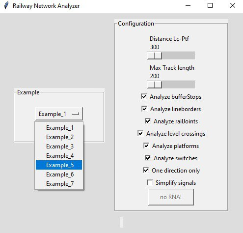

*Figure 1. Select example.*

The necessary information to define the graph network is distributed across several sections of the railML file, specifically inside netElements (nodes) and netRelations (edges) items found in the class Infrastructure/Topology as described in [[1]](#references).

Figure 2 shows the railway network without signalling. The user will need the Design4Rail Horizon Software Suite Track Planner application and import the archive "Example_5.railml" to visualise the railway network used in this example. 

For further information about the Design4Rail Horizon Software Suite and the Track Planner application, please refer to [Official web page of Design4Rail](https://design4rail.com/service/d4rhorizon/#section-downloadHorizon).

For a detailed explanation about importing railML files, go to section [G.1](#g1-obtaining-the-interlocking-table-in-design4rail) of this document. 

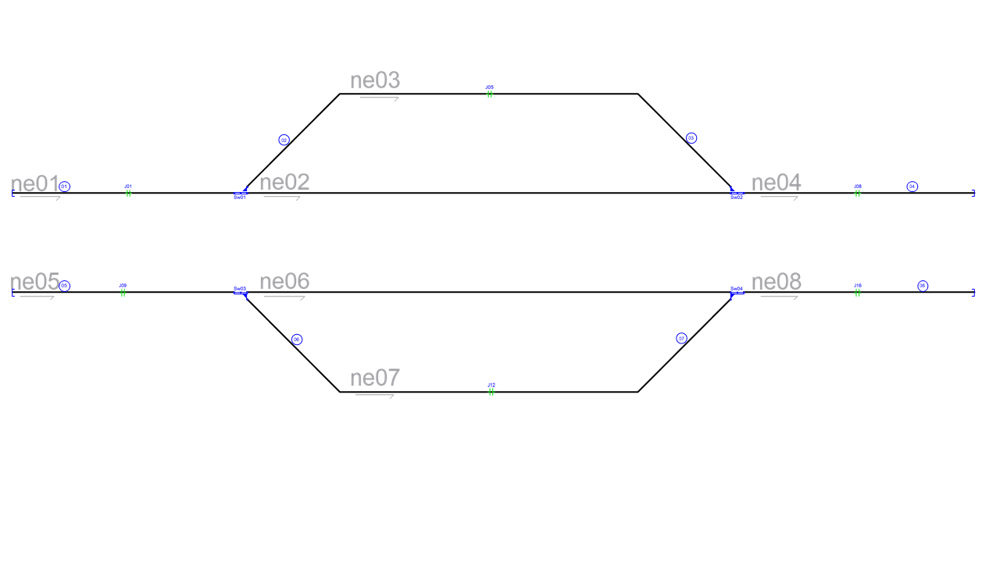

*Figure 2. Railway network without signalling.*

### B. Define a graph network to associate the railway elements

This step allows us to evaluate the consistency of the network connections provided in the RailML file, through the determination of the direction, position, and interconnection of each of the nodes of the given railway network.

In [[1]](#references), in the section "II. RAILWAY NETWORK ANALYZER DESIGN" in literal B, we see Algorithm 1, which explains the network analysis process.

The result of this RNA step is show in Console Output 1:

~~~
#################### Starting Railway Network Analyzer ####################
Reading .railML file
Creating railML object
Analyzing railML object
 Analyzing graph
ne01 [-1451, -150] [-763, -150] >>
ne02 [-763, -150] [736, -150] >>
ne03 [-763, -150] [736, -150] >>
ne04 [736, -150] [1451, -150] >>
ne05 [-1451, -450] [-763, -450] >>
ne06 [-763, -450] [736, -450] >>
ne07 [-763, -450] [736, -450] >>
ne08 [736, -450] [1451, -450] >>
 The network is not connected
~~~

*Console Output 1. Step B railway elements.*

In this example, the Console Output 1 shows that the program can identify the nodes and their directions. Consol Output 1 has, for example, this line: ne08 [736, -450] [1451, -450] >>, that indicates the name of the netElement (ne08), the position (origin [736, -450] and end point [1451, -450]) of the net element, and the direction (>>, at right in this case, but in other example it could have been at left: <<). The same analysis stands for: ne01, ne02, ne03, ne04, ne05, ne06 and ne07. It can be noticed that Console Output 1 is consistent with every "netElement" shown in Figure 2.

### C and D. Infrastructure analysis and CDL zones detection

The process of analysing the infrastructure and detecting CDL zones allows identifying the position of each infrastructure element in the network: platforms, curves, level crossings, buffer stops, derailers, lines, operational points, signals, switches, tracks and detection elements (axle counters, rail joints and track circuits).

In section "II. RAILWAY NETWORK ANALYSER DESIGN" literal C of [[1]](#references), it is shown Algorithm 2, which explains the process of analysing the network; and in the same section but in literal D, it is explained the process used to detect CDL zones.

The result of this step is shown in Console Output 2 and Figure 3.

~~~
 Analyzing infrastructure --> Infrastructure.RNA
 Detecting Danger --> Safe_points.RNA
  ne01 has a RailJoint[J01] @ [-1101, -150]     
  ne02 has a Middle point @ [-548.9, -150]      
  ne02 has a Middle point @ [-334.7, -150]      
  ne02 has a Middle point @ [-120.6, -150]
  ne02 has a Middle point @ [93.6, -150]
  ne02 has a Middle point @ [307.7, -150]
  ne02 has a Middle point @ [521.9, -150]
  ne03 has a RailJoint[J05] @ [-11, 150]
  ne03 has a Curve(3 lines) @ [[-463, 150], [436, 150]]
  ne04 has a RailJoint[J08] @ [1100, -150]
  ne05 has a RailJoint[J09] @ [-1118, -450]
  ne06 has a Middle point @ [-548.9, -450]
  ne06 has a Middle point @ [-334.7, -450]
  ne06 has a Middle point @ [-120.6, -450]
  ne06 has a Middle point @ [93.6, -450]
  ne06 has a Middle point @ [307.7, -450]
  ne06 has a Middle point @ [521.9, -450]
  ne07 has a RailJoint[J12] @ [-5, -750]
  ne07 has a Curve(3 lines) @ [[-463, -750], [436, -750]]
  ne08 has a RailJoint[J16] @ [1100, -450]
~~~

*Console Output 2. Infraestructure analysis and CDL zone detection.*

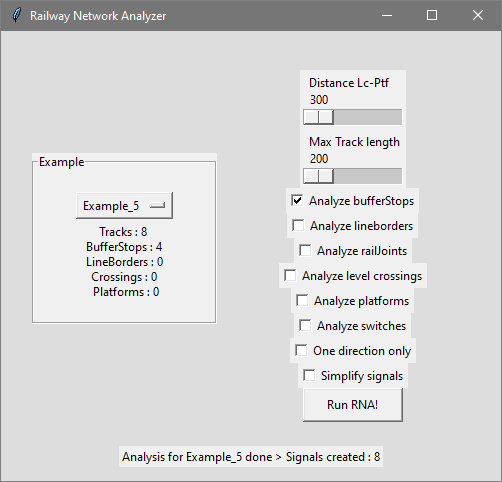

*Figure 3. Infrastructure analysis and CDL zones detection: GUI Output.*

All these identified elements are shown in Figure 4.

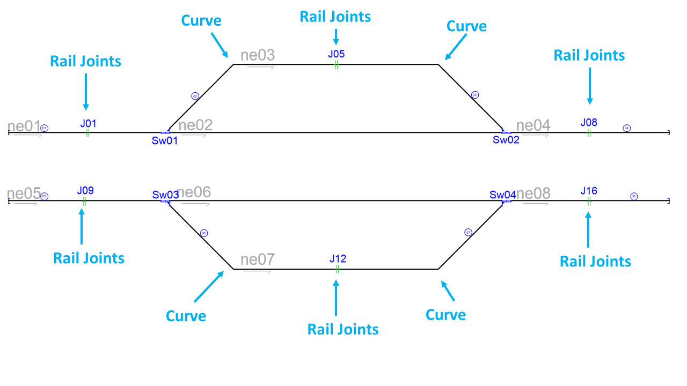

*Figure 4. Infrastructure analysis and CDL zones detection: Layout.*

### E. Generate signalling

To obtain an analysis for each network element in the program configurations, select the options you want, as shown in Figure 5.

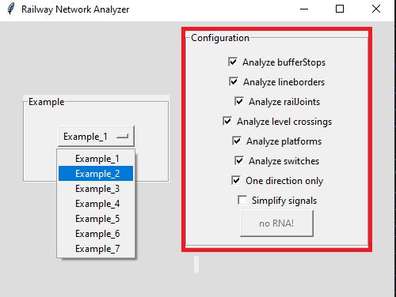

*Figure 5. Configuration options of RNA.*

Below, in subsections E.1, E.2, E.3, and E.4, you will find the sequence of configurations used to analyze, step by step, the railway in this example.

#### E.1. Signals generated due to line borders(L) and buffer stops(T)

The configuration of the RNA GUI application needed for this step of the analysis is shown in Figure 6.

*Figure 6. Configuring RNA to obtain signals for line borders(L) and buffer stops(T).*

Signals are enumerated since 00 with a prefix letter to indicate which element generates them. BufferStops and LineBorders signals start with T and L, respectively. In Figure 7, we can visualise the signals generated by applying algorithm 3, explained in [[1]](#references) section "III. SIGNALLING GENERATION".

In red letters, automatically added signals are shown.

The RNA allocates signals close to the buffer stops:

-- Stop: *T01, T03, T05 and T07*

-- Departure: *T02, T04, T06 and T08*

Also, the RNA allocates signals close to the line borders. But in this example, RNA does not allocate departure signals assigned close to every line border, because this network does not have line borders.

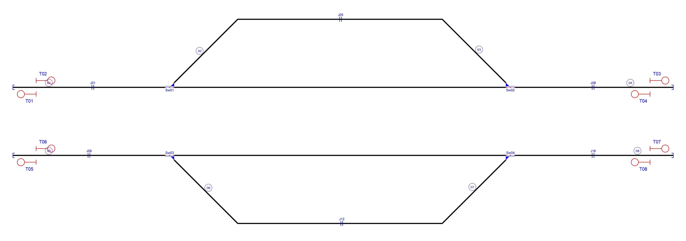

*Figure 7. Signals due to line borders(L) and buffer stops(T).*

#### E.2. Signals generated due to line borders(L),buffer stops(T) and rail joints (J)

The signals for rail joints are named J and have a consecutive number of signals.

The configuration of the RNA GUI application needed for this step of the analysis is shown in Figure 8.

*Figure 8. Configuring RNA to obtain signals for line borders(L), buffer stops(T) and rail joints (J).*

The RNA assign signalling at the beginning and the ending of each track: J09, J10, J11, J12, J13, J14, J15, J16, J17, J18, J19 and J20 as shown in Figure 9.

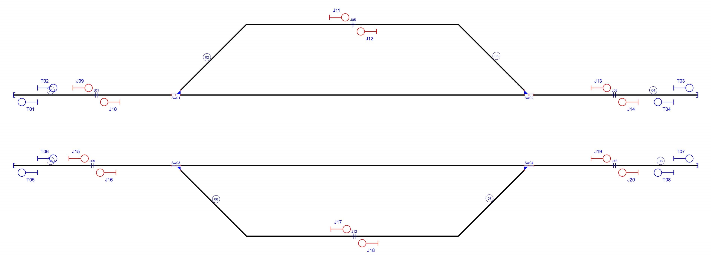

*Figure 9. Signals due to line borders(L), buffer stops(T) and rail joints (J).*

#### E.3. Signals generated due to line borders(L),buffer stops(T),rail joints (J), platforms(P) and level crossings(X)

The signals for platforms are named P, and signals for level crossings are named X. A consecutive number of signals is assigned for each type of signalling.

The configuration of the RNA GUI application needed for this step of the analysis is shown in Figure 10.

*Figure 10. Configuring RNA to obtain signals for line borders(L),buffer stops(T),rail joints (J), platforms(P) and level crossings(X).*

Notice that RNA can be configured to avoid adding duplicate signals when the level crossing and the platform are close together, as discussed in [[1]](#references), and therefore, the signalling between them is unnecessary. However, this configuration is a special parameter in RNA. For furthermore information about this, see section [G.3.1.2.](#g32-minimum-distance-parameter) 

It is necessary to introduce signals before the train reaches the level crossing as explained in Algorithm 5, explained in [[1]](#references) section "III. SIGNALLING GENERATION".

Also, it is necessary to have a departure signal after the platform. This logic is implemented using Algorithm 6, explained in [[1]](#references) section "III. SIGNALLING GENERATION".

RNA does not allocate signals assigned close to every platforms or level crossings, because this network does not have platforms or level crossings shown in Figure 11.

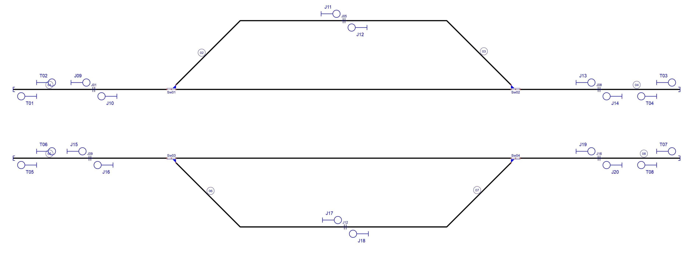

*Figure 11. Signals due to line borders(L),buffer stops(T),rail joints (J), platforms(P) and level crossings(X).*

#### E.4. Signals generated due to line borders(L),buffer stops(T),rail joints (J), platforms(P),level crossings(X) and switches(S,H,C,B)

The configuration of the RNA GUI application needed for this step of the analysis is shown in Figure 12.

*Figure 12. Configuring RNA to obtain signals for line borders(L),buffer stops(T),rail joints (J), platforms(P),level crossings(X) and switches(S,H,C,B).*

The signals for switches are named based on the point they want to protect: S for Starting branch, C for the Continue branch and B for the Detour branch. There are also signals whose name starts with H that are not explicitly protecting the starting branch, the continue branch or the detour branch of a switch. These H signals are explained in [[1]](#references) section "III. SIGNALLING GENERATION" in literal E, where a manoeuvre signal numbered with H is always added plus the corresponding numbering sequence by Algorithm 7. This manoeuvre signal always accompanies the signal of the start branch (S) of the switch, and its function is to protect the railway elements that are after this signal (i.e. elements that are in the detour branch and in the continue branch).

Signals generated for Example 5 are shown in red letters in Figure 13:

- Sw01: *C21, S23, B26 and H24*.
- Sw02: *C25, S27, B22 and H28*.
- Sw03: *C29, S31, B34 and H32*.
- Sw04: *C33, S35, B30 and H36*.

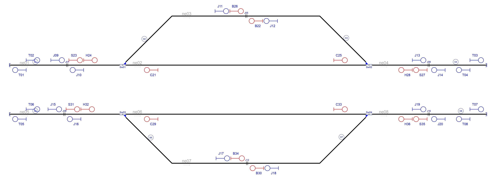

*Figure 13. Signals due to line borders(L),buffer stops(T),rail joints (J), platforms(P),level crossings(X) and switches(S,H,C,B).* 

### F. Simplify signalling

The signal simplification process used by RNA relies on two main principles: i) vertical inheritance and ii) horizontal inheritance. Both principles are explained in [[1]](#references) in section "IV. SIGNALLING SIMPLIFICATION".

To simplify signals mark the configuration option "Simplify signals", as shown in Figure 14.

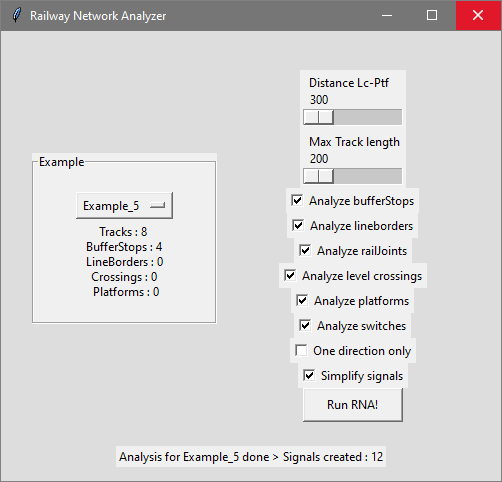

*Figure 14. Configuring RNA to simplify signalling.*

After the simplification only the appropriate signals are kept, as shown in Figure 15.

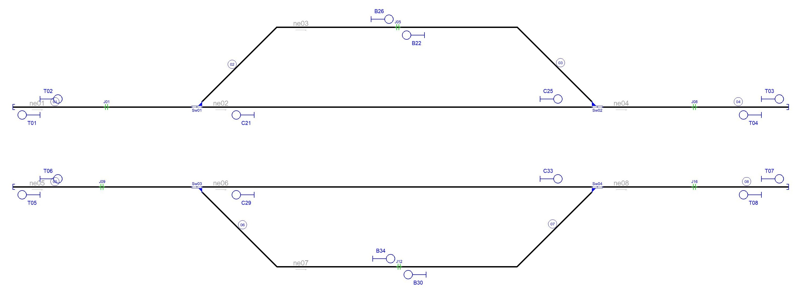

*Figure 15. Signalling simplification.*

The simplification process was carried out according to the process described in section IV. SIGNALLING SIMPLIFICATION of [[1]](#references), as follows:

- **Simplification by vertical inheritance**

    Vertical inheritance is applied using Algorithm 8 explained in section IV. SIGNALLING SIMPLIFICATION of [[1]](#references), literal A. According to this algorithm, in this example, vertical inheritance had no effect on signal allocation. 

- **Simplification by horizontal inheritance**

    The simplified signals due to horizontal inheritance are J09, J10, J11, J12, J13, J14, J15, J16, J17, J18, S23, H24, S27, H28, S31, H32, S35 and H23. Signals J09, S23 and H24 was deleted by RNA due it was nearby of signal T02, and have the same direction and orientation. The same situation occurs when signals J14, S27 and H28 was deleted for T04; signals J15, S31 and H32 was deleted for T06; signals J20, S35 and H36 was deleted for T08; J10 deleted for T01; J13 deleted for T03; J16 deleted for T05; and J19 deleted for T07. In all cases, is applied Algorithm 9 (described in section IV. SIGNALLING SIMPLIFICATION of [[1]](#references)). This algorithm was designed to group nearby objects as one single object, and generating signals according to the leftmost and rightmost railway element in the new single object. 

~~~
Reducing redundant signals
removing sig10 for sig01
removing sig09 for sig02
removing sig23 for sig02
removing sig24 for sig02
removing sig13 for sig03
removing sig14 for sig04
removing sig27 for sig04
removing sig28 for sig04
removing sig16 for sig05
removing sig15 for sig06
removing sig31 for sig06
removing sig32 for sig06
removing sig19 for sig07
removing sig20 for sig08
removing sig35 for sig08
removing sig36 for sig08
removing sig11 for sig26
removing sig12 for sig22
removing sig17 for sig34
removing sig18 for sig30
~~~

### G. Output generated by RNA

Once the signalling is generated, it is necessary to establish the railway routes to create the railway interlocking table. A railway route is the simplest path between two consecutive signals in the same direction, using the same tracks (see [[1]](#references)). RNA generates 4 logfiles as a summary of all the analysis, these files are: 

- Infrastructure.RNA: summary of elements node per node. 
- Safe_points.RNA: absolute coordinates of every point where it is safe to add signals depending on prev/next direction, node per node.
- Signalling: summary of all the signalling generated and their relevant information.
- Routes.RNA: Interlocking table with the information of each route.

Aditionally, RNA generates the object that will be used by the ACG. The logfiles are a summary of the information contained in the object.

#### G.1 Infrastructure.RNA: 

~~~
Nodes: 8 | Switches: 4 | Signals: 0 | Detectors: 6 | Ends: 4 | Barriers: 0
Node ne01:
	Track = track1
	TrainDetectionElements -> tde89
		Type -> insulatedRailJoint
	Type = BufferStop -> ['bus174']
	Neighbours = 2 -> ['ne02', 'ne03']
	Switches -> Sw01
		ContinueCourse -> right -> ne02
		BranchCourse -> left -> ne03
Node ne02:
	Track = track5
	Neighbours = 3 -> ['ne01', 'ne03', 'ne04']
Node ne03:
	Track = track6
	TrainDetectionElements -> tde93
		Type -> insulatedRailJoint
	Neighbours = 3 -> ['ne01', 'ne02', 'ne04']
Node ne04:
	Track = track3
	TrainDetectionElements -> tde96
		Type -> insulatedRailJoint
	Type = BufferStop -> ['bus176']
	Neighbours = 2 -> ['ne02', 'ne03']
	Switches -> Sw02
		ContinueCourse -> left -> ne02
		BranchCourse -> right -> ne03
Node ne05:
	Track = track2
	TrainDetectionElements -> tde105
		Type -> insulatedRailJoint
	Type = BufferStop -> ['bus175']
	Neighbours = 2 -> ['ne06', 'ne07']
	Switches -> Sw03
		ContinueCourse -> left -> ne06
		BranchCourse -> right -> ne07
Node ne06:
	Track = track7
	Neighbours = 3 -> ['ne05', 'ne07', 'ne08']
Node ne07:
	Track = track8
	TrainDetectionElements -> tde108
		Type -> insulatedRailJoint
	Neighbours = 3 -> ['ne05', 'ne06', 'ne08']
Node ne08:
	Track = track4
	TrainDetectionElements -> tde112
		Type -> insulatedRailJoint
	Type = BufferStop -> ['bus177']
	Neighbours = 2 -> ['ne06', 'ne07']
	Switches -> Sw04
		ContinueCourse -> right -> ne06
		BranchCourse -> left -> ne07

~~~

#### G.2 Safe_points.RNA: 

~~~
ne01:
  Next: [[-1201.0, -150]]
  Prev: [[-1001.0, -150]]
ne02:
  Next: [[-548.9, -150], [-334.7, -150], [-120.6, -150], [93.6, -150], [307.7, -150], [521.9, -150]]
  Prev: [[-548.9, -150], [-334.7, -150], [-120.6, -150], [93.6, -150], [307.7, -150], [521.9, -150]]
ne03:
  Next: [[-111.0, 150], [336.0, 150]]
  Prev: [[89.0, 150], [-363.0, 150]]
ne04:
  Next: [[1000.0, -150]]
  Prev: [[1200.0, -150]]
ne05:
  Next: [[-1218.0, -450]]
  Prev: [[-1018.0, -450]]
ne06:
  Next: [[-548.9, -450], [-334.7, -450], [-120.6, -450], [93.6, -450], [307.7, -450], [521.9, -450]]
  Prev: [[-548.9, -450], [-334.7, -450], [-120.6, -450], [93.6, -450], [307.7, -450], [521.9, -450]]
ne07:
  Next: [[-105.0, -750], [336.0, -750]]
  Prev: [[95.0, -750], [-363.0, -750]]
ne08:
  Next: [[1000.0, -450]]
  Prev: [[1200.0, -450]]
~~~

#### G.3 Signalling.RNA: 

~~~
sig01 [T01] <<:
	From: ne01 | To: bus174_left
	Type: Stop | Direction: reverse | AtTrack: right 
	Position: [-1351, 150] | Coordinate: 0.1453
sig02 [T02] >>:
	From: ne01 | To: ne01_right
	Type: Stop | Direction: normal | AtTrack: left 
	Position: [-1351, 150] | Coordinate: 0.1453
sig03 [T03] >>:
	From: ne04 | To: bus176_right
	Type: Stop | Direction: normal | AtTrack: left 
	Position: [1351, 150] | Coordinate: 0.8601
sig04 [T04] <<:
	From: ne04 | To: ne04_left
	Type: Stop | Direction: reverse | AtTrack: right 
	Position: [1351, 150] | Coordinate: 0.8601
sig05 [T05] <<:
	From: ne05 | To: bus175_left
	Type: Stop | Direction: reverse | AtTrack: right 
	Position: [-1351, 450] | Coordinate: 0.1453
sig06 [T06] >>:
	From: ne05 | To: ne05_right
	Type: Stop | Direction: normal | AtTrack: left 
	Position: [-1351, 450] | Coordinate: 0.1453
sig07 [T07] >>:
	From: ne08 | To: bus177_right
	Type: Stop | Direction: normal | AtTrack: left 
	Position: [1351, 450] | Coordinate: 0.8601
sig08 [T08] <<:
	From: ne08 | To: ne08_left
	Type: Stop | Direction: reverse | AtTrack: right 
	Position: [1351, 450] | Coordinate: 0.8601
sig21 [C21] <<:
	From: ne02 | To: ne02_left
	Type: Circulation | Direction: reverse | AtTrack: right 
	Position: [-548.9, 150] | Coordinate: 0.1428
sig22 [B22] <<:
	From: ne03 | To: ne03_left
	Type: Manouver | Direction: reverse | AtTrack: right 
	Position: [89.0, -150] | Coordinate: 0.8014
sig25 [C25] >>:
	From: ne02 | To: ne02_right
	Type: Circulation | Direction: normal | AtTrack: left 
	Position: [521.9, 150] | Coordinate: 0.8571
sig26 [B26] >>:
	From: ne03 | To: ne03_right
	Type: Manouver | Direction: normal | AtTrack: left 
	Position: [-111.0, -150] | Coordinate: 0.6869
sig29 [C29] <<:
	From: ne06 | To: ne06_left
	Type: Circulation | Direction: reverse | AtTrack: right 
	Position: [-548.9, 450] | Coordinate: 0.1428
sig30 [B30] <<:
	From: ne07 | To: ne07_left
	Type: Manouver | Direction: reverse | AtTrack: right 
	Position: [95.0, 750] | Coordinate: 0.8048
sig33 [C33] >>:
	From: ne06 | To: ne06_right
	Type: Circulation | Direction: normal | AtTrack: left 
	Position: [521.9, 450] | Coordinate: 0.8571
sig34 [B34] >>:
	From: ne07 | To: ne07_right
	Type: Manouver | Direction: normal | AtTrack: left 
	Position: [-105.0, 750] | Coordinate: 0.6904
~~~

#### G.4 Routes.RNA: 

Full interlocking table
~~~
route_1 [sig02 >> sig25]:
	Path: ['ne01', 'ne02']
	Switches: ['Sw01']
route_2 [sig02 >> sig26]:
	Path: ['ne01', 'ne03']
	Switches: ['Sw01']
route_3 [sig04 << sig21]:
	Path: ['ne04', 'ne02']
	Switches: ['Sw02']
route_4 [sig04 << sig22]:
	Path: ['ne04', 'ne03']
	Switches: ['Sw02']
route_5 [sig06 >> sig33]:
	Path: ['ne05', 'ne06']
	Switches: ['Sw03']
route_6 [sig06 >> sig34]:
	Path: ['ne05', 'ne07']
	Switches: ['Sw03']
route_7 [sig08 << sig29]:
	Path: ['ne08', 'ne06']
	Switches: ['Sw04']
route_8 [sig08 << sig30]:
	Path: ['ne08', 'ne07']
	Switches: ['Sw04']
route_9 [sig21 << sig01]:
	Path: ['ne02', 'ne01']
	Switches: ['Sw01']
route_10 [sig22 << sig01]:
	Path: ['ne03', 'ne01']
	Switches: ['Sw01']
route_11 [sig25 >> sig03]:
	Path: ['ne02', 'ne04']
	Switches: ['Sw02']
route_12 [sig26 >> sig03]:
	Path: ['ne03', 'ne04']
	Switches: ['Sw02']
route_13 [sig29 << sig05]:
	Path: ['ne06', 'ne05']
	Switches: ['Sw03']
route_14 [sig30 << sig05]:
	Path: ['ne07', 'ne05']
	Switches: ['Sw03']
route_15 [sig33 >> sig07]:
	Path: ['ne06', 'ne08']
	Switches: ['Sw04']
route_16 [sig34 >> sig07]:
	Path: ['ne07', 'ne08']
	Switches: ['Sw04']
~~~

### H. Comparing interlocking tables.

The interlocking table generated by the RNA in G.4 for the new signalling (Example_5_B.railml) must be compared with the interlocking table generated by Design4Rail for the original signalling (Example_5.railml).

#### H.1. Original interlocking table

Figure 16 shows the structure of the original example. The signalling and the routes were designed by experts following the RailMl standard.

*Figure 16. Original example provided by RailMl*

The original interlocking table can be found in the original railML file in railML/interlocking/assetsForIL/routes. There are a lot of information in those lines, but focusing on the designtor tag only, we can find the data associated to begin/end signals. The signalling and the original interlocking table were designed by experts following the RailMl standard.

Routes defined in "Example_5.railML" (original layout)

~~~
<routes>
                <route id="rt_sig186_sig202">
                    <designator register="_Example" entry="Route S03-S15"/>
                    <handlesRouteType ref="rt_main"/>
                    <hasTvdSection ref="tvd98"/>
                    <hasTvdSection ref="tvd103"/>
                    <hasTvdSection ref="tvd104"/>
                    <routeEntry id="rts_sig186_rt_sig186_sig202">
                        <refersTo ref="il_sig186"/>
                    </routeEntry>
                    <routeExit id="rtd_sig202_rt_sig186_sig202">
                        <refersTo ref="il_sig202"/>
                    </routeExit>
                </route>
                <route id="rt_sig187_sig200">
                    <designator register="_Example" entry="Route S04-S13"/>
                    <handlesRouteType ref="rt_main"/>
                    <hasTvdSection ref="tvd98"/>
                    <hasTvdSection ref="tvd103"/>
                    <hasTvdSection ref="tvd97"/>
                    <routeEntry id="rts_sig187_rt_sig187_sig200">
                        <refersTo ref="il_sig187"/>
                    </routeEntry>
                    <routeExit id="rtd_sig200_rt_sig187_sig200">
                        <refersTo ref="il_sig200"/>
                    </routeExit>
                </route>
                <route id="rt_sig188_sig200">
                    <designator register="_Example" entry="Route S05-S13"/>
                    <handlesRouteType ref="rt_main"/>
                    <hasTvdSection ref="tvd98"/>
                    <hasTvdSection ref="tvd103"/>
                    <hasTvdSection ref="tvd97"/>
                    <routeEntry id="rts_sig188_rt_sig188_sig200">
                        <refersTo ref="il_sig188"/>
                    </routeEntry>
                    <routeExit id="rtd_sig200_rt_sig188_sig200">
                        <refersTo ref="il_sig200"/>
                    </routeExit>
                </route>
                <route id="rt_sig189_sig202">
                    <designator register="_Example" entry="Route S06-S15"/>
                    <handlesRouteType ref="rt_main"/>
                    <hasTvdSection ref="tvd98"/>
                    <hasTvdSection ref="tvd103"/>
                    <hasTvdSection ref="tvd104"/>
                    <routeEntry id="rts_sig189_rt_sig189_sig202">
                        <refersTo ref="il_sig189"/>
                    </routeEntry>
                    <routeExit id="rtd_sig202_rt_sig189_sig202">
                        <refersTo ref="il_sig202"/>
                    </routeExit>
                </route>
                <route id="rt_sig191_sig201">
                    <designator register="_Example" entry="Route S08-S14"/>
                    <handlesRouteType ref="rt_main"/>
                    <hasTvdSection ref="tvd163"/>
                    <hasTvdSection ref="tvd172"/>
                    <hasTvdSection ref="tvd162"/>
                    <routeEntry id="rts_sig191_rt_sig191_sig201">
                        <refersTo ref="il_sig191"/>
                    </routeEntry>
                    <routeExit id="rtd_sig201_rt_sig191_sig201">
                        <refersTo ref="il_sig201"/>
                    </routeExit>
                </route>
                <route id="rt_sig192_sig203">
                    <designator register="_Example" entry="Route S09-S16"/>
                    <handlesRouteType ref="rt_main"/>
                    <hasTvdSection ref="tvd163"/>
                    <hasTvdSection ref="tvd172"/>
                    <hasTvdSection ref="tvd173"/>
                    <routeEntry id="rts_sig192_rt_sig192_sig203">
                        <refersTo ref="il_sig192"/>
                    </routeEntry>
                    <routeExit id="rtd_sig203_rt_sig192_sig203">
                        <refersTo ref="il_sig203"/>
                    </routeExit>
                </route>
                <route id="rt_sig193_sig201">
                    <designator register="_Example" entry="Route S10-S14"/>
                    <handlesRouteType ref="rt_main"/>
                    <hasTvdSection ref="tvd163"/>
                    <hasTvdSection ref="tvd172"/>
                    <hasTvdSection ref="tvd162"/>
                    <routeEntry id="rts_sig193_rt_sig193_sig201">
                        <refersTo ref="il_sig193"/>
                    </routeEntry>
                    <routeExit id="rtd_sig201_rt_sig193_sig201">
                        <refersTo ref="il_sig201"/>
                    </routeExit>
                </route>
                <route id="rt_sig194_sig203">
                    <designator register="_Example" entry="Route S11-S16"/>
                    <handlesRouteType ref="rt_main"/>
                    <hasTvdSection ref="tvd163"/>
                    <hasTvdSection ref="tvd172"/>
                    <hasTvdSection ref="tvd173"/>
                    <routeEntry id="rts_sig194_rt_sig194_sig203">
                        <refersTo ref="il_sig194"/>
                    </routeEntry>
                    <routeExit id="rtd_sig203_rt_sig194_sig203">
                        <refersTo ref="il_sig203"/>
                    </routeExit>
                </route>
                <route id="rt_sig196_sig193_swi04N">
                    <designator register="_Example" entry="Route S12-S10 (Sw04N)"/>
                    <handlesRouteType ref="rt_main"/>
                    <facingSwitchInPosition id="rp_pt_swi04_rt_sig196_sig193_swi04N" inPosition="right">
                        <designator register="_Example" entry="Sw04 in right"/>
                        <refersToSwitch ref="il_swi04"/>
                    </facingSwitchInPosition>
                    <hasTvdSection ref="tvd173"/>
                    <hasTvdSection ref="tvd163"/>
                    <hasTvdSection ref="tvd172"/>
                    <routeEntry id="rts_sig196_rt_sig196_sig193_swi04N">
                        <refersTo ref="il_sig196"/>
                    </routeEntry>
                    <routeExit id="rtd_sig193_rt_sig196_sig193_swi04N">
                        <refersTo ref="il_sig193"/>
                    </routeExit>
                </route>
                <route id="rt_sig196_sig191_swi04R">
                    <designator register="_Example" entry="Route S12-S08 (Sw04R)"/>
                    <handlesRouteType ref="rt_main"/>
                    <facingSwitchInPosition id="rp_pt_swi04_rt_sig196_sig191_swi04R" inPosition="left">
                        <designator register="_Example" entry="Sw04 in left"/>
                        <refersToSwitch ref="il_swi04"/>
                    </facingSwitchInPosition>
                    <hasTvdSection ref="tvd173"/>
                    <hasTvdSection ref="tvd163"/>
                    <hasTvdSection ref="tvd172"/>
                    <routeEntry id="rts_sig196_rt_sig196_sig191_swi04R">
                        <refersTo ref="il_sig196"/>
                    </routeEntry>
                    <routeExit id="rtd_sig191_rt_sig196_sig191_swi04R">
                        <refersTo ref="il_sig191"/>
                    </routeExit>
                </route>
                <route id="rt_sig197_sig188_swi02N">
                    <designator register="_Example" entry="Route S02-S05 (Sw02N)"/>
                    <handlesRouteType ref="rt_main"/>
                    <facingSwitchInPosition id="rp_pt_swi02_rt_sig197_sig188_swi02N" inPosition="left">
                        <designator register="_Example" entry="Sw02 in left"/>
                        <refersToSwitch ref="il_swi02"/>
                    </facingSwitchInPosition>
                    <hasTvdSection ref="tvd104"/>
                    <hasTvdSection ref="tvd98"/>
                    <hasTvdSection ref="tvd103"/>
                    <routeEntry id="rts_sig197_rt_sig197_sig188_swi02N">
                        <refersTo ref="il_sig197"/>
                    </routeEntry>
                    <routeExit id="rtd_sig188_rt_sig197_sig188_swi02N">
                        <refersTo ref="il_sig188"/>
                    </routeExit>
                </route>
                <route id="rt_sig197_sig187_swi02R">
                    <designator register="_Example" entry="Route S02-S04 (Sw02R)"/>
                    <handlesRouteType ref="rt_main"/>
                    <facingSwitchInPosition id="rp_pt_swi02_rt_sig197_sig187_swi02R" inPosition="right">
                        <designator register="_Example" entry="Sw02 in right"/>
                        <refersToSwitch ref="il_swi02"/>
                    </facingSwitchInPosition>
                    <hasTvdSection ref="tvd104"/>
                    <hasTvdSection ref="tvd98"/>
                    <hasTvdSection ref="tvd103"/>
                    <routeEntry id="rts_sig197_rt_sig197_sig187_swi02R">
                        <refersTo ref="il_sig197"/>
                    </routeEntry>
                    <routeExit id="rtd_sig187_rt_sig197_sig187_swi02R">
                        <refersTo ref="il_sig187"/>
                    </routeExit>
                </route>
                <route id="rt_sig198_sig189_swi01N">
                    <designator register="_Example" entry="Route S01-S06 (Sw01N)"/>
                    <handlesRouteType ref="rt_main"/>
                    <facingSwitchInPosition id="rp_pt_swi01_rt_sig198_sig189_swi01N" inPosition="right">
                        <designator register="_Example" entry="Sw01 in right"/>
                        <refersToSwitch ref="il_swi01"/>
                    </facingSwitchInPosition>
                    <hasTvdSection ref="tvd97"/>
                    <hasTvdSection ref="tvd98"/>
                    <hasTvdSection ref="tvd103"/>
                    <routeEntry id="rts_sig198_rt_sig198_sig189_swi01N">
                        <refersTo ref="il_sig198"/>
                    </routeEntry>
                    <routeExit id="rtd_sig189_rt_sig198_sig189_swi01N">
                        <refersTo ref="il_sig189"/>
                    </routeExit>
                </route>
                <route id="rt_sig198_sig186_swi01R">
                    <designator register="_Example" entry="Route S01-S03 (Sw01R)"/>
                    <handlesRouteType ref="rt_main"/>
                    <facingSwitchInPosition id="rp_pt_swi01_rt_sig198_sig186_swi01R" inPosition="left">
                        <designator register="_Example" entry="Sw01 in left"/>
                        <refersToSwitch ref="il_swi01"/>
                    </facingSwitchInPosition>
                    <hasTvdSection ref="tvd97"/>
                    <hasTvdSection ref="tvd98"/>
                    <hasTvdSection ref="tvd103"/>
                    <routeEntry id="rts_sig198_rt_sig198_sig186_swi01R">
                        <refersTo ref="il_sig198"/>
                    </routeEntry>
                    <routeExit id="rtd_sig186_rt_sig198_sig186_swi01R">
                        <refersTo ref="il_sig186"/>
                    </routeExit>
                </route>
                <route id="rt_sig199_sig194_swi03N">
                    <designator register="_Example" entry="Route S07-S11 (Sw03N)"/>
                    <handlesRouteType ref="rt_main"/>
                    <facingSwitchInPosition id="rp_pt_swi03_rt_sig199_sig194_swi03N" inPosition="left">
                        <designator register="_Example" entry="Sw03 in left"/>
                        <refersToSwitch ref="il_swi03"/>
                    </facingSwitchInPosition>
                    <hasTvdSection ref="tvd162"/>
                    <hasTvdSection ref="tvd163"/>
                    <hasTvdSection ref="tvd172"/>
                    <routeEntry id="rts_sig199_rt_sig199_sig194_swi03N">
                        <refersTo ref="il_sig199"/>
                    </routeEntry>
                    <routeExit id="rtd_sig194_rt_sig199_sig194_swi03N">
                        <refersTo ref="il_sig194"/>
                    </routeExit>
                </route>
                <route id="rt_sig199_sig192_swi03R">
                    <designator register="_Example" entry="Route S07-S09 (Sw03R)"/>
                    <handlesRouteType ref="rt_main"/>
                    <facingSwitchInPosition id="rp_pt_swi03_rt_sig199_sig192_swi03R" inPosition="right">
                        <designator register="_Example" entry="Sw03 in right"/>
                        <refersToSwitch ref="il_swi03"/>
                    </facingSwitchInPosition>
                    <hasTvdSection ref="tvd162"/>
                    <hasTvdSection ref="tvd163"/>
                    <hasTvdSection ref="tvd172"/>
                    <routeEntry id="rts_sig199_rt_sig199_sig192_swi03R">
                        <refersTo ref="il_sig199"/>
                    </routeEntry>
                    <routeExit id="rtd_sig192_rt_sig199_sig192_swi03R">
                        <refersTo ref="il_sig192"/>
                    </routeExit>
                </route>
            </routes>
~~~

This routes were rearrenged and summarized in Table 1.

*Table 1. Original interlocking table for this example provided by RailMl*

| Route  | Entry | Exit | Switches | Platforms | Crossings | netElements |
|  :---:  |  :---:  |  :---:  |  :---:  |  :---:  |  :---:  |  :---:  |
| R_01 |  S01  |  S06  | Sw01_N  | - | - | ne01-ne02 |
| R_02 |  S05  |  S13  | Sw01_N  | - | - | ne02-ne01 |
| R_03 |  S01  |  S03  | Sw01_R  | - | - | ne01-ne03 |
| R_04 |  S04  |  S13  | Sw01_R  | - | - | ne03-ne01 |
| R_05 |  S02  |  S04  | Sw02_R  | - | - | ne04-ne02 |
| R_06 |  S06  |  S15  | Sw02_N  | - | - | ne02-ne04 |
| R_07 |  S02  |  S05  | Sw02_N  | - | - | ne04-ne03 |
| R_08 |  S03  |  S15  | Sw02_R  | - | - | ne03-ne04 |
| R_09 |  S07  |  S11  | Sw03_N  | - | - | ne05-ne06 |
| R_10 |  S10  |  S14  | Sw03_N  | - | - | ne06-ne05 |
| R_11 |  S07  |  S09  | Sw03_R  | - | - | ne05-ne07 |
| R_12 |  S08  |  S14  | Sw03_R  | - | - | ne07-ne05 |
| R_13 |  S12  |  S10  | Sw04_N  | - | - | ne08-ne06 |
| R_14 |  S11  |  S16  | Sw04_N  | - | - | ne06-ne08 |
| R_15 |  S12  |  S08  | Sw04_R  | - | - | ne08-ne07 |
| R_16 |  S09  |  S16  | Sw04_R  | - | - | ne07-ne08 |

#### H.2. Generated interlocking table

The result of the automatic process carried by the RNA (Obtained in G.4) is the intelocking table shown in Table 2.

*Table 2. Interlocking table obtain through RNA when the option "One direction only" is dismismarked.*

| Route  | Entry | Exit | Switches | Platforms | Crossings | netElements |
|  :---:  |  :---:  |  :---:  |  :---:  |  :---:  |  :---:  |  :---:  |
| R_01 | T02 | C25 | SW01_N | -  | - | ne01-ne02 |
| R_02 | T02 | B26 | SW01_R | -  | - | ne01-ne03 |
| R_03 | T04 | C21 | SW02_N | -  | - | ne04-ne02 |
| R_04 | T04 | B26 | SW02_R | -  | - | ne04-ne03 |
| R_05 | T06 | C33 | SW03_N | -  | - | ne05-ne06 |
| R_06 | T06 | B34 | SW03_R | -  | - | ne05-ne07 |
| R_07 | T08 | C29 | SW04_N | -  | - | ne08-ne06 |
| R_08 | T08 | B30 | SW04_R | -  | - | ne08-ne07 |
| R_09 | C21 | T01 | SW01_N | -  | - | ne02-ne01 |
| R_10 | B22 | T01 | SW01_R | -  | - | ne03-ne01 |
| R_11 | C25 | T03 | SW02_N | -  | - | ne02-ne04 |
| R_12 | B26 | T03 | SW02_R | -  | - | ne03-ne04 |
| R_13 | C29 | T05 | SW03_N | -  | - | ne06-ne05 |
| R_14 | B30 | T05 | SW03_R | -  | - | ne07-ne05 |
| R_15 | C33 | T07 | SW04_N | -  | - | ne06-ne08 |
| R_16 | B34 | T07 | SW04_R | -  | - | ne07-ne08 |

#### H.3. Interlocking table comparisson

*Table 3. Comparisson between the original interlocking table (Design4Rail) and the interlocking table generated by RNA*

| Design4Rail  | Signals | netElements | RNA | Signals | netElements |
|  :---:  |  :---:  |  :---:  |  :---:  |  :---:  |  :---:  |
| R_01 | S01-S06 | ne01-ne02 | R_01 | T02-C25 | ne01-ne02 |
| R_02 | S05-S13 | ne02-ne01 | R_09 | C21-T01 | ne02-ne01 |
| R_03 | S01-S03 | ne01-ne03 | R_02 | T02-B26 | ne01-ne03 |
| R_04 | S04-S13 | ne03-ne01 | R_10 | B22-T01 | ne03-ne01 |
| R_05 | S02-S04 | ne04-ne02 | R_03 | T04-C21 | ne04-ne02 |
| R_06 | S06-S15 | ne02-ne04 | R_11 | C25-T03 | ne02-ne04 |
| R_07 | S02-S05 | ne04-ne03 | R_04 | T04-B26 | ne04-ne03 |
| R_08 | S03-S15 | ne03-ne04 | R_12 | B26-T03 | ne03-ne04 |
| R_09 | S07-S11 | ne05-ne06 | R_05 | T06-C33 | ne05-ne06 |
| R_10 | S10-S14 | ne06-ne05 | R_13 | C29-T05 | ne06-ne05 |
| R_11 | S07-S09 | ne05-ne07 | R_06 | T06-B34 | ne05-ne07 |
| R_12 | S08-S14 | ne07-ne05 | R_14 | B30-T05 | ne07-ne05 |
| R_13 | S12-S10 | ne08-ne06 | R_07 | T08-C29 | ne08-ne06 |
| R_14 | S11-S16 | ne06-ne08 | R_15 | C33-T07 | ne06-ne08 |
| R_15 | S12-S08 | ne08-ne07 | R_08 | T08-B30 | ne08-ne07 |
| R_16 | S09-S16 | ne07-ne08 | R_16 | B34-T07 | ne07-ne08 |

The 16 routes in the original interlocking table (Table 1) have en exact equivalent in the interlocking table generated by RNA (Table 2). It is clear that not safety functionality were ignored by RNA.

### E Extras

#### E.1. One-directional and bidirectional tracks

RNA can consider tracks as one-directional as well as bidirectional. This feature is activated by mismarking the "One direction only" option, as shown in Figure 17.

*Figure 17. Produce routes considering bidirectional tracks*

#### E.2. Minimum distance parameter

As explained in literal B of section "IV. SIGNALING SIMPLIFICATION" in [[1]](#references), more than two railway elements can be combined if they are close enough. The threshold distance to determine if this combination must be done is a configuration parameter of RNA, named MIN_DISTANCE (minimum distance). As shown in Algorithms 8, 9, and 10 in [[1]](#references), this parameter is essential to locate, relocate and simplify signals. Because of integrity software reasons, this parameter should be between 300 and 500. For default, this value is 300. Figure 18 shows the parameter configuration in the GUI of RNA. 

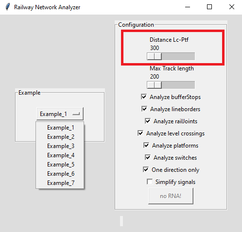

*Figure 18. Minimum distance parameter configuration*

#### E.3. Fixed length parameter

The fixed length parameter is necessary to allocate the departure signals, which maintains the trains in the network until the next network approves the movement. These signals allow trains to move outside the network without restrictions only if the track is not long enough (fixed length). RNA could easily be adapted to different criteria and regulations, thanks to this parameter. As shown in Algorithms 3, and 4 in [[1]](#references). Configuration of the fixed length parameter in RNA as shown in Figure 19. Because of integrity software reasons, this parameter should be between 300 and 500. For default, this value is 200. Figure 23 shows the parameter configuration in the GUI of RNA.

*Figure 19. Fixed length parameter configuration*

#### E.4. Obtaining the interlocking tables using Design4Rail.

Design4Rail has not only a sintax analyzer that is used to check that the .railML file generated by RNA is correct. It also can be used as a visualization tool for both the layout and the interlocking table if you import the correspondig railML file. Design4Rail generates its own interlocking table based on the railML file. This can be done following the next steps:

In Design4Rail software open the archive Example_1_B.railml", generated by RNA for this example, as shown in Figure 20.

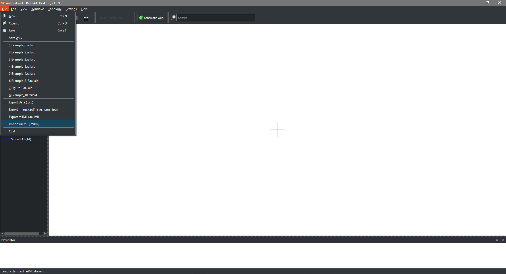

*Figure 20. Import railml file.*

Once the file is opened, it will be possible to view the network and its elements, as in Figure 21.

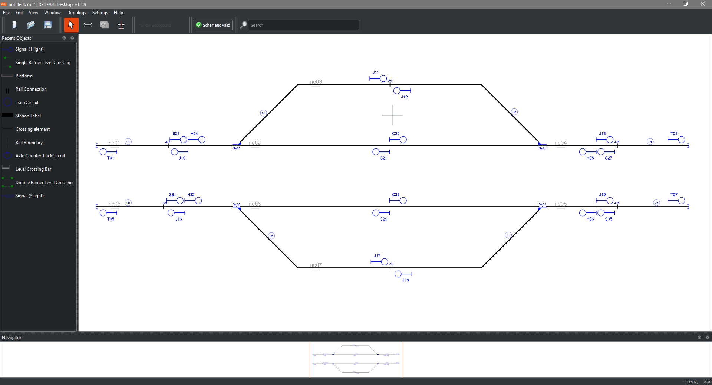

*Figure 21. Example 5 network in Design4Rail Track Planner.*

In the menu "View" in Design4Rail Track Planner, select "Routes", as shown in Figure 22.

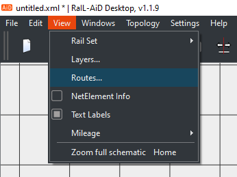

*Figure 22. View Routes*

Then Design4Rail Track Planner will display the interlocking table for this network. It is shown in Figure 23.

*Interlocking table visualized in Design4Rail*

### ***Note***
   To carry out this research work, we used the software Rail-AID developed by NEAT, and provided to us on July 2021. However, NEAT no longer supports this software. They upgrade to a new software named Desgin4Rail TrackPlanner application, whose functionalities are essentially the same as Rail-AID. Because of this reason, we recommended in the manuscript and the development of the examples available in this repository, the use of Design4Rail TrackPlanner. Users are notified, that Rail-AID and Design4Rail are not free software; therefore, appropriate licenses should be purchased for use. A trial version is sufficient to open and visualize the layouts of examples 2, 5, 6 y 7. However, to open and visualize examples 1, 3 y 4 a license should be purchased.

   Moreover, it is important to mention that when the RNA exports the railML file the Rail-AID software considers all these signals as a single aspect. This issue was notified by us to NEAT in March 2022, they acknowledged the notification, agreed that there is an error on their software and committed to fix this problem. However, this problem was never solved, and NEAT discontinued Rail-AID software, as explained above. This problem is not solved yet on Design4Rail, either. To get around this issue, the RNA creates N semaphores of one aspect and displays them one after the other, instead of creating one semaphore of N aspects. However, this extra signals are not considered by RNA when routes are generated and, therefore, has no impact in the interlocking table.

## References

[1] M. N. Menendez, S. Germino, L. Díaz-Charris, and A. Lutenberg, Automatic Railway Signalling Generation for Railways Systems Described on Railway Markup Language (railML). 
