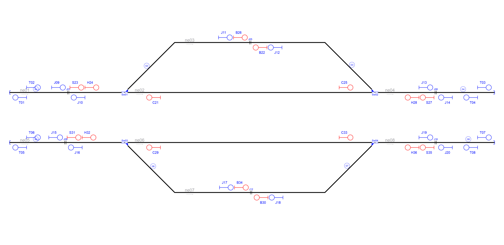

# Example_5
## Description
Name: 

## Step by step

Layout without signalling:

Signals generated due to line borders(L) and buffer stops(T):

Signals generated due to line borders(L),buffer stops(T) and rail joints (J):

Signals generated due to line borders(L),buffer stops(T),rail joints (J), platforms(P) and level crossings(X):

Signals generated due to line borders(L),buffer stops(T),rail joints (J), platforms(P),level crossings(X) and switches(S,H,C,B):

Simplified signalling:

## Original table

| Route  | Entry | Exit | Switches | Platforms | Crossings | netElements |
|  :---:  |  :---:  |  :---:  |  :---:  |  :---:  |  :---:  |  :---:  |
| R_01 |  S01  |  S06  | Sw01_N  | - | - | ne01-ne02 |
| R_02 |  S05  |  S13  | Sw01_N  | - | - | ne02-ne01 |
| R_03 |  S01  |  S03  | Sw01_R  | - | - | ne01-ne03 |
| R_04 |  S04  |  S13  | Sw01_R  | - | - | ne03-ne01 |
| R_05 |  S02  |  S04  | Sw02_R  | - | - | ne04-ne02 |
| R_06 |  S06  |  S15  | Sw02_N  | - | - | ne02-ne04 |
| R_07 |  S02  |  S05  | Sw02_N  | - | - | ne04-ne03 |
| R_08 |  S03  |  S15  | Sw02_R  | - | - | ne03-ne04 |
| R_09 |  S07  |  S11  | Sw03_N  | - | - | ne05-ne06 |
| R_10 |  S10  |  S14  | Sw03_N  | - | - | ne06-ne05 |
| R_11 |  S07  |  S09  | Sw03_R  | - | - | ne05-ne07 |
| R_12 |  S08  |  S14  | Sw03_R  | - | - | ne07-ne05 |
| R_13 |  S12  |  S10  | Sw04_N  | - | - | ne08-ne06 |
| R_14 |  S11  |  S16  | Sw04_N  | - | - | ne06-ne08 |
| R_15 |  S12  |  S08  | Sw04_R  | - | - | ne08-ne07 |
| R_16 |  S09  |  S16  | Sw04_R  | - | - | ne07-ne08 |

## Generated table

| Route  | Entry | Exit | Switches | Platforms | Crossings | netElements |
|  :---:  |  :---:  |  :---:  |  :---:  |  :---:  |  :---:  |  :---:  |
| R_01 |  S23  |  C25  | Sw01_N | - | - | ne01-ne02 |
| R_02 |  C21  |  T01  | Sw01_N | - | - | ne02-ne01 |
| R_03 |  S23  |  J11  | Sw01_R | - | - | ne01-ne03 |
| R_04 |  J12  |  T01  | Sw01_R | - | - | ne03-ne01 |
| R_05 |  S27  |  C21  | Sw02_N | - | - | ne04-ne02 |
| R_06 |  C25  |  T03  | Sw02_N | - | - | ne02-ne04 |
| R_07 |  S27  |  J12  | Sw02_R | - | - | ne04-ne03 |
| R_08 |  J11  |  T04  | Sw02_R | - | - | ne03-ne04 |
| R_09 |  S31  |  C33  | Sw03_N | - | - | ne05-ne06 |
| R_10 |  C29  |  T05  | Sw03_N | - | - | ne06-ne05 |
| R_11 |  S31  |  J17  | Sw03_R | - | - | ne05-ne07 |
| R_12 |  J18  |  T05  | Sw03_R | - | - | ne07-ne05 |
| R_13 |  S35  |  C29  | Sw04_N | - | - | ne08-ne06 |
| R_14 |  C33  |  T07  | Sw04_N | - | - | ne06-ne08 |
| R_15 |  S35  |  J18  | Sw04_R | - | - | ne08-ne07 |
| R_16 |  J17  |  T07  | Sw04_R | - | - | ne07-ne08 |

Extra routes considering bidirectional tracks:
| Route  | Entry | Exit | Switches | Platforms | Crossings | netElements |
|  :---:  |  :---:  |  :---:  |  :---:  |  :---:  |  :---:  |  :---:  |
| R_17 |  T02  |  S23  | - | - | - | ne01 |
| R_18 |  T04  |  S27  | - | - | - | ne04 |
| R_19 |  T06  |  S31  | - | - | - | ne05 |
| R_20 |  T08  |  S35  | - | - | - | ne08 |

Routes 1 to 16 are the same in both interlocking tables, but RNA considers a departure signal is necessary close to buffer stops to allow trains to start moving. This authority could be delegated on signals S23,S31,S27 and S35 but they are far away their respective buffer stops. This extra four signals add four more routes to move the train from each buffer stop prior to every switch. It does not affect safety but it adds an extra step before a critical action, increasing safety.
