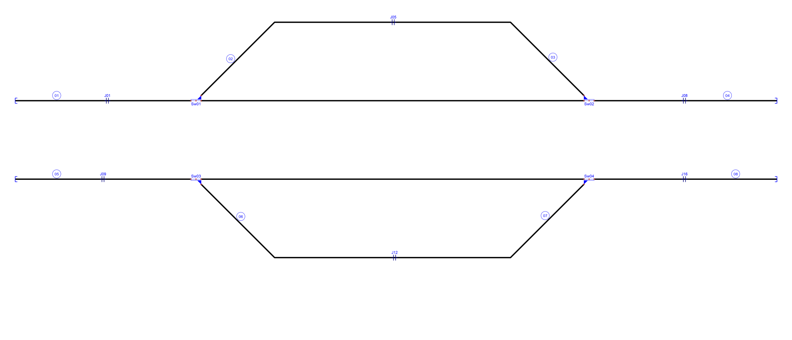
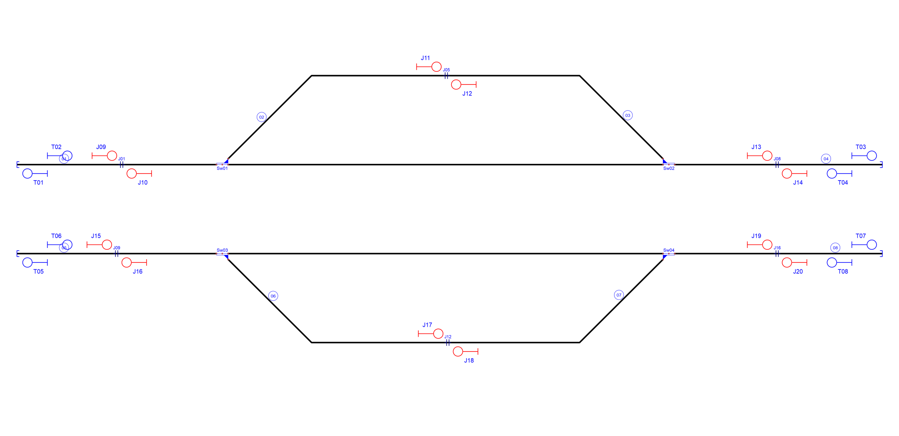

# Example_5
## Description
Name: 

## Step by step

The signalling generation process used in this work was designed following signalling principles defined by Transport for New South Wales (TfNSW). These principles are based on the concepts defined by the Institution of Railway Signal Engineers (IRSE), the Rail Industry Safety and Standards Board (RISSB). These principles include: 

(P1) Having a limited right-to-use (henceforth ”authority”) to one rail element or set of elements.

(P2) Allowing/Denying movement authorities unambiguously.

(P3) Warning train drivers about dangers with enough time to react.

(P4) Enough granularity to support train operations.

(P5) Warning train drivers about the end of the network.

(P6) Waning train drivers about any movable infrastructure such as switches or level crossings or static such as platforms.

(P7) Avoiding train blocking facilities or branches whenever it is possible.

### A. Import the railway layout description

Its imports a railway network without signalling from: C:\PhD\RailML\Layouts\Example_5\Example_5.railml

The necessary information to define the graph network is distributed across several sections of the railML file, specifically inside netElements (nodes) and netRelations (edges) items found in the class Infrastructure/Topology.

### B. Define a graph network to associate the railway elements

The positional information found there can be used to identify straight tracks and curves.

A railway network can be defined as a set of rail tracks that are connected to each other. Only the networks that fulfil the following rules will be considered a valid railway network for the current specification of the RNA, otherwise, the network will be rejected and the analysis will be aborted:

- Every track is defined between two points.
- Two tracks with a common point are connected.
- Each track is connected at least at one of its ends to
another track or a switch.
- The length of a track is within a minimum and a maximum given value.
- A connected region is made up of at least 3 tracks (we
named it a “zone”).
- There is at least one zone in the railway network.
- Two zones connected with a track make one zone.

The result of this step is: 

Signals generated due to line borders(L) and buffer stops(T):

Signals generated due to line borders(L),buffer stops(T) and rail joints (J):

Signals generated due to line borders(L),buffer stops(T),rail joints (J), platforms(P) and level crossings(X):

Signals generated due to line borders(L),buffer stops(T),rail joints (J), platforms(P),level crossings(X) and switches(S,H,C,B):

Simplified signalling:

## Original table

| Route  | Entry | Exit | Switches | Platforms | Crossings | netElements |
|  :---:  |  :---:  |  :---:  |  :---:  |  :---:  |  :---:  |  :---:  |
| R_01 |  S01  |  S06  | Sw01_N  | - | - | ne01-ne02 |
| R_02 |  S05  |  S13  | Sw01_N  | - | - | ne02-ne01 |
| R_03 |  S01  |  S03  | Sw01_R  | - | - | ne01-ne03 |
| R_04 |  S04  |  S13  | Sw01_R  | - | - | ne03-ne01 |
| R_05 |  S02  |  S04  | Sw02_R  | - | - | ne04-ne02 |
| R_06 |  S06  |  S15  | Sw02_N  | - | - | ne02-ne04 |
| R_07 |  S02  |  S05  | Sw02_N  | - | - | ne04-ne03 |
| R_08 |  S03  |  S15  | Sw02_R  | - | - | ne03-ne04 |
| R_09 |  S07  |  S11  | Sw03_N  | - | - | ne05-ne06 |
| R_10 |  S10  |  S14  | Sw03_N  | - | - | ne06-ne05 |
| R_11 |  S07  |  S09  | Sw03_R  | - | - | ne05-ne07 |
| R_12 |  S08  |  S14  | Sw03_R  | - | - | ne07-ne05 |
| R_13 |  S12  |  S10  | Sw04_N  | - | - | ne08-ne06 |
| R_14 |  S11  |  S16  | Sw04_N  | - | - | ne06-ne08 |
| R_15 |  S12  |  S08  | Sw04_R  | - | - | ne08-ne07 |
| R_16 |  S09  |  S16  | Sw04_R  | - | - | ne07-ne08 |

## Generated table

| Route  | Entry | Exit | Switches | Platforms | Crossings | netElements |
|  :---:  |  :---:  |  :---:  |  :---:  |  :---:  |  :---:  |  :---:  |
| R_01 |  S23  |  C25  | Sw01_N | - | - | ne01-ne02 |
| R_02 |  C21  |  T01  | Sw01_N | - | - | ne02-ne01 |
| R_03 |  S23  |  J11  | Sw01_R | - | - | ne01-ne03 |
| R_04 |  J12  |  T01  | Sw01_R | - | - | ne03-ne01 |
| R_05 |  S27  |  C21  | Sw02_N | - | - | ne04-ne02 |
| R_06 |  C25  |  T03  | Sw02_N | - | - | ne02-ne04 |
| R_07 |  S27  |  J12  | Sw02_R | - | - | ne04-ne03 |
| R_08 |  J11  |  T04  | Sw02_R | - | - | ne03-ne04 |
| R_09 |  S31  |  C33  | Sw03_N | - | - | ne05-ne06 |
| R_10 |  C29  |  T05  | Sw03_N | - | - | ne06-ne05 |
| R_11 |  S31  |  J17  | Sw03_R | - | - | ne05-ne07 |
| R_12 |  J18  |  T05  | Sw03_R | - | - | ne07-ne05 |
| R_13 |  S35  |  C29  | Sw04_N | - | - | ne08-ne06 |
| R_14 |  C33  |  T07  | Sw04_N | - | - | ne06-ne08 |
| R_15 |  S35  |  J18  | Sw04_R | - | - | ne08-ne07 |
| R_16 |  J17  |  T07  | Sw04_R | - | - | ne07-ne08 |

Extra routes considering bidirectional tracks:
| Route  | Entry | Exit | Switches | Platforms | Crossings | netElements |
|  :---:  |  :---:  |  :---:  |  :---:  |  :---:  |  :---:  |  :---:  |
| R_17 |  T02  |  S23  | - | - | - | ne01 |
| R_18 |  T04  |  S27  | - | - | - | ne04 |
| R_19 |  T06  |  S31  | - | - | - | ne05 |
| R_20 |  T08  |  S35  | - | - | - | ne08 |

Routes 1 to 16 are the same in both interlocking tables, but RNA considers a departure signal is necessary close to buffer stops to allow trains to start moving. This authority could be delegated on signals S23,S31,S27 and S35 but they are far away their respective buffer stops. This extra four signals add four more routes to move the train from each buffer stop prior to every switch. It does not affect safety but it adds an extra step before a critical action, increasing safety.
