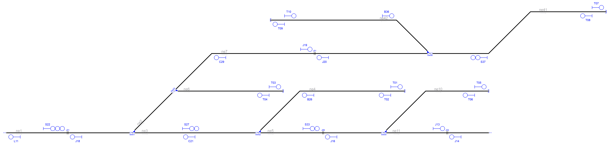
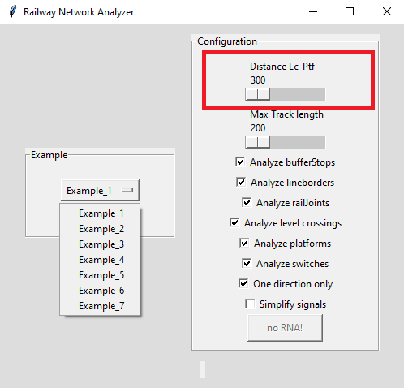

# Example_6
## Description

Name: Complex switches I

This example is mentioned in the manuscript titled: "Automatic Railway Signalling Generation for Railways Systems Described on Railway Markup Language (railML)". Henceforth, when we refer to the manuscript, we will do it as [[1]](#references).

## Analysis principles

The signalling generation process used in this work was designed following signalling principles detailed in [[1]](#references) in the section "I. INTRODUCTION".

## Step by step

The following is the general methodology or "step by step" followed for analysing a railway network with the approach of this work [[1]](#references).

A. Import the railway layout description.

B. Define a graph network to associate the railway elements.

C. Infrastructure analysis

D. Detect CDL zones.

E. Generate signalling.

F. Simplify signalling.

G. Export a resulting railway layout description.

Each step is explained below.

### A. Import the railway layout description

After having installed the RNA program according to the steps shown in the the section ["Usage"](https://github.com/GICSAFePhD/Layouts#usage), run the Python archive "main_GUI.py". This action produces the program output shown in Figure 1.

*Figure 1. Select example.*

The necessary information to define the graph network is distributed across several sections of the railML file, specifically inside netElements (nodes) and netRelations (edges) items found in the class Infrastructure/Topology as described in [[1]](#references).

Figure 2 shows the railway network without signalling. The user will need the Design4Rail Horizon Software Suite Track Planner application and import the archive "Example_6.railml" to visualise the railway network used in this example. 

For further information about the Design4Rail Horizon Software Suite and the Track Planner application, please refer to [Official web page of Design4Rail](https://design4rail.com/service/d4rhorizon/#section-downloadHorizon).

For a detailed explanation about importing railML files, go to section [G.1](#g1-obtaining-the-interlocking-table-in-design4rail) of this document. 

*Figure 2. Railway network without signalling.*

### B. Define a graph network to associate the railway elements

This step allows us to evaluate the consistency of the network connections provided in the RailML file, through the determination of the direction, position, and interconnection of each of the nodes of the given railway network.

In [[1]](#references), in the section "II. RAILWAY NETWORK ANALYZER DESIGN" in literal B, we see Algorithm 1, which explains the network analysis process.

The result of this RNA step is show in Console Output 1:

~~~
#################### Starting Railway Network Analyzer ####################
Reading .railML file
Creating railML object
Analysing railML object
 Analysing graph
ne1 [-1500, 450] [-600, 450] >>
ne2 [-600, 450] [-300, 750] >>
ne3 [-600, 450] [300, 450] >>
ne4 [300, 450] [1350, 750] >>
ne5 [300, 450] [1200, 450] >>
ne6 [-300, 750] [480, 750] >>
ne7 [-300, 750] [1530, 1020] >>
ne10 [1200, 450] [1950, 750] >>
ne11 [1200, 450] [1950, 450] >>
ne41 [1530, 1020] [2790, 1320] >>
ne42 [1530, 1020] [390, 1260] <<
 The network is connected
~~~

*Console Output 1. Step B railway elements.*

In this example, the Console Output 1 shows that the program can identify the nodes and their directions. Consol Output 1 has, for example, this line: ne42 [1530, 1020] [390, 1260] <<, it indicates the name of the netElement (ne42), the position (origin [1530, 1020] and end point [390, 1260]) of the net element, and the direction (<<, to the left in this case, but in other example it could have been to the right: >>). If compare this Console Output 1 with Figure 2, and analysing each "netElement", all elements are coincident. The same analysis for: ne1, ne2, ne3, ne4, ne5, ne6, ne7, ne10, ne11, ne41 and ne42.

### C and D. Infrastructure analysis and CDL zones detection

The process of analysing the infrastructure and detecting CDL zones allows identifying the position of each infrastructure element in the network: platforms, curves, level crossings, buffer stops, derailers, lines, operational points, signals, switches, tracks and detection elements (axle counters, rail joints and track circuits).

In section "II. RAILWAY NETWORK ANALYSER DESIGN" literal C of [[1]](#references), it is shown Algorithm 2, which explains the process of analysing the network; and in the same section but in literal D, it is explained the process used to detect CDL zones.

The result of this step is shown in Console Output 2 and Figure 3.

~~~
Analysing infrastructure --> Infrastructure.RNA
 Detecting Danger --> Safe_points.RNA
 ne1 has a RailJoint[J01] @ [-1060, 450]
 ne3 has a Middle point @ [-375.0, 450]
 ne3 has a Middle point @ [-150.0, 450]
 ne3 has a Middle point @ [75.0, 450]
 ne4 has a Curve(2 lines) @ [[600, 750]]
 ne5 has a RailJoint[J06] @ [765, 450]
 ne6 has a Middle point @ [-40.0, 750]
 ne6 has a Middle point @ [220.0, 750]
 ne7 has a RailJoint[J01] @ [705, 1020]
 ne7 has a Curve(2 lines) @ [[-30, 1020]]
 ne10 has a Curve(2 lines) @ [[1500, 750]]
 ne11 has a RailJoint[J02] @ [1653, 450]
 ne41 has a Curve(3 lines) @ [[1950, 1020], [2250, 1320]]
 ne42 has a Curve(2 lines) @ [[1290, 1260]]
~~~

*Console Output 2. Infraestructure analysis and CDL zone detection.*

*Figure 3. Infrastructure analysis and CDL zones detection: GUI Output.*

Figure 4 shows these elements.

*Figure 4. Infrastructure analysis and CDL zones detection: Layout.*

### E. Generate signalling

To obtain an analysis for each network element in the program configurations (view Figure 5), select only the options you want.

*Figure 5. Configuration options of RNA.*

Below, in subsections E.1, E.2, E.3, and E.4, you will find the sequence of configurations used to analyze, step by step, the railway in this example.

#### E.1. Signals generated due to line borders(L) and buffer stops(T)

The configuration of the RNA GUI application needed for this step of the analysis is shown in Figure 6.

*Figure 6. Configuring RNA to obtain signals for line borders(L) and buffer stops(T).*

Signals are enumerated since 00 with a prefix letter to indicate which element generates them. BufferStops and LineBorders signals start with T and L, respectively. In Figure 7, we can visualise the signals generated by applying algorithm 3, explained in [[1]](#references) section "III. SIGNALLING GENERATION".

In red letters, automatically added signals are shown.

The RNA allocates signals close to the buffer stops:

-- Stop: *T01*, *T03*, *T05*, *T07*, *T09*

-- Departure: *T02*, *T04*, *T06*, *T08*, *T10*

The RNA allocate signals L11 and L12 close to the line borders because to protect them.

*Figure 7. Signals due to line borders(L) and buffer stops(T).*

#### E.2. Signals generated due to line borders(L), buffer stops(T) and rail joints (J)

The signals for rail joints are named J and have a consecutive number of signals.

The configuration of the RNA GUI application needed for this step of the analysis is shown in Figure 8.

*Figure 8. Configuring RNA to obtain signals for line borders(L), buffer stops(T) and rail joints (J).*

The algorithm assignes signals *J13 to J20* at the beginning and end of each track to indicate near rail joints as shown in Figure 9.

*Figure 9. Signals due to line borders(L), buffer stops(T) and rail joints (J).*

#### E.3. Signals generated due to line borders(L), buffer stops(T),rail joints (J), platforms(P) and level crossings(X)

The signals for platforms are named P, and signals for level crossings are named X. A consecutive number of signals is assigned for each type of signalling.

The configuration of the RNA GUI application needed for this step of the analysis is shown in Figure 10.

*Figure 10. Configuring RNA to obtain signals for line borders(L),buffer stops(T),rail joints (J), platforms(P) and level crossings(X).*

Notice that RNA can be configured to avoid adding duplicate signals when the level crossing and the platform are close together, as discussed in [[1]](#references), and therefore, the signalling between them is unnecessary. However, this configuration is a special parameter in RNA. For furthermore information about this, see section [G.3.1.2.](#g32-minimum-distance-parameter) 

It is necessary to introduce signals before the train reaches the level crossing as explained in Algorithm 5, explained in [[1]](#references) section "III. SIGNALLING GENERATION".

Also, it is necessary to have a departure signal after the platform. This logic is implemented using Algorithm 6, explained in [[1]](#references) section "III. SIGNALLING GENERATION".

In red letters, the signals Generated due level crossings and platforms are shown in Figure 11.

*Figure 11. Signals due to line borders(L),buffer stops(T),rail joints (J), platforms(P) and level crossings(X).*

#### E.4. Signals generated due to line borders(L),buffer stops(T),rail joints (J), platforms(P),level crossings(X) and switches(S,H,C,B)

Figure 6 shows the configuration of the RNA GUI application needed for this step of analysis.

*Figure 12. Configuring RNA to obtain signals for line borders(L),buffer stops(T),rail joints (J), platforms(P),level crossings(X) and switches(S,H,C,B).*

The signals for switches are named based on the point they want to protect: S for Starting branch, C for the Continue branch and B for the Detour branch. There are also signals whose name starts with H that are not explicitly protecting the starting branch, the continue branch or the detour branch of a switch. These H signals are explained in [[1]](#references) section "III. SIGNALLING GENERATION" in literal E, where a manoeuvre signal numbered with H is always added plus the corresponding numbering sequence by Algorithm 7. This manoeuvre signal always accompanies the signal of the start branch (S) of the switch, and its function is to protect the railway elements that are after this signal (i.e. elements that are in the detour branch and in the continue branch).

Signals generated for Example 6 are shown in red letters in Figure 13:

- Sw01:*S22, C21, H23, H24*.
- Sw02:*S27, C25, B26 and H28*.
- Sw03:*C29 and B30*.
- Sw05:*S33, C31, B32 and H34*.
- Sw08:*S37, C35, B36 and H38*.

*Figure 13. Signals due to line borders(L),buffer stops(T),rail joints (J), platforms(P),level crossings(X) and switches(S,H,C,B).*

### F. Simplify signalling

The signal simplification process used by RNA relies on two main principles: i) vertical inheritance and ii) horizontal inheritance. Both principles are explained in [[1]](#references) in section "IV. SIGNALLING SIMPLIFICATION".

To simplify signals is needed that, mark the configuration option "Simplify signals", as shown in Figure 14.

*Figure 14. Configuring RNA to simplify signalling.*

After the simplification only the appropriate signals are kept, as shown in Figure 15.

*Figure 15. Signalling simplification.*

The simplification process was carried out according to the process described in section IV. SIGNALLING SIMPLIFICATION of [[1]](#references), as follows:

- **Simplification by vertical inheritance**

    Vertical inheritance was applied when the B signals between Sw01 and Sw03 were moved to the signals H23 y H24, respectably. These signals B were not created, because the RNA applied Algorithm 8 explained in section IV. SIGNALLING SIMPLIFICATION of [[1]](#references), literal A. It also moves signal B for Sw02 to H28, signal B for Sw05 to H34 and signal B for Sw08 to H38. 

- **Simplification by horizontal inheritance**

    The simplified signals due to horizontal inheritance are follows: L12, J15, J17, C25, B30, C31, B32 and C35. Signal L12 was deleted due this was nearby of signal J13, with the same direction and orientation. The same situation occurs between signals J15 and S33, signals J17 and S22, signals C25 and J16, signals B30 and T04, signals C31 and J14, signals B32 and T06 and signals C35 and J19. In all cases, is applied Algorithm 9 (described in section IV. SIGNALLING SIMPLIFICATION of [1]). This algorithm was designed to avoid collisions by considering nearby objects as one single object, and generating signals according to the leftmost and rightmost railway element in the new single object. 
 
    The priority of the surviving signals were higher than the replaced signals, as explained in section IV. SIGNALLING SIMPLIFICATION of [1], literal B. 

~~~
Reducing redundant signals
 removing sig30 for sig04
 removing sig32 for sig06
 removing sig12 for sig13
 removing sig31 for sig14
 removing sig15 for sig33
 removing sig25 for sig16
 removing sig17 for sig22
 removing sig35 for sig19
~~~

### G. Export a resulting railway layout description

Once the signalling is generated, it is necessary to establish the railway routes to create the railway interlocking table. A railway route is the simplest path between two consecutive signals in the same direction, using the same tracks (see [[1]](#references)).

#### G.1. Obtaining the interlocking table in Design4Rail

To obtain the interlocking table is necessary to use Design4Rail software to open the archive Example_2_B.railml" generated by RNA for this example, as shown in Figure 16.

*Figure 16. Import railml file.*

Once the file is opened, it will be possible to view the network and its elements, as in Figure 17.

*Figure 17. Example 2 network in Design4Rail Track Planner.*

In the menu "View" in Design4Rail Track Planner, select "Routes", as shown in Figure 18.

*Figure 18. View Routes*

Then Design4Rail Track Planner will display the table of routes for this network. It is shown in Table 1.

*Table 1. Routes in Design4Rail*

### ***Note***

   To carry out this research work, we used the software Rail-AID developed by NEAT, and provided to us on July 2021. However, NEAT no longer supports this software. They upgrade to a new software named Desgin4Rail TrackPlanner application, whose functionalities are essentially the same as Rail-AID. Because of this reason, we recommended in the manuscript and the development of the examples available in this repository, the use of Design4Rail TrackPlanner. Users are notified, that Rail-AID and Design4Rail are not free software; therefore, appropriate licenses should be purchased for use. A trial version is sufficient to open and visualize the layouts of examples 2, 5, 6 y 7. However, to open and visualize examples 1, 3 y 4 a license should be purchased.

   Moreover, it is important to mention that when the RNA exports the railML file the Rail-AID software considers all these signals as a single aspect. This issue was notified by us to NEAT in March 2022, they acknowledged the notification, agreed that there is an error on their software and committed to fix this problem. However, this problem was never solved, and NEAT discontinued Rail-AID software, as explained above. This problem is not solved yet on Design4Rail, either. To get around this issue, the RNA creates N semaphores of one aspect and displays them one after the other, instead of creating one semaphore of N aspects. As a consequence of having N semaphores of one aspect the interlocking table has more routes than the scenario where there is one semaphore of N aspects. Therefore, to get the appropriate interlocking table corresponding to one semaphore of N aspects, use the procedure shown in section [G.1.](#g1-obtaining-the-interlocking-table-in-design4rail)

#### G.2. Original interlocking table

Figure 19 shows the structure of the original example. 

*Figure 19. Original example provided by RailMl*

The signalling and the original interlocking table were designed by experts following the RailMl standard, and are shown in Table 2.

*Table 2. Original interlocking table for this example provided by RailMl*

| Route  | Entry | Exit | Switches | Platforms | Crossings | netElements |
|  :---:  |  :---:  |  :---:  |  :---:  |  :---:  |  :---:  |  :---:  |
| R_01 | S01 | S06 | Sw01_N | - | - | ne01-ne03 |
| R_02 | S01 | S13 | Sw01_R + Sw03_R | - | - | ne01-ne02-ne06 |
| R_03 | S01 | S18 | Sw01_R + Sw03_N | - | - | ne01-ne02-ne07 |
| R_04 | S06 | S07 | Sw02_N | - | - | ne03-ne05 |
| R_05 | S06 | S12 | Sw02_R | - | - | ne03-ne04 |
| R_06 | S21 | S19 | Sw08_N | - | - | ne41-ne07 |
| R_07 | S21 | S14 | Sw08_R | - | - | ne41-ne42 |
| R_08 | S05 | S02 | Sw01_N | - | - | ne03-ne01 |
| R_09 | S09 | S08 | Sw05_N | - | - | ne11-ne05 |
| R_10 | S08 | S05 | Sw02_N | - | - | ne05-ne03 |
| R_11 | S10 | S08 | Sw05_R | - | - | ne10-ne05 |
| R_12 | S15 | S16 | Sw08_R | - | - | ne42-ne41 |
| R_13 | S18 | S16 | Sw08_N | - | - | ne07-ne41 |
| R_14 | S19 | S20 | - | - | - | ne07 |
| R_15 | S20 | S02 | Sw01_R + Sw03_N | - | - | ne07-ne02-ne01 |
| R_16 | S07 | S11 | Sw05_R | - | - | ne05-ne10 |

#### G.3. Generated interlocking table

The result of the automatic process carried by the RNA is the intelocking table shown in Table 3. This result is consistent with Table 1 shown in subsection [G.2.](#g2-original-interlocking-table) Original interlocking table.

*Table 3. Interlocking table obtain through RNA when the option "One-direction only" is marked.*

| Route  | Entry | Exit | Switches | Platforms | Crossings | netElements |
|  :---:  |  :---:  |  :---:  |  :---:  |  :---:  |  :---:  |  :---:  |
| R_01 | S22 | S27 | Sw01_N | - | - | ne01-ne03 |
| R_02 | S22 | T03 | Sw01_R + Sw03_R | - | - | ne01-ne02-ne06 |
| R_03 | S22 | J19 | Sw01_R + Sw03_N | - | - | ne01-ne02-ne07 |
| R_04 | S27 | S22 | Sw02_N | - | - | ne03-ne05 |
| R_05 | S27 | T01 | Sw02_R | - | - | ne03-ne04 |
| R_06 | S37 | J20 | Sw08_N | - | - | ne41-ne07 |
| R_07 | S37 | T09 | Sw08_R | - | - | ne41-ne42 |
| R_08 | C21 | J18 | Sw01_N | - | - | ne03-ne01 |
| R_09 | J14 | J16 | Sw05_N | - | - | ne11-ne05 |
| R_10 | J16 | C21 | Sw02_N | - | - | ne05-ne03 |
| R_11 | T06 | J16 | Sw05_R | - | - | ne10-ne05 |
| R_12 | B36 | T07 | Sw08_R | - | - | ne42-ne41 |
| R_13 | J19 | T07 | Sw08_N | - | - | ne07-ne41 |
| R_14 | J20 | C29 | - | - | - | ne07 |
| R_15 | C29 | J18 | Sw01_R + Sw03_N | - | - | ne07-ne02-ne01 |
| R_16 | S33 | T05 | Sw05_R | - | - | ne05-ne10 |

#### G.3.1. One-directional and bidirectional tracks

RNA can consider tracks as bidirectional, while the original layout has only one-directional track. This feature is activated by mismarking the "One direction only" option, as shown in Figure 20.

*Figure 20. Produce routes considering bidirectional tracks*

In this way the extra routes shown in Table 4 are obtained, where routes 6 to 10 are the opposite of routes 1 to 5. This extra routes does not affect safety. Moreover, departure signals are considered for line borders and buffer stops for extra protection.

*Table 4. Interlocking table obtain through RNA when the option "One direction only" is mismarked.*

| Route  | Entry | Exit | Switches | Platforms | Crossings | netElements |
|  :---:  |  :---:  |  :---:  |  :---:  |  :---:  |  :---:  |  :---:  |
| R_17 | S33 | J13 | Sw05_N | - | - | ne05-ne11 |
| R_18 | T04 | J18 | Sw01_R + Sw03_R | - | - | ne06-ne02-ne01 |
| R_19 | B26 | C21 | Sw02_R | - | - | ne04-ne03 |
| R_20 | T02 | B26 | - | - | - | ne04 |
| R_21 | T08 | S37 | - | - | - | ne41 |
| R_22 | T10 | B36 | - | - | - | ne42 |
| R_23 | J18 | L11 | - | - | - | ne01 |

Table 4 shows the additional routes, considering bidirectional tracks. Routes 1 to 16 are equivalent in both interlocking tables.

The RNA adds departure signlas T02, T08 and T10, creating new routes 20,21 and 22 used to insert back trains in the main line.

Routes 17, 18, 19 and 23 use new signals added by the RNA, necessary to improve mobility.

#### G.3.2. Minimum distance parameter

As explained in literal B of section "IV. SIGNALING SIMPLIFICATION" in [[1]](#references), more than two railway elements can be combined if they are close enough. The threshold distance to determine if this combination must be done is a configuration parameter of RNA, named MIN_DISTANCE (minimum distance). As shown in Algorithms 8, 9, and 10 in [[1]](#references), this parameter is essential to locate, relocate and simplify signals. Because of integrity software reasons, this parameter should be between 300 and 500. For default, this value is 300. Figure 22 shows the parameter configuration in the GUI of RNA. 

*Figure 22. Minimum distance parameter configuration*

#### G.3.3. Fixed length parameter

The fixed length parameter is necessary to allocate the departure signals, which maintains the trains in the network until the next network approves the movement. These signals allow trains to move outside the network without restrictions only if the track is not long enough (fixed length). RNA could easily be adapted to different criteria and regulations, thanks to this parameter. As shown in Algorithms 3, and 4 in [[1]](#references). Configuration of the fixed length parameter in RNA as shown in Figure 23. Because of integrity software reasons, this parameter should be between 300 and 500. For default, this value is 200. Figure 23 shows the parameter configuration in the GUI of RNA.

*Figure 23. Fixed length parameter configuration*

## References

[1] M. N. Menendez, S. Germino, L. Díaz-Charris, and A. Lutenberg, Automatic Railway Signalling Generation for Railways Systems Described on Railway Markup Language (railML). 
