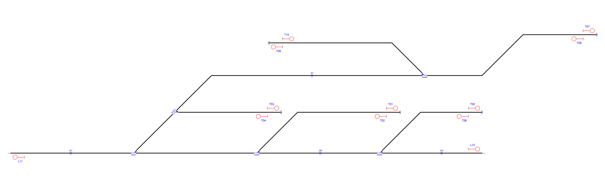
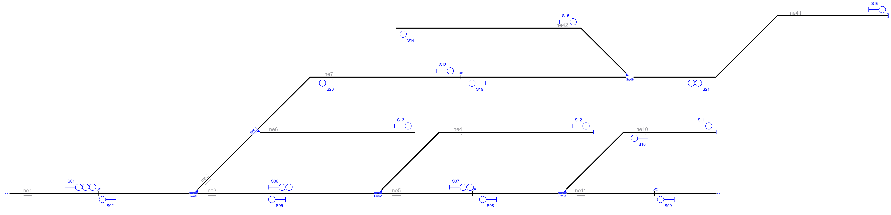

# Example_6
## Description
Name: 

## Step by step

Layout without signalling:

Signals generated due to line borders(L) and buffer stops(T):

Signals generated due to line borders(L),buffer stops(T) and rail joints (J):

Signals generated due to line borders(L),buffer stops(T),rail joints (J), platforms(P) and level crossings(X):

Signals generated due to line borders(L),buffer stops(T),rail joints (J), platforms(P),level crossings(X) and switches(S,H,C,B):

Simplified signalling:

## Original table

| Route  | Entry | Exit | Switches | Platforms | Crossings | netElements |
|  :---:  |  :---:  |  :---:  |  :---:  |  :---:  |  :---:  |  :---:  |
| R_01 | S01 | S06 | Sw01_N | - | - | ne01-ne03 |
| R_02 | S01 | S13 | Sw01_R + Sw03_R | - | - | ne01-ne02-ne06 |
| R_03 | S01 | S18 | Sw01_R + Sw03_N | - | - | ne01-ne02-ne07 |
| R_04 | S06 | S07 | Sw02_N | - | - | ne03-ne05 |
| R_05 | S06 | S12 | Sw02_R | - | - | ne03-ne04 |
| R_06 | S21 | S19 | Sw08_N | - | - | ne41-ne07 |
| R_07 | S21 | S14 | Sw08_R | - | - | ne41-ne42 |
| R_08 | S05 | S02 | Sw01_N | - | - | ne03-ne01 |
| R_09 | S09 | S08 | Sw05_N | - | - | ne11-ne05 |
| R_10 | S08 | S05 | Sw02_N | - | - | ne05-ne03 |
| R_11 | S10 | S08 | Sw05_R | - | - | ne10-ne05 |
| R_12 | S15 | S16 | Sw08_R | - | - | ne42-ne41 |
| R_13 | S18 | S16 | Sw08_N | - | - | ne07-ne41 |
| R_14 | S19 | S20 | - | - | - | ne07 |
| R_15 | S20 | S02 | Sw01_R + Sw03_N | - | - | ne07-ne02-ne01 |
| R_16 | S07 | S11 | Sw05_R | - | - | ne05-ne10 |

## Generated table

| Route  | Entry | Exit | Switches | Platforms | Crossings | netElements |
|  :---:  |  :---:  |  :---:  |  :---:  |  :---:  |  :---:  |  :---:  |
| R_01 | S22 | S27 | Sw01_N | - | - | ne01-ne03 |
| R_02 | S22 | T03 | Sw01_R + Sw03_R | - | - | ne01-ne02-ne06 |
| R_03 | S22 | J19 | Sw01_R + Sw03_N | - | - | ne01-ne02-ne07 |
| R_04 | S27 | S22 | Sw02_N | - | - | ne03-ne05 |
| R_05 | S27 | T01 | Sw02_R | - | - | ne03-ne04 |
| R_06 | S37 | J20 | Sw08_N | - | - | ne41-ne07 |
| R_07 | S37 | T09 | Sw08_R | - | - | ne41-ne42 |
| R_08 | C21 | J18 | Sw01_N | - | - | ne03-ne01 |
| R_09 | J14 | J16 | Sw05_N | - | - | ne11-ne05 |
| R_10 | J16 | C21 | Sw02_N | - | - | ne05-ne03 |
| R_11 | T06 | J16 | Sw05_R | - | - | ne10-ne05 |
| R_12 | B36 | T07 | Sw08_R | - | - | ne42-ne41 |
| R_13 | J19 | T07 | Sw08_N | - | - | ne07-ne41 |
| R_14 | J20 | C29 | - | - | - | ne07 |
| R_15 | C29 | J18 | Sw01_R + Sw03_N | - | - | ne07-ne02-ne01 |
| R_16 | S33 | T05 | Sw05_R | - | - | ne05-ne10 |

Extra routes considering bidirectional tracks:
| Route  | Entry | Exit | Switches | Platforms | Crossings | netElements |
|  :---:  |  :---:  |  :---:  |  :---:  |  :---:  |  :---:  |  :---:  |
| R_17 | S33 | J13 | Sw05_N | - | - | ne05-ne11 |
| R_18 | T04 | J18 | Sw01_R + Sw03_R | - | - | ne06-ne02-ne01 |
| R_19 | B26 | C21 | Sw02_R | - | - | ne04-ne03 |
| R_20 | T02 | B26 | - | - | - | ne04 |
| R_21 | T08 | S37 | - | - | - | ne41 |
| R_22 | T10 | B36 | - | - | - | ne42 |
| R_23 | J18 | L11 | - | - | - | ne01 |

Routes 1 to 16 are equivalent in both interlocking tables.

The RNA adds departure signlas T02, T08 and T10, creating new routes 20,21 and 22 used to insert back trains in the main line.

Routes 17, 18, 19 and 23 use new signals added by the RNA, necessary to improve mobility.

With these changes it is possible to cover all the layout in any direction without any restriction.
