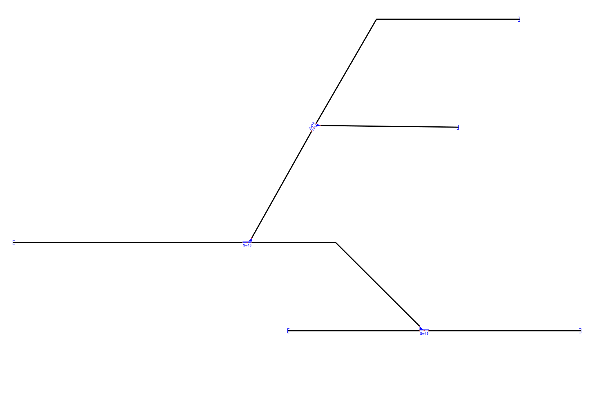
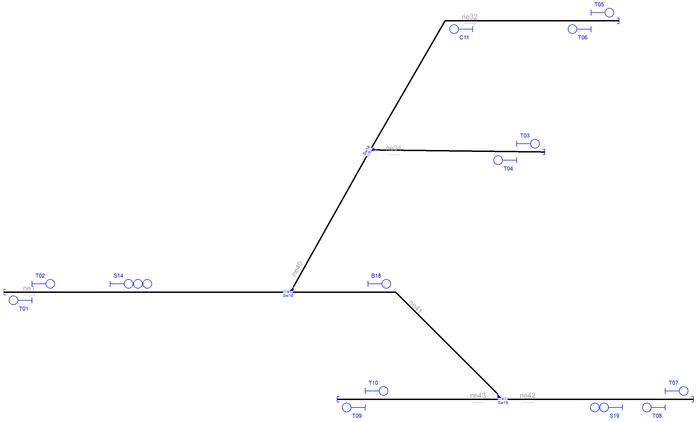
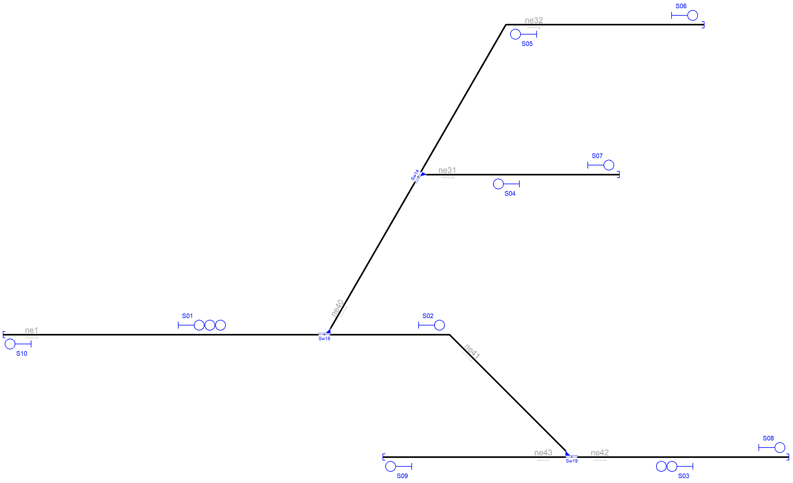

# Example_7
## Description
Name: 

## Step by step

Layout without signalling:

Signals generated due to line borders(L) and buffer stops(T):

Signals generated due to line borders(L),buffer stops(T) and rail joints (J):

Signals generated due to line borders(L),buffer stops(T),rail joints (J), platforms(P) and level crossings(X):

Signals generated due to line borders(L),buffer stops(T),rail joints (J), platforms(P),level crossings(X) and switches(S,H,C,B):

Simplified signalling:

## Original table

| Route  | Entry | Exit | Switches | Platforms | Crossings | netElements |
|  :---:  |  :---:  |  :---:  |  :---:  |  :---:  |  :---:  |  :---:  |
| R_01 |  S01  |  S02  | Sw18_N | - | - | ne01-ne41 |
| R_02 |  S01  |  S06  | Sw14_N + Sw18_R | - | - | ne01-ne40-ne32 |
| R_03 |  S01  |  S07  | Sw14_R + Sw18_R | - | - | ne01-ne40-ne31 |
| R_04 |  S03  |  S09  | Sw19_N | - | - | ne42-ne43 |
| R_05 |  S03  |  S10  | Sw18_N + Sw19_R | - | - | ne42-ne41-ne01 |
| R_06 |  S02  |  S08  | Sw19_R | - | - | ne41-ne42 |
| R_07 |  S04  |  S10  | Sw14_R + Sw18_R | - | - | ne31-ne40-ne01 |
| R_08 |  S05  |  S10  | Sw14_N + Sw18_R | - | - | ne32-ne40-ne01 |

## Generated table

| Route  | Entry | Exit | Switches | Platforms | Crossings | netElements |
|  :---:  |  :---:  |  :---:  |  :---:  |  :---:  |  :---:  |  :---:  |
| R_01 |  S14  |  B18  | Sw18_N | - | - | ne01-ne41 |
| R_02 |  S14  |  T05  | Sw14_N + Sw18_R | - | - | ne01-ne40-ne32 |
| R_03 |  S14  |  T03  | Sw14_R + Sw18_R | - | - | ne01-ne40-ne31 |
| R_04 |  S19  |  T09  | Sw19_N | - | - | ne42-ne43 |
| R_05 |  S19  |  T01  | Sw18_N + Sw19_R | - | - | ne42-ne41-ne01 |
| R_06 |  B18  |  T07  | Sw19_R | - | - | ne41-ne42 |
| R_07 |  T04  |  T01  | Sw14_R + Sw18_R | - | - | ne31-ne40-ne01 |
| R_08 |  C11  |  T01  | Sw14_N + Sw18_R | - | - | ne32-ne40-ne01 |

Extra routes considering bidirectional tracks:
| Route  | Entry | Exit | Switches | Platforms | Crossings | netElements |
|  :---:  |  :---:  |  :---:  |  :---:  |  :---:  |  :---:  |  :---:  |
| R_09 |  T02  |  S14  | - | - | - | ne01 |
| R_10 |  T06  |  C11  | - | - | - | ne32 |
| R_11 |  T08  |  S19  | - | - | - | ne42 |
| R_12 |  T10  |  T07  | Sw19_N | - | - | ne43-ne42 |

Routes 1 to 8 are equivalente in both interlocking tables.

The RNA adds departure signal T02, T06, T08 and T10 to protect buffer stops. Signals T02, T06 and T08 are used to allow stopped trains to move close to the main signals S14, S19 and C11. signal T04 is used to insert trains back to the main line. These extra signals increase safety by protecting the buffer stops, mandatory in many countries. If the buffer stops are configured to not be protected then both interlocking tables are the same.
